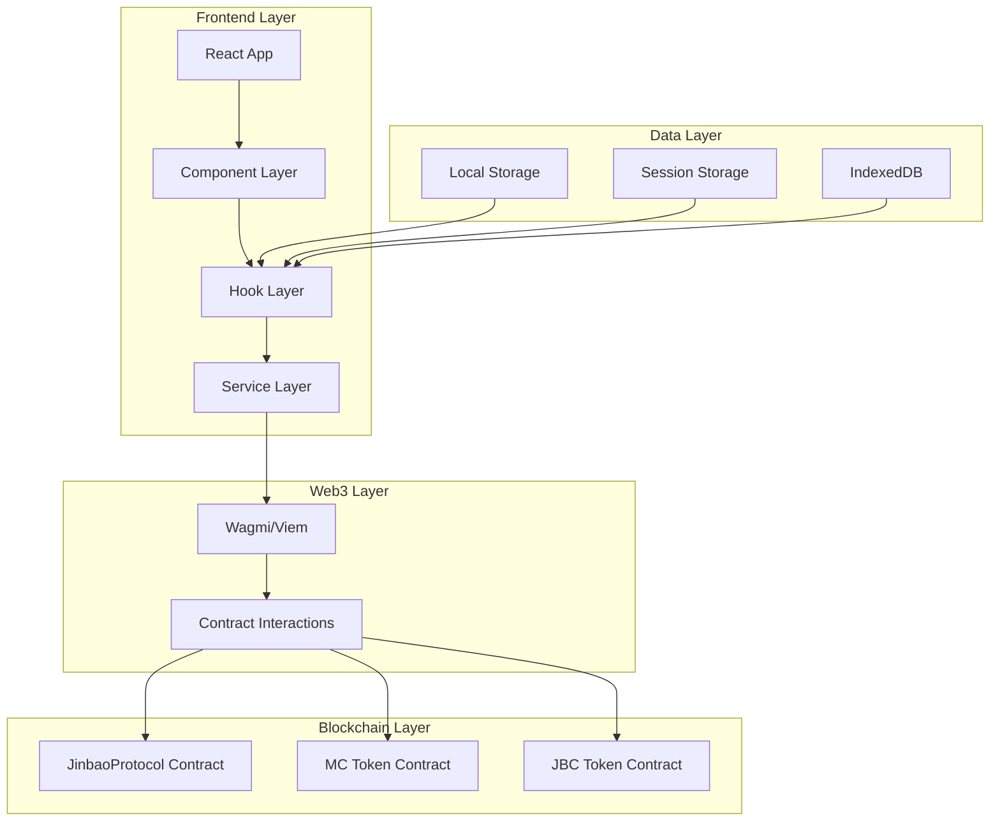
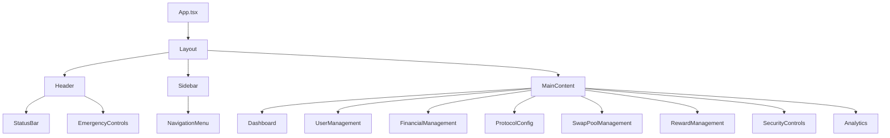

# Admin Dashboard Design Document

## Overview

Jinbao Protocol Admin Dashboard是一个基于React和TypeScript的现代化Web应用程序，为协议管理员提供全面的系统管理界面。该Dashboard直接与JinbaoProtocol智能合约交互，提供实时监控、配置管理、财务操作和安全控制等功能。

设计采用模块化架构，确保代码的可维护性和可扩展性。通过Web3技术栈实现与区块链的无缝集成，提供安全可靠的管理体验。

## Architecture

### System Architecture



### Component Architecture



## Components and Interfaces

### Chinese UI System (中文界面系统)

#### 1. Navigation and Layout Labels (导航和布局标签)

```typescript
interface ChineseUILabels {
  // 主导航
  navigation: {
    dashboard: '仪表板';
    userManagement: '用户管理';
    financialManagement: '财务管理';
    protocolConfig: '协议配置';
    swapPoolManagement: '交换池管理';
    rewardManagement: '奖励管理';
    securityControls: '安全控制';
    dataAnalytics: '数据分析';
    systemSettings: '系统设置';
  };
  
  // 操作按钮
  actions: {
    save: '保存';
    cancel: '取消';
    confirm: '确认';
    delete: '删除';
    edit: '编辑';
    view: '查看';
    export: '导出';
    import: '导入';
    refresh: '刷新';
    search: '搜索';
    reset: '重置';
    submit: '提交';
  };
  
  // 状态标签
  status: {
    active: '激活';
    inactive: '未激活';
    pending: '待处理';
    completed: '已完成';
    failed: '失败';
    success: '成功';
    warning: '警告';
    error: '错误';
    loading: '加载中';
  };
}

const useChineseLabels = () => {
  const labels: ChineseUILabels = {
    navigation: {
      dashboard: '仪表板',
      userManagement: '用户管理',
      financialManagement: '财务管理',
      protocolConfig: '协议配置',
      swapPoolManagement: '交换池管理',
      rewardManagement: '奖励管理',
      securityControls: '安全控制',
      dataAnalytics: '数据分析',
      systemSettings: '系统设置'
    },
    actions: {
      save: '保存',
      cancel: '取消',
      confirm: '确认',
      delete: '删除',
      edit: '编辑',
      view: '查看',
      export: '导出',
      import: '导入',
      refresh: '刷新',
      search: '搜索',
      reset: '重置',
      submit: '提交'
    },
    status: {
      active: '激活',
      inactive: '未激活',
      pending: '待处理',
      completed: '已完成',
      failed: '失败',
      success: '成功',
      warning: '警告',
      error: '错误',
      loading: '加载中'
    }
  };

  return labels;
};
```

#### 2. Chinese Formatting Utilities (中文格式化工具)

```typescript
const useChineseFormatters = () => {
  const formatNumber = (value: number | bigint): string => {
    const num = typeof value === 'bigint' ? Number(value) : value;
    return new Intl.NumberFormat('zh-CN').format(num);
  };

  const formatCurrency = (value: number | bigint, symbol: string = 'MC'): string => {
    const formatted = formatNumber(value);
    return `${formatted} ${symbol}`;
  };

  const formatDateTime = (timestamp: number): string => {
    return new Date(timestamp).toLocaleString('zh-CN', {
      year: 'numeric',
      month: '2-digit',
      day: '2-digit',
      hour: '2-digit',
      minute: '2-digit',
      second: '2-digit'
    });
  };

  const formatRelativeTime = (timestamp: number): string => {
    const now = Date.now();
    const diff = now - timestamp;
    const minutes = Math.floor(diff / 60000);
    const hours = Math.floor(diff / 3600000);
    const days = Math.floor(diff / 86400000);

    if (minutes < 1) return '刚刚';
    if (minutes < 60) return `${minutes}分钟前`;
    if (hours < 24) return `${hours}小时前`;
    if (days < 30) return `${days}天前`;
    return new Date(timestamp).toLocaleDateString('zh-CN');
  };

  return {
    formatNumber,
    formatCurrency,
    formatDateTime,
    formatRelativeTime
  };
};
```

### Core Components

#### 1. Authentication System

```typescript
interface AuthenticationProps {
  onAuthSuccess: (address: string) => void;
  onAuthFailure: (error: string) => void;
}

interface AuthState {
  isAuthenticated: boolean;
  adminAddress: string | null;
  isOwner: boolean;
  sessionExpiry: number;
}

const useAuthentication = () => {
  const [authState, setAuthState] = useState<AuthState>({
    isAuthenticated: false,
    adminAddress: null,
    isOwner: false,
    sessionExpiry: 0
  });

  const authenticate = async (address: string) => {
    // 验证地址是否为合约owner
    const isOwner = await checkOwnership(address);
    if (!isOwner) {
      throw new Error('Unauthorized: Not contract owner');
    }
    
    setAuthState({
      isAuthenticated: true,
      adminAddress: address,
      isOwner: true,
      sessionExpiry: Date.now() + 30 * 60 * 1000 // 30分钟
    });
  };

  return { authState, authenticate };
};
```

#### 2. Protocol Status Monitor

```typescript
interface ProtocolStatus {
  totalUsers: number;
  activeUsers: number;
  totalTicketVolume: bigint;
  totalStakedAmount: bigint;
  swapReserveMC: bigint;
  swapReserveJBC: bigint;
  levelRewardPool: bigint;
  contractBalances: {
    mc: bigint;
    jbc: bigint;
    others: TokenBalance[];
  };
  systemHealth: {
    status: 'healthy' | 'warning' | 'critical';
    issues: string[];
  };
}

const useProtocolStatus = () => {
  const [status, setStatus] = useState<ProtocolStatus | null>(null);
  const [loading, setLoading] = useState(true);
  const [error, setError] = useState<string | null>(null);

  const fetchStatus = useCallback(async () => {
    try {
      setLoading(true);
      const data = await getProtocolStatus();
      setStatus(data);
      setError(null);
    } catch (err) {
      setError(err instanceof Error ? err.message : 'Unknown error');
    } finally {
      setLoading(false);
    }
  }, []);

  useEffect(() => {
    fetchStatus();
    const interval = setInterval(fetchStatus, 30000); // 30秒刷新
    return () => clearInterval(interval);
  }, [fetchStatus]);

  return { status, loading, error, refetch: fetchStatus };
};
```

#### 3. User Management Interface

```typescript
interface UserSearchCriteria {
  address?: string;
  referrer?: string;
  isActive?: boolean;
  hasTicket?: boolean;
  hasStake?: boolean;
  minTicketAmount?: bigint;
  maxTicketAmount?: bigint;
}

interface UserDetails {
  address: string;
  referrer: string;
  activeDirects: number;
  teamCount: number;
  totalRevenue: bigint;
  currentCap: bigint;
  isActive: boolean;
  ticket: {
    ticketId: number;
    amount: bigint;
    purchaseTime: number;
    exited: boolean;
  };
  stakes: Stake[];
  directReferrals: string[];
}

const useUserManagement = () => {
  const searchUsers = async (criteria: UserSearchCriteria): Promise<UserDetails[]> => {
    // 实现用户搜索逻辑
    return await searchUsersByCriteria(criteria);
  };

  const getUserDetails = async (address: string): Promise<UserDetails> => {
    // 获取用户详细信息
    return await fetchUserDetails(address);
  };

  const getUserDetails = async (address: string): Promise<UserDetails> => {
    // 获取用户详细信息
    return await fetchUserDetails(address);
  };

  const batchUpdateTeamCounts = async (updates: TeamCountUpdate[]) => {
    // 批量更新团队数量
    return await executeBatchUpdate(updates);
  };

  return {
    searchUsers,
    getUserDetails,
    batchUpdateTeamCounts
  };
};
```

#### 4. Data Modification System

```typescript
interface DataModificationOperations {
  updateUserTeamCount: (userAddress: string, newCount: number, reason: string) => Promise<TransactionResult>;
  adjustUserCap: (userAddress: string, newCap: bigint, reason: string) => Promise<TransactionResult>;
  toggleUserActiveStatus: (userAddress: string, reason: string) => Promise<TransactionResult>;
  updateUserReferrer: (userAddress: string, newReferrer: string, reason: string) => Promise<TransactionResult>;
  updateUserTicketAmounts: (userAddress: string, maxTicket: bigint, maxSingle: bigint, reason: string) => Promise<TransactionResult>;
  batchUpdateFromCSV: (csvData: UserUpdateData[], reason: string) => Promise<BatchUpdateResult>;
}

interface UserUpdateData {
  address: string;
  teamCount?: number;
  currentCap?: bigint;
  isActive?: boolean;
  referrer?: string;
  maxTicketAmount?: bigint;
  maxSingleTicketAmount?: bigint;
}

interface DataModificationLog {
  id: string;
  operator: string;
  targetUser: string;
  operation: string;
  oldValue: any;
  newValue: any;
  reason: string;
  timestamp: number;
  transactionHash?: string;
}

const useDataModification = () => {
  const [modificationLogs, setModificationLogs] = useState<DataModificationLog[]>([]);

  const updateUserTeamCount = async (userAddress: string, newCount: number, reason: string) => {
    try {
      // 记录修改前的值
      const oldCount = await getUserTeamCount(userAddress);
      
      // 执行修改操作
      const hash = await writeContract({
        address: PROTOCOL_ADDRESS,
        abi: PROTOCOL_ABI,
        functionName: 'batchUpdateTeamCounts',
        args: [[userAddress], [newCount]]
      });

      // 记录操作日志
      const log: DataModificationLog = {
        id: generateId(),
        operator: currentAdmin,
        targetUser: userAddress,
        operation: 'updateTeamCount',
        oldValue: oldCount,
        newValue: newCount,
        reason,
        timestamp: Date.now(),
        transactionHash: hash
      };

      await saveModificationLog(log);
      setModificationLogs(prev => [log, ...prev]);

      return { success: true, hash };
    } catch (error) {
      return { success: false, error: error.message };
    }
  };

  const adjustUserCap = async (userAddress: string, newCap: bigint, reason: string) => {
    // 注意：这个功能需要合约支持，当前合约没有直接修改用户cap的函数
    // 可能需要通过其他方式实现，比如记录在本地数据库中
    const log: DataModificationLog = {
      id: generateId(),
      operator: currentAdmin,
      targetUser: userAddress,
      operation: 'adjustUserCap',
      oldValue: await getUserCurrentCap(userAddress),
      newValue: newCap,
      reason,
      timestamp: Date.now()
    };

    await saveModificationLog(log);
    // 这里需要实现具体的cap调整逻辑
    return { success: true, message: 'Cap adjustment logged for manual processing' };
  };

  const batchUpdateFromCSV = async (csvData: UserUpdateData[], reason: string) => {
    const results: BatchUpdateResult = {
      successful: [],
      failed: [],
      totalProcessed: csvData.length
    };

    for (const userData of csvData) {
      try {
        // 根据数据类型执行相应的更新操作
        if (userData.teamCount !== undefined) {
          await updateUserTeamCount(userData.address, userData.teamCount, reason);
        }
        // 其他字段的更新...
        
        results.successful.push(userData.address);
      } catch (error) {
        results.failed.push({
          address: userData.address,
          error: error.message
        });
      }
    }

    return results;
  };

  return {
    updateUserTeamCount,
    adjustUserCap,
    toggleUserActiveStatus,
    updateUserReferrer,
    updateUserTicketAmounts,
    batchUpdateFromCSV,
    modificationLogs
  };
};
```

#### 5. Financial Management System

```typescript
interface FinancialOperations {
  withdrawSwapReserves: (params: WithdrawSwapReservesParams) => Promise<TransactionResult>;
  withdrawLevelRewardPool: (params: WithdrawLevelRewardPoolParams) => Promise<TransactionResult>;
  rescueTokens: (params: RescueTokensParams) => Promise<TransactionResult>;
  addLiquidity: (params: AddLiquidityParams) => Promise<TransactionResult>;
  updateWallets: (params: UpdateWalletsParams) => Promise<TransactionResult>;
}

interface WithdrawSwapReservesParams {
  toAddressMC: string;
  amountMC: bigint;
  toAddressJBC: string;
  amountJBC: bigint;
}

const useFinancialManagement = (): FinancialOperations => {
  const { writeContract } = useWriteContract();

  const withdrawSwapReserves = async (params: WithdrawSwapReservesParams) => {
    try {
      const hash = await writeContract({
        address: PROTOCOL_ADDRESS,
        abi: PROTOCOL_ABI,
        functionName: 'withdrawSwapReserves',
        args: [params.toAddressMC, params.amountMC, params.toAddressJBC, params.amountJBC]
      });
      
      return { success: true, hash };
    } catch (error) {
      return { success: false, error: error.message };
    }
  };

  return {
    withdrawSwapReserves,
    withdrawLevelRewardPool,
    rescueTokens,
    addLiquidity,
    updateWallets
  };
};
```

#### 5. Protocol Configuration Manager

```typescript
interface ProtocolConfig {
  distributionConfig: {
    directReward: number;
    levelReward: number;
    marketing: number;
    buyback: number;
    lpInjection: number;
    treasury: number;
  };
  feeConfiguration: {
    redemptionFee: number;
    swapBuyTax: number;
    swapSellTax: number;
  };
  operationalSettings: {
    ticketFlexibilityDuration: number;
    liquidityEnabled: boolean;
    redeemEnabled: boolean;
  };
}

const useProtocolConfig = () => {
  const [config, setConfig] = useState<ProtocolConfig | null>(null);

  const updateDistributionConfig = async (newConfig: DistributionConfig) => {
    // 验证总和为100%
    const total = Object.values(newConfig).reduce((sum, val) => sum + val, 0);
    if (total !== 100) {
      throw new Error('Distribution percentages must sum to 100%');
    }

    const hash = await writeContract({
      address: PROTOCOL_ADDRESS,
      abi: PROTOCOL_ABI,
      functionName: 'setDistributionConfig',
      args: [
        newConfig.directReward,
        newConfig.levelReward,
        newConfig.marketing,
        newConfig.buyback,
        newConfig.lpInjection,
        newConfig.treasury
      ]
    });

    return { success: true, hash };
  };

  return {
    config,
    updateDistributionConfig,
    updateSwapTaxes,
    updateRedemptionFee,
    updateOperationalStatus
  };
};
```

## Data Models

### Core Data Structures

```typescript
// 用户信息模型
interface UserInfo {
  address: string;
  referrer: string;
  activeDirects: number;
  teamCount: number;
  totalRevenue: bigint;
  currentCap: bigint;
  isActive: boolean;
  refundFeeAmount: bigint;
  teamTotalVolume: bigint;
  teamTotalCap: bigint;
  maxTicketAmount: bigint;
  maxSingleTicketAmount: bigint;
}

// 质押信息模型
interface Stake {
  id: number;
  amount: bigint;
  startTime: number;
  cycleDays: number;
  active: boolean;
  paid: bigint;
}

// 票据信息模型
interface Ticket {
  ticketId: number;
  amount: bigint;
  purchaseTime: number;
  exited: boolean;
}

// 交换池状态模型
interface SwapPoolState {
  reserveMC: bigint;
  reserveJBC: bigint;
  currentPrice: bigint;
  volume24h: bigint;
  priceChange24h: number;
  liquidityUSD: bigint;
}

// 奖励记录模型
interface RewardRecord {
  id: string;
  recipient: string;
  amount: bigint;
  rewardType: RewardType;
  timestamp: number;
  transactionHash: string;
  blockNumber: number;
}

// 操作日志模型
interface OperationLog {
  id: string;
  operator: string;
  operation: string;
  parameters: Record<string, any>;
  timestamp: number;
  transactionHash?: string;
  status: 'pending' | 'success' | 'failed';
  error?: string;
}
```

### API Response Models

```typescript
// API响应基础结构
interface ApiResponse<T> {
  success: boolean;
  data?: T;
  error?: string;
  timestamp: number;
}

// 分页响应结构
interface PaginatedResponse<T> {
  items: T[];
  total: number;
  page: number;
  pageSize: number;
  hasNext: boolean;
  hasPrev: boolean;
}

// 统计数据响应
interface AnalyticsResponse {
  userGrowth: ChartDataPoint[];
  volumeAnalysis: ChartDataPoint[];
  rewardDistribution: ChartDataPoint[];
  burnAnalysis: ChartDataPoint[];
  summary: {
    totalUsers: number;
    totalVolume: bigint;
    totalRewards: bigint;
    totalBurned: bigint;
  };
}
```

## Correctness Properties

*A property is a characteristic or behavior that should hold true across all valid executions of a system-essentially, a formal statement about what the system should do. Properties serve as the bridge between human-readable specifications and machine-verifiable correctness guarantees.*

<function_calls>
<invoke name="prework">
<parameter name="featureName">admin-dashboard

### Property Reflection

After reviewing all the testable criteria from the prework analysis, I identified several areas where properties can be consolidated:

- Authentication and access control properties (1.1, 1.2, 1.4) can be combined into comprehensive authentication properties
- Data display properties (2.2, 8.4, 10.3) share common validation patterns
- Financial operation properties (4.1, 4.6, 5.1) all involve transaction validation and safety checks
- Error handling and user feedback properties (6.4, 8.1, 10.4) follow similar patterns

The following properties provide unique validation value without redundancy:

### Correctness Properties

**Property 1: Authentication Access Control**
*For any* wallet address attempting to access the admin dashboard, access should be granted if and only if the address is the contract owner
**Validates: Requirements 1.1, 1.2**

**Property 2: Session Management**
*For any* authenticated admin session, the session should automatically expire and require re-authentication after 30 minutes of inactivity
**Validates: Requirements 1.4**

**Property 3: Status Data Completeness**
*For any* protocol status display, all required fields (total users, active users, ticket volume, staked amount, swap reserves, reward pool) must be present and valid
**Validates: Requirements 2.2**

**Property 4: Data Refresh Consistency**
*For any* dashboard view with auto-refresh enabled, data should be updated every 30 seconds without user intervention
**Validates: Requirements 2.5**

**Property 5: User Search Functionality**
*For any* valid search criteria combination (address, referrer, status), the search should return all matching users and only matching users
**Validates: Requirements 3.1**

**Property 6: Financial Operation Safety**
*For any* financial operation (withdraw, rescue, liquidity management), the system should display operation preview and risk warnings before execution
**Validates: Requirements 4.1, 4.6**

**Property 7: Configuration Validation**
*For any* distribution configuration change, the sum of all percentage values must equal exactly 100%
**Validates: Requirements 5.1**

**Property 8: Liquidity Warning System**
*For any* swap pool state where liquidity falls below safe thresholds, appropriate warnings should be displayed with suggested actions
**Validates: Requirements 6.4**

**Property 9: Security Monitoring**
*For any* detected anomalous activity, security alerts should be generated and detailed information should be logged
**Validates: Requirements 8.1**

**Property 10: Audit Trail Completeness**
*For any* administrative operation performed through the dashboard, a complete audit record should be created and stored
**Validates: Requirements 8.4**

**Property 11: User Feedback Consistency**
*For any* user operation (successful or failed), appropriate progress indicators and result feedback should be displayed
**Validates: Requirements 10.3**

**Property 12: Error Handling Completeness**
*For any* error condition encountered, user-friendly error messages with actionable suggestions should be displayed
**Validates: Requirements 11.4**

**Property 13: Data Modification Logging**
*For any* data modification operation performed through the admin dashboard, a complete audit log should be created with operator, target, old value, new value, reason, and timestamp
**Validates: Requirements 10.6**

**Property 14: Batch Update Consistency**
*For any* batch update operation from CSV data, all successful updates should be applied and all failed updates should be reported with specific error messages
**Validates: Requirements 10.7**

**Property 15: Chinese UI Consistency**
*For any* user interface element displayed in the admin dashboard, all text should be in simplified Chinese with proper formatting for numbers, dates, and currency
**Validates: Requirements 11.7, 11.8**

## Error Handling

### Error Categories and Handling Strategies

#### 1. Authentication Errors
```typescript
enum AuthError {
  WALLET_NOT_CONNECTED = 'wallet_not_connected',
  UNAUTHORIZED_ADDRESS = 'unauthorized_address',
  SESSION_EXPIRED = 'session_expired',
  SIGNATURE_REJECTED = 'signature_rejected'
}

const handleAuthError = (error: AuthError) => {
  switch (error) {
    case AuthError.WALLET_NOT_CONNECTED:
      return {
        message: '请连接您的Web3钱包',
        action: 'connect_wallet',
        severity: 'warning'
      };
    case AuthError.UNAUTHORIZED_ADDRESS:
      return {
        message: '您的地址没有管理员权限',
        action: 'contact_admin',
        severity: 'error'
      };
    // ... 其他错误处理
  }
};
```

#### 2. Contract Interaction Errors
```typescript
enum ContractError {
  TRANSACTION_FAILED = 'transaction_failed',
  INSUFFICIENT_GAS = 'insufficient_gas',
  CONTRACT_PAUSED = 'contract_paused',
  INVALID_PARAMETERS = 'invalid_parameters',
  NETWORK_ERROR = 'network_error'
}

const handleContractError = (error: ContractError, context: string) => {
  // 根据错误类型和上下文提供具体的错误处理
  return {
    message: getErrorMessage(error),
    suggestion: getErrorSuggestion(error, context),
    retryable: isRetryableError(error),
    severity: getErrorSeverity(error)
  };
};
```

#### 3. Data Validation Errors
```typescript
interface ValidationError {
  field: string;
  value: any;
  constraint: string;
  message: string;
}

const validateFinancialOperation = (operation: FinancialOperation): ValidationError[] => {
  const errors: ValidationError[] = [];
  
  // 验证金额
  if (operation.amount <= 0) {
    errors.push({
      field: 'amount',
      value: operation.amount,
      constraint: 'positive',
      message: '金额必须大于0'
    });
  }
  
  // 验证地址
  if (!isValidAddress(operation.toAddress)) {
    errors.push({
      field: 'toAddress',
      value: operation.toAddress,
      constraint: 'valid_address',
      message: '请输入有效的以太坊地址'
    });
  }
  
  return errors;
};
```

### Error Recovery Mechanisms

#### 1. Automatic Retry Logic
```typescript
const useRetryableOperation = <T>(
  operation: () => Promise<T>,
  maxRetries: number = 3,
  retryDelay: number = 1000
) => {
  const [isRetrying, setIsRetrying] = useState(false);
  const [retryCount, setRetryCount] = useState(0);

  const executeWithRetry = async (): Promise<T> => {
    try {
      const result = await operation();
      setRetryCount(0);
      return result;
    } catch (error) {
      if (retryCount < maxRetries && isRetryableError(error)) {
        setIsRetrying(true);
        setRetryCount(prev => prev + 1);
        
        await new Promise(resolve => setTimeout(resolve, retryDelay * retryCount));
        
        setIsRetrying(false);
        return executeWithRetry();
      }
      throw error;
    }
  };

  return { executeWithRetry, isRetrying, retryCount };
};
```

#### 2. Graceful Degradation
```typescript
const useGracefulDegradation = () => {
  const [degradedMode, setDegradedMode] = useState(false);
  const [availableFeatures, setAvailableFeatures] = useState<string[]>([]);

  const checkSystemHealth = async () => {
    try {
      const health = await getSystemHealth();
      if (health.status === 'degraded') {
        setDegradedMode(true);
        setAvailableFeatures(health.availableFeatures);
      }
    } catch (error) {
      // 进入最小功能模式
      setDegradedMode(true);
      setAvailableFeatures(['view_only']);
    }
  };

  return { degradedMode, availableFeatures, checkSystemHealth };
};
```

## Testing Strategy

### Dual Testing Approach

The Admin Dashboard will employ both unit testing and property-based testing to ensure comprehensive coverage and correctness validation.

#### Unit Testing Strategy
- **Component Testing**: Test individual React components in isolation
- **Hook Testing**: Test custom hooks with various input scenarios
- **Integration Testing**: Test component interactions and data flow
- **API Testing**: Test contract interaction functions
- **Error Handling Testing**: Test error scenarios and recovery mechanisms

#### Property-Based Testing Strategy
- **Authentication Properties**: Test access control across all possible addresses
- **Data Validation Properties**: Test input validation with generated data
- **State Management Properties**: Test state consistency across operations
- **UI Behavior Properties**: Test user interface responses to various inputs

### Testing Configuration

#### Unit Tests
- Framework: Vitest + React Testing Library
- Coverage Target: 90%+ for critical components
- Test Environment: jsdom for DOM simulation

#### Property-Based Tests
- Framework: fast-check for TypeScript
- Iterations: Minimum 100 per property test
- Test Tagging: Each property test tagged with **Feature: admin-dashboard, Property {number}: {property_text}**

#### Example Property Test
```typescript
import fc from 'fast-check';

describe('Authentication Properties', () => {
  it('should reject non-owner addresses', () => {
    // **Feature: admin-dashboard, Property 1: Authentication Access Control**
    fc.assert(fc.property(
      fc.hexaString({ minLength: 40, maxLength: 40 }), // Generate random addresses
      async (address) => {
        const fullAddress = `0x${address}`;
        if (fullAddress.toLowerCase() !== OWNER_ADDRESS.toLowerCase()) {
          const result = await attemptAuthentication(fullAddress);
          expect(result.success).toBe(false);
          expect(result.error).toContain('unauthorized');
        }
      }
    ), { numRuns: 100 });
  });

  it('should expire sessions after timeout', () => {
    // **Feature: admin-dashboard, Property 2: Session Management**
    fc.assert(fc.property(
      fc.integer({ min: 1800000, max: 3600000 }), // 30-60 minutes in ms
      async (timeoutMs) => {
        const session = createTestSession();
        await advanceTime(timeoutMs);
        const isValid = await validateSession(session);
        
        if (timeoutMs > 1800000) { // 30 minutes
          expect(isValid).toBe(false);
        }
      }
    ), { numRuns: 100 });
  });
});
```

### Integration Testing

#### End-to-End Testing
- Framework: Playwright for browser automation
- Scenarios: Complete user workflows from authentication to operation execution
- Network Testing: Test with different network conditions and contract states

#### Contract Integration Testing
- Local Blockchain: Use Hardhat network for testing
- Mock Contracts: Create test versions of JinbaoProtocol for isolated testing
- State Verification: Verify contract state changes after operations

### Performance Testing

#### Load Testing
- Concurrent Users: Test dashboard performance with multiple admin sessions
- Data Volume: Test with large datasets (many users, transactions)
- Memory Usage: Monitor memory consumption during extended usage

#### Network Testing
- Slow Networks: Test functionality under poor network conditions
- Network Failures: Test error handling and recovery mechanisms
- RPC Failures: Test behavior when blockchain RPC calls fail

This comprehensive testing strategy ensures the Admin Dashboard maintains high reliability and correctness across all operational scenarios while providing administrators with confidence in the system's behavior.