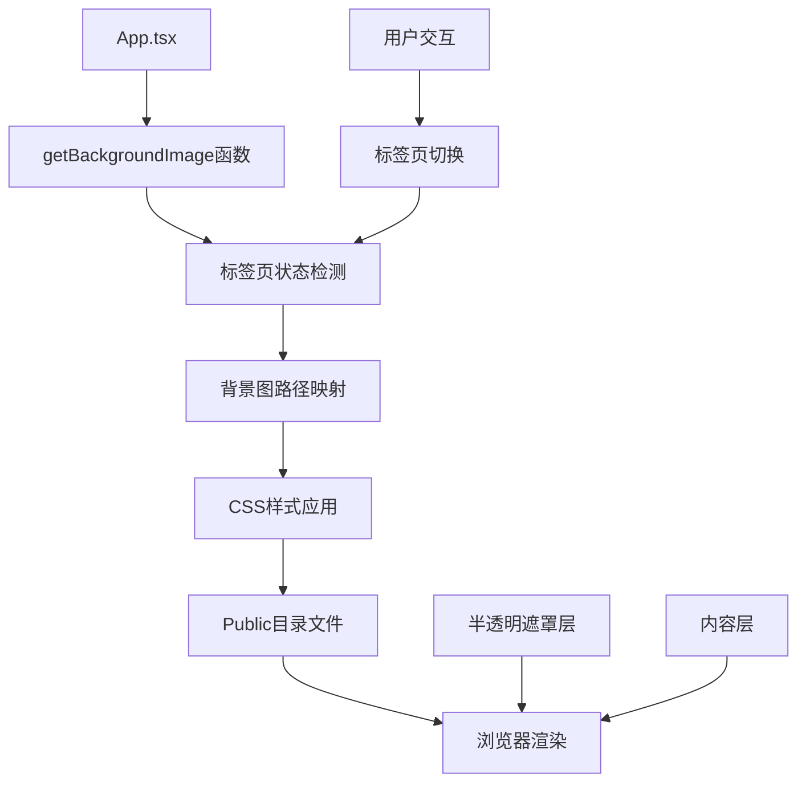

# 背景图显示问题调查设计文档

## 概述

本文档分析当前网页背景图的配置状态，调查可能的显示问题，并提供详细的修改历史记录和解决方案。

## 架构

### 背景图系统架构



### 当前配置状态

#### 1. 背景图文件映射

| 标签页 | 背景图文件 | 文件状态 |
|--------|------------|----------|
| HOME | /bg-3.png | ✅ 存在 |
| MINING | /bg-16.png | ✅ 存在 |
| BUY_TICKET | /bg-16.png | ✅ 存在 |
| TEAM | /bg-11.png | ✅ 存在 |
| SWAP | /bg-2.png | ✅ 存在 |
| HISTORY | /bg-14.png | ✅ 存在 |
| EARNINGS | /bg-14.png | ✅ 存在 |
| 默认 | /bg-11.png | ✅ 存在 |

#### 2. CSS样式配置

```typescript
style={{
  backgroundImage: `url(${getBackgroundImage()})`,
  backgroundSize: 'cover',
  backgroundPosition: currentTab === AppTab.TEAM ? '26% 100%' : 
                     currentTab === AppTab.HISTORY ? '24% 100%' : 'center',
  backgroundAttachment: 'fixed',
  backgroundRepeat: 'no-repeat'
}}
```

#### 3. 遮罩层配置

```jsx
<div className="fixed inset-0 bg-black/60 backdrop-blur-sm z-0"></div>
```

## 组件和接口

### 核心组件

#### getBackgroundImage函数

```typescript
const getBackgroundImage = () => {
  switch (currentTab) {
    case AppTab.HOME: return '/bg-3.png'
    case AppTab.MINING: return '/bg-16.png'
    case AppTab.BUY_TICKET: return '/bg-16.png'
    case AppTab.TEAM: return '/bg-11.png'
    case AppTab.SWAP: return '/bg-2.png'
    case AppTab.HISTORY: return '/bg-14.png'
    case AppTab.EARNINGS: return '/bg-14.png'
    default: return '/bg-11.png'
  }
}
```

#### 背景容器组件

```jsx
<div 
  className="min-h-screen bg-black text-white selection:bg-neon-500 selection:text-black font-sans pb-20 md:pb-8 relative overflow-x-hidden"
  style={{
    backgroundImage: `url(${getBackgroundImage()})`,
    backgroundSize:'cover',
    backgroundPosition: /* 动态位置 */,
    backgroundAttachment: 'fixed',
    backgroundRepeat: 'no-repeat'
  }}
>
```

## 数据模型

### 背景图配置模型

```typescript
interface BackgroundConfig {
  tab: AppTab;
  imagePath: string;
  position: string;
  size: string;
  attachment: string;
  repeat: string;
}

interface BackgroundImageFile {
  filename: string;
  path: string;
  exists: boolean;
  size?: number;
  lastModified?: Date;
}
```

## 问题诊断结果

### 1. 文件完整性检查

✅ **所有背景图文件都存在于public目录中**

- bg-1.png ✅
- bg-2.png ✅ (SWAP页面使用)
- bg-3.png ✅ (HOME页面使用)
- bg-10.png ✅
- bg-11.png ✅ (TEAM页面和默认使用)
- bg-12.png ✅
- bg-13.png ✅
- bg-14.png ✅ (HISTORY和EARNINGS页面使用)
- bg-15.png ✅
- bg-16.png ✅ (MINING和BUY_TICKET页面使用)

### 2. 代码配置检查

✅ **背景图配置逻辑完整且正确**

- getBackgroundImage函数正确映射所有标签页
- CSS样式属性配置完整
- 动态位置配置针对特定页面优化

### 3. 可能的显示问题原因

#### A. 遮罩层透明度过高

当前遮罩层配置：`bg-black/60` (60%透明度)

**影响**: 可能使背景图显得过暗，用户感觉"看不到"背景图

#### B. 浏览器缓存问题

**影响**: 浏览器可能缓存了旧版本的页面或资源

#### C. 网络加载问题

**影响**: 背景图文件可能加载失败或加载缓慢

#### D. CSS优先级冲突

**影响**: 其他CSS规则可能覆盖了背景图样式

## 修改历史分析

### 最近的相关修改

1. **遮罩层添加** (最可能的原因)
   ```jsx
   {/* 添加半透明遮罩层以确保内容可读性 */}
   <div className="fixed inset-0 bg-black/60 backdrop-blur-sm z-0"></div>
   ```
   
   **影响**: 这个遮罩层可能使背景图变得不够明显

2. **背景固定属性**
   ```css
   backgroundAttachment: 'fixed'
   ```
   
   **影响**: 在某些移动设备上可能导致背景图显示问题

3. **模糊效果**
   ```css
   backdrop-blur-sm
   ```
   
   **影响**: 可能进一步降低背景图的可见度

## 错误处理

### 背景图加载失败处理

```typescript
const handleBackgroundError = (imagePath: string) => {
  console.warn(`Background image failed to load: ${imagePath}`);
  // 可以添加回退背景或错误处理逻辑
};
```

### 浏览器兼容性处理

```css
/* 为不支持backdrop-filter的浏览器提供回退 */
@supports not (backdrop-filter: blur(12px)) {
  .glass-panel {
    background: rgba(0, 0, 0, 0.95);
  }
}
```

## 测试策略

### 单元测试

1. **背景图路径测试**
   - 验证getBackgroundImage函数返回正确路径
   - 测试所有标签页的背景图映射

2. **文件存在性测试**
   - 验证所有引用的背景图文件都存在
   - 检查文件路径的正确性

### 集成测试

1. **页面渲染测试**
   - 验证背景图在不同标签页正确显示
   - 测试标签页切换时背景图的变化

2. **响应式测试**
   - 测试不同屏幕尺寸下的背景图显示
   - 验证移动设备上的背景图效果

### 属性测试

**属性 1: 背景图文件完整性**
*对于任何* 标签页状态，getBackgroundImage函数返回的路径应该对应一个存在的文件
**验证: 需求 2.1, 2.2**

**属性 2: 背景图样式一致性**
*对于任何* 标签页切换，背景图的CSS属性应该保持一致的配置格式
**验证: 需求 3.1**

**属性 3: 遮罩层透明度合理性**
*对于任何* 背景图显示，遮罩层的透明度应该允许背景图可见
**验证: 需求 3.2**