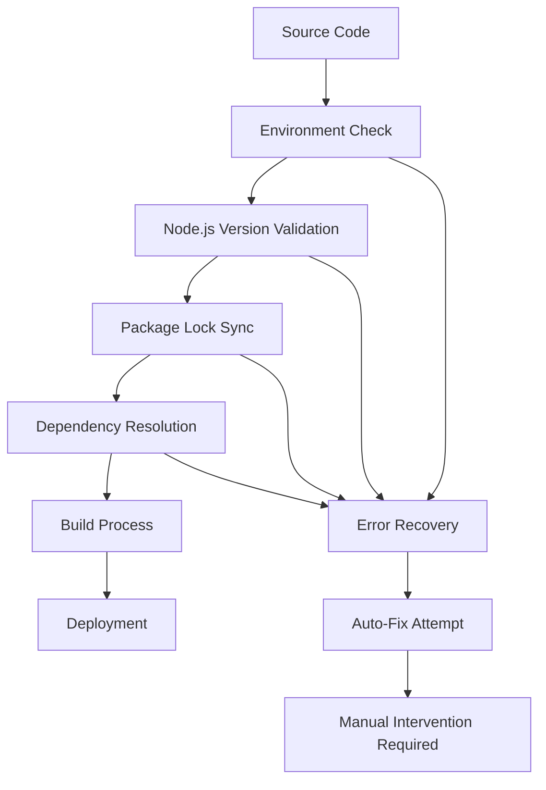

# Design Document: Build Environment Optimization

## Overview

This design addresses critical build environment issues by implementing Node.js version upgrades, package management fixes, and standardized deployment configurations. The solution focuses on resolving immediate build failures while establishing robust long-term build processes.

## Architecture

### Build Pipeline Architecture



### Component Interaction

- **Environment Validator**: Checks Node.js version and system compatibility
- **Package Synchronizer**: Ensures package.json and lock file alignment
- **Dependency Resolver**: Handles package installation and conflict resolution
- **Build Orchestrator**: Coordinates the entire build process
- **Error Handler**: Provides recovery mechanisms and clear error reporting

## Components and Interfaces

### 1. Environment Validator

**Purpose**: Validate build environment prerequisites

**Interface**:
```typescript
interface EnvironmentValidator {
  validateNodeVersion(): Promise<ValidationResult>
  checkSystemCompatibility(): Promise<CompatibilityReport>
  suggestUpgrades(): UpgradeRecommendation[]
}
```

**Implementation**:
- Check current Node.js version against requirements (≥20)
- Validate npm version compatibility
- Detect platform-specific requirements
- Generate upgrade recommendations

### 2. Package Synchronizer

**Purpose**: Synchronize package.json with package-lock.json

**Interface**:
```typescript
interface PackageSynchronizer {
  validateLockFile(): Promise<SyncStatus>
  regenerateLockFile(): Promise<void>
  resolveMissingPackages(): Promise<PackageResolution[]>
}
```

**Implementation**:
- Compare package.json dependencies with lock file entries
- Identify missing or outdated packages
- Regenerate lock file when necessary
- Preserve version constraints and resolutions

### 3. Dependency Resolver

**Purpose**: Resolve and install project dependencies

**Interface**:
```typescript
interface DependencyResolver {
  installDependencies(): Promise<InstallResult>
  resolveConflicts(): Promise<ConflictResolution[]>
  updateIncompatiblePackages(): Promise<UpdateResult>
}
```

**Implementation**:
- Use npm install instead of npm ci when lock file is out of sync
- Handle version conflicts automatically
- Update packages that require newer Node.js versions
- Maintain compatibility with existing functionality

## Data Models

### Build Configuration

```typescript
interface BuildConfig {
  nodeVersion: string
  npmVersion: string
  packageManager: 'npm' | 'yarn' | 'pnpm'
  buildCommand: string
  outputDirectory: string
  environmentVariables: Record<string, string>
}
```

### Error Context

```typescript
interface BuildError {
  type: 'NODE_VERSION' | 'PACKAGE_SYNC' | 'DEPENDENCY' | 'BUILD'
  message: string
  suggestion: string
  autoFixAvailable: boolean
  recoverySteps: string[]
}
```

## Correctness Properties

*A property is a characteristic or behavior that should hold true across all valid executions of a system-essentially, a formal statement about what the system should do. Properties serve as the bridge between human-readable specifications and machine-verifiable correctness guarantees.*

### Property Reflection

After analyzing all acceptance criteria, I identified several properties that can be consolidated:
- Node.js version validation properties (1.1, 1.4) can be combined into a comprehensive version compatibility property
- Package synchronization properties (2.1, 2.2) are closely related and can be unified
- Dependency resolution properties (3.1, 3.3) overlap in their validation approach
- Error handling properties (5.1, 5.2, 5.3) can be combined into a comprehensive error response property

### Core Properties

**Property 1: Node.js Version Compatibility**
*For any* build environment, the Node.js version should be 20 or higher and all dependencies should be compatible with the current Node.js version
**Validates: Requirements 1.1, 1.2, 1.4**

**Property 2: Package Lock File Integrity**
*For any* project with package.json and package-lock.json, all dependencies listed in package.json should have corresponding entries in the lock file
**Validates: Requirements 2.1, 2.2**

**Property 3: Automatic Lock File Recovery**
*For any* build process where packages are missing from the lock file, the system should automatically regenerate the lock file and validate its integrity
**Validates: Requirements 2.3, 2.4**

**Property 4: Complete Dependency Resolution**
*For any* project dependencies, all direct and transitive dependencies should be resolved and available before the build process begins
**Validates: Requirements 3.1, 3.3**

**Property 5: Conflict Resolution**
*For any* dependency conflicts that occur, the package manager should resolve them using compatible versions and install missing packages automatically
**Validates: Requirements 3.2, 3.4**

**Property 6: Environment Consistency**
*For any* deployment across different environments, the Node.js version and package versions should remain identical
**Validates: Requirements 4.1, 4.2, 4.3**

**Property 7: Comprehensive Error Handling**
*For any* build failure, the system should provide specific error descriptions, suggest concrete resolution steps, and attempt automatic recovery when possible
**Validates: Requirements 5.1, 5.2, 5.3, 5.4**

<function_calls>
<invoke name="prework">
<parameter name="featureName">build-environment-optimization

## Error Handling

### Error Categories

1. **Node.js Version Errors**
   - Current version too old (< 20)
   - Incompatible package engines
   - Missing Node.js installation

2. **Package Synchronization Errors**
   - Lock file out of sync with package.json
   - Missing packages in lock file
   - Corrupted lock file

3. **Dependency Resolution Errors**
   - Package not found
   - Version conflicts
   - Network connectivity issues

4. **Build Process Errors**
   - Compilation failures
   - Missing build tools
   - Insufficient permissions

### Recovery Strategies

1. **Automatic Recovery**
   - Regenerate package-lock.json when out of sync
   - Use `npm install` instead of `npm ci` when necessary
   - Update incompatible packages to compatible versions

2. **Guided Manual Recovery**
   - Provide specific upgrade commands for Node.js
   - Suggest package version fixes
   - Offer alternative dependency solutions

3. **Fallback Mechanisms**
   - Use legacy build processes when modern ones fail
   - Skip optional dependencies that cause conflicts
   - Provide minimal viable build configurations

## Testing Strategy

### Dual Testing Approach

The testing strategy combines unit tests for specific scenarios with property-based tests for comprehensive coverage:

**Unit Tests**:
- Specific Node.js version scenarios (v18, v20, v22)
- Known package conflict cases
- Common build failure patterns
- Platform-specific edge cases

**Property-Based Tests**:
- Universal properties across all build environments
- Comprehensive input coverage through randomization
- Minimum 100 iterations per property test
- Each property test references its design document property

### Property Test Configuration

Each property test must:
- Run minimum 100 iterations due to randomization
- Reference the corresponding design document property
- Use tag format: **Feature: build-environment-optimization, Property {number}: {property_text}**

### Test Coverage Areas

1. **Environment Validation Tests**
   - Node.js version detection and validation
   - System compatibility checks
   - Upgrade recommendation accuracy

2. **Package Management Tests**
   - Lock file synchronization validation
   - Dependency resolution accuracy
   - Conflict resolution effectiveness

3. **Build Process Tests**
   - End-to-end build success rates
   - Error handling and recovery
   - Cross-platform consistency

4. **Integration Tests**
   - Full deployment pipeline testing
   - Multi-environment consistency
   - Error recovery workflows

## Implementation Notes

### Immediate Actions Required

1. **Update Node.js Version**
   - Upgrade from v18.20.8 to Node.js v20 LTS or higher
   - Update deployment environments to use consistent Node.js version

2. **Fix Package Lock File**
   - Run `npm install` to regenerate package-lock.json
   - Commit updated lock file to repository
   - Ensure all environments use the same lock file

3. **Update Build Scripts**
   - Modify build commands to handle version conflicts gracefully
   - Add environment validation steps
   - Implement automatic recovery mechanisms

### Long-term Improvements

1. **Standardize Build Environment**
   - Use Docker containers for consistent environments
   - Implement version pinning for all tools
   - Add automated environment validation

2. **Enhanced Error Reporting**
   - Implement structured error logging
   - Add automated issue detection
   - Provide self-service recovery options

3. **Continuous Integration Improvements**
   - Add pre-build validation steps
   - Implement automatic dependency updates
   - Add cross-platform testing