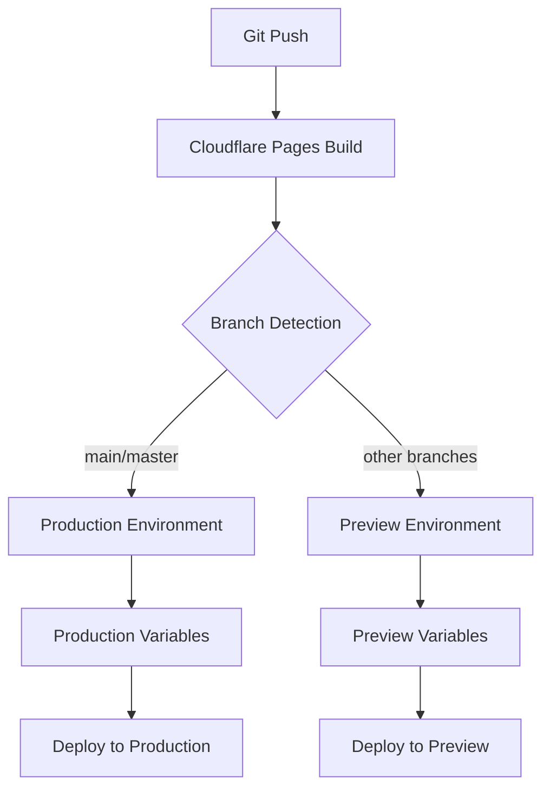

# Design Document

## Overview

This design addresses the Cloudflare Pages deployment configuration error by updating wrangler.toml files to use only supported environment names. The solution involves migrating from unsupported "staging" and "development" environments to the supported "preview" and "production" environments while preserving all functionality.

## Architecture

The fix involves updating two main configuration files:
- `wrangler.toml` (root level)
- `config/pages-wrangler.toml` (alternative configuration)

The architecture maintains the same deployment pipeline but aligns with Cloudflare Pages' supported environment model:



## Components and Interfaces

### Configuration File Structure

**Primary Configuration (wrangler.toml)**
- Base configuration with project name and compatibility settings
- Production environment with production-specific variables
- Preview environment with testing-appropriate variables
- Removed development environment (unsupported)

**Alternative Configuration (config/pages-wrangler.toml)**
- Mirror structure of primary configuration
- Consistent environment variable mapping
- Build and compatibility settings

### Environment Variable Mapping

**Current → New Mapping:**
- `staging` → `preview`
- `development` → removed (functionality merged into preview)
- `production` → `production` (unchanged)

### Variable Categories

**Build Configuration:**
- `pages_build_output_dir`: "dist"
- `compatibility_date`: "2024-01-01"
- `compatibility_flags`: ["nodejs_compat"]

**Environment-Specific Variables:**
- `DAILY_BURN_AMOUNT`: Different values per environment
- `MAX_BURN_AMOUNT`: Environment-appropriate limits
- `BURN_PERCENTAGE`: Scaled for testing vs production
- `MIN_BALANCE_THRESHOLD`: Environment-specific thresholds

## Data Models

### Environment Configuration Schema

```typescript
interface EnvironmentConfig {
  name: string;
  vars: {
    ENVIRONMENT: "production" | "preview";
    NODE_ENV: "production" | "development";
    DAILY_BURN_AMOUNT: string;
    MAX_BURN_AMOUNT: string;
    BURN_PERCENTAGE: string;
    MIN_BALANCE_THRESHOLD: string;
  };
}

interface WranglerConfig {
  name: string;
  compatibility_date: string;
  compatibility_flags: string[];
  pages_build_output_dir: string;
  env: {
    production: EnvironmentConfig;
    preview: EnvironmentConfig;
  };
}
```

## Correctness Properties

*A property is a characteristic or behavior that should hold true across all valid executions of a system-essentially, a formal statement about what the system should do. Properties serve as the bridge between human-readable specifications and machine-verifiable correctness guarantees.*

Based on the prework analysis, here are the testable correctness properties:

**Property 1: Supported Environment Names Only**
*For any* wrangler configuration file, all environment names should be either "production" or "preview"
**Validates: Requirements 1.1**

**Property 2: Staging to Preview Migration**
*For any* configuration file that previously had staging environment, it should now have preview environment with equivalent variable values
**Validates: Requirements 1.2**

**Property 3: Development Environment Removal**
*For any* wrangler configuration file, no "development" environment should be present
**Validates: Requirements 1.3**

**Property 4: Required Environment Variables Present**
*For any* supported environment (production or preview), all necessary environment variables should be present
**Validates: Requirements 1.4, 2.2**

**Property 5: Variable Value Preservation**
*For any* environment variable that existed in staging, the equivalent value should exist in preview
**Validates: Requirements 1.5, 2.3**

**Property 6: Testing-Appropriate Preview Values**
*For any* preview environment, burn amounts and thresholds should be smaller than production values
**Validates: Requirements 2.1**

**Property 7: No Sensitive Variables in Config**
*For any* configuration file, sensitive variables (PRIVATE_KEY, RPC_URL, etc.) should not be hardcoded
**Validates: Requirements 2.5**

**Property 8: Build Configuration Preservation**
*For any* updated configuration file, build-related settings should remain unchanged from the original
**Validates: Requirements 3.1, 3.2**

**Property 9: Compatibility Flags Preservation**
*For any* updated configuration file, nodejs_compat and other compatibility flags should be preserved
**Validates: Requirements 3.4**

**Property 10: Documentation Comments Present**
*For any* configuration file, explanatory comments about environment changes should be present
**Validates: Requirements 4.1**

**Property 11: Migration Documentation Present**
*For any* updated configuration, migration notes explaining the changes should be included
**Validates: Requirements 4.4**

<function_calls>
<invoke name="prework">
<parameter name="featureName">cloudflare-pages-config-fix

## Error Handling

### Configuration Validation Errors
- **Invalid Environment Names**: Detect and report unsupported environment names
- **Missing Required Variables**: Validate that all necessary environment variables are present
- **Malformed TOML**: Handle syntax errors in configuration files gracefully

### Migration Errors
- **Backup Creation**: Create backup copies of original configuration files before modification
- **Rollback Capability**: Provide ability to restore original configuration if migration fails
- **Validation Checks**: Verify configuration integrity after migration

### Deployment Errors
- **Environment Mismatch**: Handle cases where Cloudflare Pages environment doesn't match configuration
- **Variable Access**: Provide clear error messages for missing or inaccessible environment variables
- **Build Failures**: Ensure configuration errors don't break the build process

## Testing Strategy

### Dual Testing Approach
This feature will use both unit tests and property-based tests to ensure comprehensive coverage:

**Unit Tests:**
- Test specific configuration file parsing and validation
- Test environment variable migration logic
- Test error handling for malformed configurations
- Test backup and rollback functionality

**Property-Based Tests:**
- Verify universal properties across all configuration files (minimum 100 iterations)
- Test configuration validation with randomly generated valid and invalid inputs
- Verify migration consistency across different starting configurations
- Test that all supported environment combinations work correctly

### Property Test Configuration
- **Testing Framework**: Use Jest with fast-check for property-based testing
- **Minimum Iterations**: 100 per property test
- **Test Tags**: Each property test references its design document property
- **Tag Format**: **Feature: cloudflare-pages-config-fix, Property {number}: {property_text}**

### Integration Testing
- Test actual deployment to Cloudflare Pages with updated configuration
- Verify that environment variables are accessible in deployed functions
- Test that build process works with new configuration
- Validate that existing secrets remain accessible after configuration update

### Manual Testing Checklist
- Deploy to Cloudflare Pages with new configuration
- Verify environment-specific behavior in both production and preview
- Test that all existing functionality continues to work
- Validate that deployment scripts work without modification