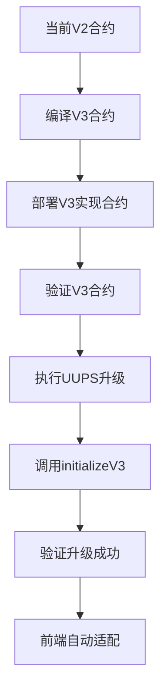

# Design Document

## Overview

本设计文档详细描述了Jinbao Protocol V2到V3的升级部署架构、流程和技术实现方案。升级将通过UUPS代理模式实现，确保数据安全和功能连续性。

## Architecture

### Current System (V2)
```
用户 → UUPS代理合约 → JinbaoProtocol(V2)
                    ↓
                存储槽布局(V2)
```

### Target System (V3)
```
用户 → UUPS代理合约 → JinbaoProtocolV3(V3)
                    ↓
                存储槽布局(V2 + V3新增)
```

### Upgrade Flow


## Components and Interfaces

### 1. 合约升级组件

#### UpgradeManager
```solidity
contract UpgradeManager {
    // 升级前数据备份
    function backupContractState() external;
    
    // 执行UUPS升级
    function upgradeToV3(address newImplementation) external;
    
    // 验证升级结果
    function verifyUpgrade() external view returns (bool);
    
    // 紧急回滚
    function emergencyRollback() external;
}
```

#### DataValidator
```solidity
contract DataValidator {
    // 验证用户数据完整性
    function validateUserData(address user) external view returns (bool);
    
    // 验证合约总资产
    function validateTotalAssets() external view returns (bool);
    
    // 验证存储布局
    function validateStorageLayout() external view returns (bool);
}
```

### 2. 部署脚本组件

#### DeploymentScript
```javascript
class DeploymentScript {
    // 部署V3实现合约
    async deployV3Implementation();
    
    // 执行升级操作
    async executeUpgrade();
    
    // 初始化V3功能
    async initializeV3Features();
    
    // 验证部署结果
    async verifyDeployment();
}
```

#### MonitoringService
```javascript
class MonitoringService {
    // 监控升级进度
    async monitorUpgradeProgress();
    
    // 检查系统健康状态
    async checkSystemHealth();
    
    // 发送告警通知
    async sendAlert(message);
}
```

### 3. 前端适配组件

#### ContractVersionDetector
```typescript
class ContractVersionDetector {
    // 检测合约版本
    async detectContractVersion(): Promise<'V2' | 'V3'>;
    
    // 检查V3功能可用性
    async checkV3Features(): Promise<boolean>;
    
    // 获取功能支持列表
    async getSupportedFeatures(): Promise<string[]>;
}
```

#### DynamicRewardsManager
```typescript
class DynamicRewardsManager {
    // 获取动态奖励数据
    async getDynamicRewards(user: string): Promise<DynamicRewardsData>;
    
    // 提取动态奖励
    async claimDynamicRewards(): Promise<TransactionResponse>;
    
    // 监听动态奖励事件
    setupEventListeners(): void;
}
```

## Data Models

### 升级状态模型
```typescript
interface UpgradeStatus {
    phase: 'preparing' | 'deploying' | 'upgrading' | 'initializing' | 'verifying' | 'completed' | 'failed';
    progress: number; // 0-100
    currentStep: string;
    startTime: number;
    estimatedCompletion: number;
    errors: string[];
}
```

### 验证结果模型
```typescript
interface ValidationResult {
    isValid: boolean;
    checkedItems: {
        userBalances: boolean;
        ticketData: boolean;
        referralChains: boolean;
        stakingRecords: boolean;
        contractAssets: boolean;
    };
    errors: string[];
    warnings: string[];
}
```

### 动态奖励数据模型
```typescript
interface DynamicRewardsData {
    totalEarned: string;
    totalClaimed: string;
    pendingAmount: string;
    claimableAmount: string;
    rewardsList: DynamicReward[];
}

interface DynamicReward {
    amount: string;
    timestamp: number;
    sourceType: 1 | 2 | 3; // 1=直推, 2=层级, 3=极差
    fromUser: string;
    claimed: boolean;
    unlockTime: number;
}
```

## Correctness Properties

*A property is a characteristic or behavior that should hold true across all valid executions of a system-essentially, a formal statement about what the system should do. Properties serve as the bridge between human-readable specifications and machine-verifiable correctness guarantees.*

### Property 1: 数据完整性保持
*For any* user address and data field, the value before upgrade should equal the value after upgrade for all V2 data fields
**Validates: Requirements 3.1, 3.2, 3.3, 3.4, 3.5**

### Property 2: 功能向后兼容
*For any* V2 function call with valid parameters, the behavior after upgrade should be identical to the behavior before upgrade
**Validates: Requirements 1.2, 4.5**

### Property 3: V3功能正确性
*For any* V3-specific function call, the result should conform to the dynamic rewards specification and return expected data structures
**Validates: Requirements 2.2, 2.3, 4.1, 4.2, 4.3**

### Property 4: 升级原子性
*For any* upgrade operation, either all changes are applied successfully or the system remains in the original V2 state
**Validates: Requirements 1.5, 6.4**

### Property 5: 前端适配自动性
*For any* user accessing the frontend after upgrade, the interface should automatically detect V3 capabilities and display appropriate features without manual intervention
**Validates: Requirements 5.1, 5.2, 5.3, 5.4, 5.5**

### Property 6: 安全性维护
*For any* upgrade operation, all security mechanisms (access control, reentrancy protection, pause functionality) should remain active and effective
**Validates: Requirements 6.1, 6.2, 6.3, 6.4, 6.5**

## Error Handling

### 升级失败处理
```typescript
class UpgradeErrorHandler {
    // 处理部署失败
    async handleDeploymentFailure(error: Error): Promise<void> {
        await this.logError(error);
        await this.notifyAdministrators(error);
        await this.initiateRollback();
    }
    
    // 处理初始化失败
    async handleInitializationFailure(error: Error): Promise<void> {
        await this.pauseContract();
        await this.investigateIssue(error);
        await this.prepareFixPlan();
    }
    
    // 处理验证失败
    async handleValidationFailure(results: ValidationResult): Promise<void> {
        await this.analyzeFailures(results.errors);
        await this.determineRollbackNecessity();
        await this.executeRecoveryPlan();
    }
}
```

### 前端错误处理
```typescript
class FrontendErrorHandler {
    // 处理合约调用失败
    async handleContractCallFailure(error: Error): Promise<void> {
        if (this.isV3NotAvailable(error)) {
            this.gracefullyDegradeToV2();
        } else {
            this.showUserFriendlyError(error);
        }
    }
    
    // 处理网络连接问题
    async handleNetworkError(error: Error): Promise<void> {
        await this.retryWithBackoff();
        this.showOfflineMode();
    }
}
```

## Testing Strategy

### 升级测试方法
1. **单元测试**: 验证V3合约的每个新功能
2. **集成测试**: 验证V2到V3的升级流程
3. **回归测试**: 确保所有V2功能在V3中正常工作
4. **性能测试**: 验证升级后的系统性能
5. **安全测试**: 验证升级过程和结果的安全性

### 测试环境策略
```typescript
interface TestEnvironment {
    name: 'local' | 'testnet' | 'staging' | 'production';
    contractAddress: string;
    testUsers: string[];
    testScenarios: TestScenario[];
}

interface TestScenario {
    name: string;
    description: string;
    steps: TestStep[];
    expectedResults: any[];
}
```

### 属性测试配置
- 每个属性测试运行最少100次迭代
- 使用随机生成的用户地址和交易数据
- 测试标签格式: **Feature: contract-v3-upgrade, Property {number}: {property_text}**

## Deployment Plan

### Phase 1: 准备阶段 (1-2小时)
1. 备份当前合约状态
2. 编译和验证V3合约
3. 准备升级脚本和监控工具
4. 通知用户即将升级

### Phase 2: 部署阶段 (30分钟)
1. 部署V3实现合约
2. 验证部署结果
3. 准备升级交易

### Phase 3: 升级阶段 (15分钟)
1. 执行UUPS升级
2. 调用initializeV3
3. 验证升级成功

### Phase 4: 验证阶段 (1小时)
1. 全面数据完整性检查
2. 功能测试验证
3. 性能监控
4. 安全审计

### Phase 5: 上线阶段 (持续)
1. 前端自动适配
2. 用户通知
3. 持续监控
4. 问题响应

## Monitoring and Alerting

### 关键指标监控
```typescript
interface MonitoringMetrics {
    // 系统健康指标
    contractBalance: string;
    totalUsers: number;
    activeStakes: number;
    
    // V3功能指标
    dynamicRewardsIssued: string;
    dynamicRewardsClaimed: string;
    v3FunctionCalls: number;
    
    // 性能指标
    averageGasUsage: number;
    transactionSuccessRate: number;
    responseTime: number;
}
```

### 告警规则
1. 合约余额异常变化 > 5%
2. V3功能调用失败率 > 1%
3. 数据完整性检查失败
4. 系统响应时间 > 10秒
5. 任何安全相关事件

## Risk Mitigation

### 技术风险
- **存储冲突**: 使用__gap确保存储布局安全
- **升级失败**: 准备完整的回滚方案
- **数据丢失**: 多重备份和验证机制

### 业务风险
- **用户体验中断**: 最小化停机时间
- **功能异常**: 全面的测试和验证
- **资产安全**: 多重签名和审计

### 运营风险
- **人为错误**: 自动化部署脚本
- **时间压力**: 充分的准备和测试时间
- **沟通问题**: 清晰的升级计划和通知