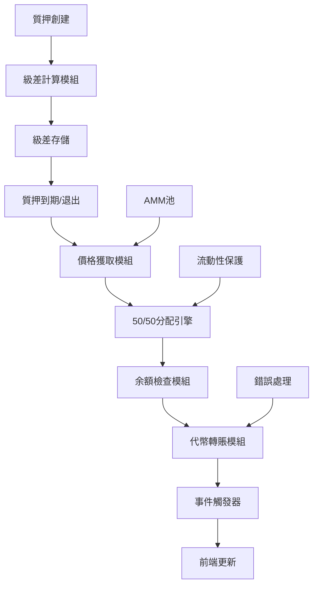

# 級差獎勵 50% MC + 50% JBC 分配機制升級設計文檔

## 概述

本設計文檔詳細描述了將現有純 MC 級差獎勵機制升級為 50% MC + 50% JBC 分配機制的實現方案。此升級將與靜態獎勵保持一致，完善雙代幣經濟模型，為用戶提供更多樣化的收益方式。

## 架構

### 系統組件



### 數據流

1. **質押創建** → **級差計算** → **總額存儲** → **質押到期** → **價格獲取** → **50/50分配** → **代幣轉賬** → **事件觸發** → **前端顯示**

## 組件和接口

### 1. 分配引擎核心接口

```solidity
interface IDifferentialRewardDistributor {
    function distributeReward(
        address user, 
        uint256 totalAmount, 
        uint8 rewardType
    ) external returns (uint256 mcAmount, uint256 jbcAmount);
    
    function calculateJBCAmount(uint256 mcValue) external view returns (uint256);
    function getCurrentJBCPrice() external view returns (uint256);
    function checkTokenBalances(uint256 mcAmount, uint256 jbcAmount) external view returns (bool, bool);
}
```

### 2. 價格計算接口

```solidity
interface IPriceCalculator {
    function getJBCPrice() external view returns (uint256);
    function isLiquiditySufficient() external view returns (bool);
    function getReserveInfo() external view returns (uint256 mcReserve, uint256 jbcReserve);
    function applyPriceProtection(uint256 rawPrice) external pure returns (uint256);
}
```

### 3. 事件定義

```solidity
event DifferentialRewardReleased(
    uint256 indexed stakeId,
    address indexed upline,
    uint256 mcAmount,
    uint256 jbcAmount,
    uint256 jbcPrice,
    uint256 timestamp
);

event ReferralRewardPaid(
    address indexed user,
    address indexed from,
    uint256 mcAmount,
    uint256 jbcAmount,
    uint8 rewardType,
    uint256 ticketId
);
```

## 數據模型

### 級差獎勵存儲結構

```solidity
struct DifferentialReward {
    uint256 totalAmount;        // 級差總額 (MC 等值)
    uint256 recordedTime;       // 記錄時間
    bool released;              // 是否已釋放
    uint256 mcReleased;         // 已釋放的 MC 數量
    uint256 jbcReleased;        // 已釋放的 JBC 數量
    uint256 releasePrice;       // 釋放時的 JBC 價格
}
```

### 分配結果結構

```solidity
struct DistributionResult {
    uint256 mcAmount;           // MC 分配數量
    uint256 jbcAmount;          // JBC 分配數量
    uint256 jbcPrice;           // 使用的 JBC 價格
    bool mcTransferred;         // MC 是否成功轉賬
    bool jbcTransferred;        // JBC 是否成功轉賬
    string errorMessage;        // 錯誤信息（如有）
}
```

## 正確性屬性

*屬性是應該在所有有效執行中保持為真的特徵或行為——本質上是關於系統應該做什麼的正式陳述。屬性作為人類可讀規範和機器可驗證正確性保證之間的橋樑。*

### 屬性 1: 50/50 分配守恆性
*對於任何* 級差獎勵總額，MC 部分應該等於總額的 50%，JBC 部分的價值也應該等於總額的 50%
**驗證需求**: 1.1, 1.2

### 屬性 2: JBC 數量計算正確性
*對於任何* 獎勵總額和 JBC 價格，計算出的 JBC 數量應該等於 (總額 ÷ 2) ÷ JBC價格
**驗證需求**: 1.3, 2.1

### 屬性 3: 價格計算一致性
*對於任何* AMM 池狀態，JBC 價格應該等於 (swapReserveMC × 1e18) ÷ swapReserveJBC
**驗證需求**: 2.1, 2.5

### 屬性 4: 代幣轉賬完整性
*對於任何* 成功的分配操作，用戶應該同時收到 MC 和 JBC 代幣（除非余額不足）
**驗證需求**: 1.5, 4.1, 4.2

### 屬性 5: 時間機制正確性
*對於任何* 質押，級差獎勵應該在質押創建時計算存儲，在質押到期時使用當前價格分配
**驗證需求**: 3.1, 3.2, 3.3

### 屬性 6: 余額檢查安全性
*對於任何* 分配請求，系統應該檢查合約余額，並在余額不足時進行適當的部分轉賬處理
**驗證需求**: 4.1, 4.2, 4.3, 4.4, 4.5

### 屬性 7: 事件觸發完整性
*對於任何* 成功的級差獎勵分配，系統應該觸發包含正確參數的 DifferentialRewardReleased 事件
**驗證需求**: 3.4, 5.1, 5.3

### 屬性 8: 數據記錄準確性
*對於任何* 分配操作，系統應該準確記錄 MC 和 JBC 數量以及相關的價格信息
**驗證需求**: 3.5, 5.4

### 屬性 9: 向後兼容性保持
*對於任何* 現有的級差獎勵記錄，升級後系統應該保持數據完整性並正確識別記錄類型
**驗證需求**: 7.1, 7.2, 7.4

### 屬性 10: 經濟安全性約束
*對於任何* JBC 分配，系統應該確保不超過合約的 JBC 儲備限制
**驗證需求**: 8.1

## 錯誤處理

### 價格計算異常
- **場景**: AMM 池儲備為 0 或價格計算溢出
- **處理**: 使用 1:1 默認比例，記錄異常日誌
- **恢復**: 等待流動性恢復，重新計算價格

### 代幣余額不足
- **場景**: 合約 MC 或 JBC 余額不足以完成分配
- **處理**: 部分轉賬可用余額，記錄未完成部分
- **恢復**: 管理員補充代幣余額，處理待分配獎勵

### 流動性保護觸發
- **場景**: AMM 池流動性低於安全閾值
- **處理**: 啟用保護機制，限制大額分配
- **恢復**: 等待流動性改善，逐步恢復正常分配

### 事件觸發失敗
- **場景**: 區塊鏈網絡擁堵導致事件觸發失敗
- **處理**: 重試機制，本地日誌備份
- **恢復**: 網絡恢復後補發事件

## 測試策略

### 單元測試
- 50/50 分配計算函數的精度測試
- JBC 價格計算的邊界值測試
- 余額檢查和部分轉賬邏輯測試
- 事件參數和日誌記錄測試

### 屬性測試
- 使用隨機獎勵總額驗證 50/50 分配守恆性
- 測試 JBC 數量計算在各種價格下的正確性
- 驗證代幣轉賬的完整性和安全性
- 測試時間機制在不同場景下的正確性

### 集成測試
- 完整的級差獎勵分配流程測試
- AMM 池價格變化對分配的影響測試
- 前端顯示與後端數據的一致性測試
- 向後兼容性和數據遷移測試

### 邊界測試
- 極端價格情況（接近 0 或極大值）
- 極小和極大獎勵金額的處理
- 合約余額為 0 的情況
- 流動性池枯竭的情況

## 部署策略

### 階段 1: 合約升級準備
1. 部署新的分配引擎合約
2. 更新價格計算邏輯
3. 添加新的事件定義
4. 測試基本分配功能

### 階段 2: 數據結構遷移
1. 更新級差獎勵存儲結構
2. 遷移現有級差獎勵記錄
3. 驗證數據完整性
4. 測試新舊記錄兼容性

### 階段 3: 前端適配
1. 更新級差獎勵顯示組件
2. 添加 50/50 分配標識
3. 實現價值計算和匯率顯示
4. 測試用戶界面更新

### 階段 4: 全面啟用
1. 啟用新的 50/50 分配機制
2. 監控分配操作和代幣余額
3. 收集用戶反饋和使用數據
4. 優化性能和用戶體驗

## 監控和維護

### 關鍵指標
- 50/50 分配的執行成功率
- JBC 價格計算的準確性
- 代幣余額充足性
- 分配延遲和失敗率
- 用戶滿意度和反饋

### 告警機制
- JBC 價格異常波動告警
- 合約代幣余額不足告警
- 分配失敗率超閾值告警
- AMM 池流動性不足告警
- 系統性能下降告警

### 維護任務
- 定期檢查代幣余額和補充
- 監控 AMM 池流動性狀況
- 優化價格計算和分配性能
- 更新前端顯示和用戶體驗
- 分析分配數據和經濟影響

## 風險評估

### 技術風險
- **價格操縱風險**: 通過大額交易影響 JBC 價格
- **緩解措施**: 實施價格保護機制，設置合理的滑點限制

### 經濟風險
- **代幣通脹風險**: JBC 分配增加可能導致通脹壓力
- **緩解措施**: 監控分配量，必要時調整分配比例

### 操作風險
- **余額管理風險**: 合約代幣余額不足影響分配
- **緩解措施**: 自動監控和告警，及時補充余額

### 用戶體驗風險
- **理解困難風險**: 用戶可能不理解新的分配機制
- **緩解措施**: 提供清晰的說明和教育材料

## 成功指標

### 功能指標
- 50/50 分配準確率 > 99.9%
- 價格計算延遲 < 100ms
- 分配成功率 > 99.5%
- 事件觸發成功率 > 99.8%

### 業務指標
- 用戶對新機制的接受度 > 80%
- 級差獎勵參與度提升 > 20%
- 代幣持有多樣性改善
- 生態系統活躍度增長

### 技術指標
- 系統可用性 > 99.9%
- 響應時間 < 2 秒
- 錯誤率 < 0.1%
- 數據一致性 100%