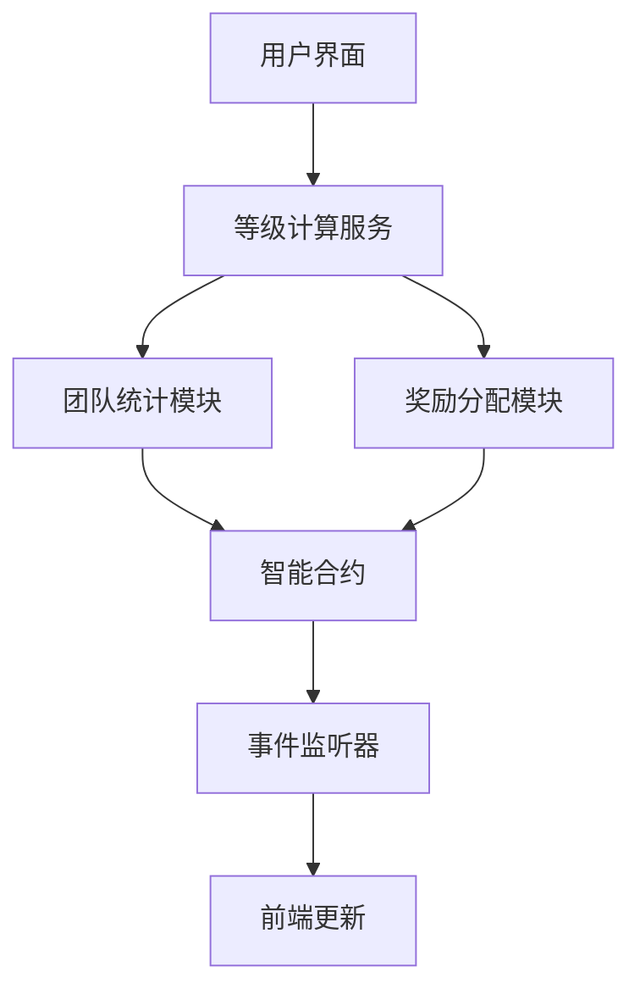

# 极差裂变机制更新设计文档

## 概述

本设计文档详细描述了极差裂变机制V1至V9等级要求和收益比例的更新实现方案。更新将优化团队激励机制，提供更合理的等级划分和奖励分配。

## 架构

### 系统组件



### 数据流

1. **团队地址统计** → **等级计算** → **收益比例确定** → **奖励分配** → **前端显示**

## 组件和接口

### 1. 等级配置常量

```solidity
// 新的V等级配置
struct VLevelConfig {
    uint256 requiredAddresses;  // 所需地址数
    uint256 rewardPercentage;   // 收益比例 (基点，如500表示5%)
}

mapping(uint8 => VLevelConfig) public vLevelConfigs;
```

### 2. 等级计算接口

```solidity
interface ILevelCalculator {
    function calculateUserLevel(address user) external view returns (uint8);
    function getRequiredAddresses(uint8 level) external view returns (uint256);
    function getRewardPercentage(uint8 level) external view returns (uint256);
    function updateUserLevel(address user) external;
}
```

### 3. 团队统计接口

```solidity
interface ITeamStats {
    function getTeamAddressCount(address user) external view returns (uint256);
    function updateTeamStats(address user) external;
    function getDirectReferrals(address user) external view returns (address[] memory);
}
```

## 数据模型

### V等级配置表

| 等级 | 地址数要求 | 收益比例 | 基点值 |
|------|------------|----------|--------|
| V1   | 10         | 5%       | 500    |
| V2   | 30         | 10%      | 1000   |
| V3   | 100        | 15%      | 1500   |
| V4   | 300        | 20%      | 2000   |
| V5   | 1000       | 25%      | 2500   |
| V6   | 3000       | 30%      | 3000   |
| V7   | 10000      | 35%      | 3500   |
| V8   | 30000      | 40%      | 4000   |
| V9   | 100000     | 45%      | 4500   |

### 用户等级数据结构

```solidity
struct UserLevel {
    uint8 currentLevel;          // 当前V等级
    uint256 teamAddressCount;    // 团队地址数
    uint256 lastUpdateTime;      // 最后更新时间
    uint256 rewardPercentage;    // 当前收益比例
}
```

## 正确性属性

*属性是应该在所有有效执行中保持为真的特征或行为——本质上是关于系统应该做什么的正式陈述。属性作为人类可读规范和机器可验证正确性保证之间的桥梁。*

### 属性 1: 等级计算一致性
*对于任何* 用户地址和团队地址数，计算出的V等级应该与配置表中的要求完全匹配
**验证需求**: 1.1-1.9, 3.1-3.2

### 属性 2: 收益比例正确性
*对于任何* V等级，分配的收益比例应该等于配置表中该等级对应的比例
**验证需求**: 2.1-2.9, 5.1-5.2

### 属性 3: 等级单调性
*对于任何* 用户，当团队地址数增加时，V等级应该保持不变或增加，不应该降低
**验证需求**: 3.1-3.4

### 属性 4: 奖励分配守恒
*对于任何* 奖励分配操作，分配给所有用户的奖励总和应该等于可分配的奖励池总额
**验证需求**: 5.3-5.5

### 属性 5: 数据迁移完整性
*对于任何* 现有用户，迁移后的V等级应该基于其当前团队地址数和新的等级要求正确计算
**验证需求**: 6.1-6.5

## 错误处理

### 等级计算错误
- **场景**: 团队地址数统计异常
- **处理**: 使用缓存数据，记录错误日志，触发重新统计
- **恢复**: 定期验证和修复数据不一致

### 奖励分配错误
- **场景**: 收益比例计算溢出或精度丢失
- **处理**: 使用安全数学库，设置合理的精度范围
- **恢复**: 回滚错误分配，重新计算

### 数据迁移错误
- **场景**: 迁移过程中数据不一致
- **处理**: 分批迁移，每批验证，支持回滚
- **恢复**: 提供手动修复工具

## 测试策略

### 单元测试
- 等级计算函数的边界值测试
- 收益比例计算的精度测试
- 团队统计功能的准确性测试

### 属性测试
- 使用随机生成的团队地址数验证等级计算一致性
- 测试奖励分配的守恒性质
- 验证等级单调性在各种场景下的保持

### 集成测试
- 完整的等级更新流程测试
- 奖励分配端到端测试
- 前端显示与后端数据的一致性测试

### 性能测试
- 大量用户等级计算的性能测试
- 奖励分配在高并发下的表现
- 数据迁移的时间和资源消耗测试

## 部署策略

### 阶段1: 合约更新
1. 部署新的等级配置
2. 更新等级计算逻辑
3. 测试基本功能

### 阶段2: 数据迁移
1. 备份现有用户数据
2. 分批迁移用户等级
3. 验证迁移结果

### 阶段3: 前端更新
1. 更新等级显示组件
2. 更新奖励计算显示
3. 测试用户界面

### 阶段4: 全面启用
1. 启用新的奖励分配逻辑
2. 监控系统运行状态
3. 收集用户反馈

## 监控和维护

### 关键指标
- 各V等级用户分布
- 奖励分配准确性
- 等级计算性能
- 用户等级变化频率

### 告警机制
- 等级计算异常告警
- 奖励分配失败告警
- 数据不一致告警
- 性能下降告警

### 维护任务
- 定期验证等级计算准确性
- 监控奖励分配总额
- 优化团队统计性能
- 更新前端显示逻辑