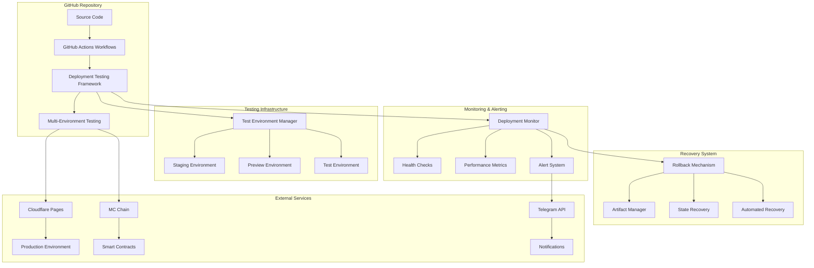
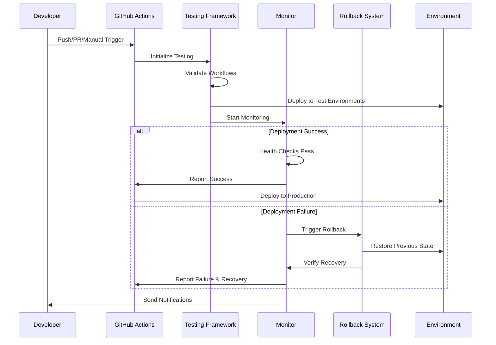

# Design Document: GitHub Deployment Testing System

## Overview

This design outlines a comprehensive GitHub deployment testing system for the Jinbao Protocol. The system enhances the existing GitHub Actions workflows (production deployment, daily token burn, and auto-commit) with robust testing, monitoring, rollback capabilities, and performance optimization. The solution provides automated validation, real-time monitoring, and intelligent recovery mechanisms to ensure reliable deployment operations.

## Architecture

### High-Level Architecture



### Component Interaction Flow



## Components and Interfaces

### 1. Deployment Testing Framework

**Purpose**: Validates GitHub Actions workflows and deployment processes before production execution.

**Core Components**:
- **Workflow Validator**: Validates YAML syntax, required secrets, and environment variables
- **Configuration Tester**: Tests deployment configurations across different environments
- **Dependency Checker**: Verifies all required dependencies and external services
- **Security Scanner**: Scans for security vulnerabilities and compliance issues

**Interface**:
```typescript
interface DeploymentTestFramework {
  validateWorkflow(workflowPath: string): ValidationResult;
  testConfiguration(environment: Environment): TestResult;
  checkDependencies(): DependencyStatus[];
  scanSecurity(): SecurityReport;
  generateTestReport(): TestReport;
}

interface ValidationResult {
  isValid: boolean;
  errors: ValidationError[];
  warnings: ValidationWarning[];
  recommendations: string[];
}
```

### 2. Multi-Environment Testing System

**Purpose**: Manages deployment testing across staging, preview, and test environments.

**Core Components**:
- **Environment Manager**: Provisions and manages test environments
- **Parallel Deployment Engine**: Executes deployments in parallel across environments
- **Configuration Synchronizer**: Ensures environment-specific configurations are properly applied
- **Result Aggregator**: Collects and compares results across environments

**Interface**:
```typescript
interface MultiEnvironmentTester {
  provisionEnvironment(config: EnvironmentConfig): Environment;
  deployToEnvironments(environments: Environment[]): DeploymentResult[];
  compareResults(results: DeploymentResult[]): ComparisonReport;
  cleanupEnvironments(environments: Environment[]): void;
}

interface Environment {
  name: string;
  type: 'staging' | 'preview' | 'test';
  config: EnvironmentConfig;
  status: 'provisioning' | 'ready' | 'deploying' | 'deployed' | 'failed';
}
```

### 3. Deployment Monitor

**Purpose**: Provides real-time monitoring of deployment processes and system health.

**Core Components**:
- **Progress Tracker**: Monitors deployment pipeline stages
- **Health Check Engine**: Performs comprehensive health checks on deployed services
- **Metrics Collector**: Gathers performance and operational metrics
- **Alert Manager**: Manages notifications and escalation procedures

**Interface**:
```typescript
interface DeploymentMonitor {
  trackProgress(deploymentId: string): ProgressStatus;
  performHealthChecks(environment: Environment): HealthStatus;
  collectMetrics(timeRange: TimeRange): MetricData[];
  sendAlert(alert: Alert): void;
  generateDashboard(): DashboardData;
}

interface HealthStatus {
  overall: 'healthy' | 'degraded' | 'unhealthy';
  services: ServiceHealth[];
  timestamp: Date;
  details: HealthDetail[];
}
```

### 4. Rollback and Recovery System

**Purpose**: Provides automated rollback capabilities and recovery mechanisms.

**Core Components**:
- **State Manager**: Maintains snapshots of deployment states
- **Rollback Engine**: Executes rollback procedures
- **Recovery Validator**: Verifies successful recovery operations
- **Artifact Manager**: Manages deployment artifacts and versions

**Interface**:
```typescript
interface RollbackSystem {
  createSnapshot(environment: Environment): Snapshot;
  executeRollback(targetSnapshot: Snapshot): RollbackResult;
  validateRecovery(environment: Environment): ValidationResult;
  manageArtifacts(operation: ArtifactOperation): void;
}

interface Snapshot {
  id: string;
  environment: string;
  timestamp: Date;
  artifacts: Artifact[];
  configuration: EnvironmentConfig;
  healthStatus: HealthStatus;
}
```

### 5. Performance Optimization Engine

**Purpose**: Optimizes deployment performance through intelligent caching and parallel processing.

**Core Components**:
- **Cache Manager**: Implements intelligent caching strategies for build artifacts
- **Parallel Processor**: Manages parallel execution of independent tasks
- **Change Detector**: Identifies changes to skip unnecessary operations
- **Performance Analyzer**: Analyzes and reports on deployment performance

**Interface**:
```typescript
interface PerformanceOptimizer {
  optimizeCache(buildContext: BuildContext): CacheStrategy;
  parallelizeExecution(tasks: Task[]): ExecutionPlan;
  detectChanges(currentState: State, previousState: State): ChangeSet;
  analyzePerformance(deploymentId: string): PerformanceReport;
}
```

## Data Models

### Deployment Configuration

```typescript
interface DeploymentConfig {
  id: string;
  name: string;
  environment: Environment;
  workflows: WorkflowConfig[];
  secrets: SecretConfig[];
  variables: VariableConfig[];
  healthChecks: HealthCheckConfig[];
  rollbackConfig: RollbackConfig;
}

interface WorkflowConfig {
  name: string;
  path: string;
  triggers: TriggerConfig[];
  jobs: JobConfig[];
  dependencies: string[];
}
```

### Monitoring Data

```typescript
interface MonitoringData {
  deploymentId: string;
  timestamp: Date;
  stage: DeploymentStage;
  status: DeploymentStatus;
  metrics: Metric[];
  logs: LogEntry[];
  alerts: Alert[];
}

interface Metric {
  name: string;
  value: number;
  unit: string;
  timestamp: Date;
  tags: Record<string, string>;
}
```

### Test Results

```typescript
interface TestResult {
  testId: string;
  testName: string;
  status: 'passed' | 'failed' | 'skipped';
  duration: number;
  environment: string;
  details: TestDetail[];
  artifacts: string[];
}

interface TestDetail {
  step: string;
  status: 'passed' | 'failed';
  message?: string;
  data?: any;
}
```

## Correctness Properties

*A property is a characteristic or behavior that should hold true across all valid executions of a system-essentially, a formal statement about what the system should do. Properties serve as the bridge between human-readable specifications and machine-verifiable correctness guarantees.*

Now I'll analyze the acceptance criteria to determine which ones are testable as properties.

### Converting EARS to Properties

Based on the prework analysis, I'll convert the testable acceptance criteria into universally quantified properties, eliminating redundancy where possible:

**Property 1: Configuration Validation Completeness**
*For any* deployment configuration (workflows, secrets, environment variables), the validation system should verify all required elements are present and properly formatted, providing detailed error reports with remediation steps when validation fails.
**Validates: Requirements 1.1, 1.4, 4.2**

**Property 2: Test Environment Production Fidelity**
*For any* production configuration, test environments should simulate the same conditions and characteristics, ensuring deployment behavior consistency across environments.
**Validates: Requirements 1.2**

**Property 3: Comprehensive Test Reporting**
*For any* completed test execution, a comprehensive report should be generated containing pass/fail status, execution details, and all relevant test artifacts.
**Validates: Requirements 1.5**

**Property 4: Deployment Progress Tracking**
*For any* deployment operation, the monitoring system should track progress through all defined pipeline stages and maintain complete deployment history with timestamps and metrics.
**Validates: Requirements 2.1, 2.4**

**Property 5: Comprehensive Alerting System**
*For any* deployment failure or threshold violation, the monitoring system should send immediate notifications through all configured channels and trigger appropriate automated responses.
**Validates: Requirements 2.2, 2.5**

**Property 6: Post-Deployment Health Verification**
*For any* successful deployment, all services should be verified as healthy and accessible before marking the deployment as complete.
**Validates: Requirements 2.3**

**Property 7: Automatic Rollback on Failure**
*For any* detected deployment failure, the rollback mechanism should automatically revert to the last known good state while preserving artifacts for analysis.
**Validates: Requirements 3.1, 3.4**

**Property 8: Rollback Performance and Verification**
*For any* rollback operation (manual or automatic), the system should complete restoration within 5 minutes, verify system functionality, create detailed logs, and notify stakeholders.
**Validates: Requirements 3.2, 3.3, 3.5**

**Property 9: Multi-Environment Deployment Consistency**
*For any* multi-environment test execution, deployments should occur to all specified environments (staging, preview, test) and results should be compared to identify discrepancies.
**Validates: Requirements 4.1, 4.3**

**Property 10: Parallel Processing Optimization**
*For any* set of independent tasks or environments, the system should execute operations in parallel to reduce overall execution time when optimization is enabled.
**Validates: Requirements 4.4, 5.1**

**Property 11: Approval Gate Management**
*For any* environment test execution, approval gates should be provided for production deployment only when all environment tests pass successfully.
**Validates: Requirements 4.5**

**Property 12: Intelligent Caching and Change Detection**
*For any* build artifacts and deployment steps, the system should implement intelligent caching strategies and skip unnecessary operations based on change detection.
**Validates: Requirements 5.2, 5.3**

**Property 13: Deployment Performance Requirements**
*For any* typical deployment changes, full deployment operations should complete within 10 minutes and performance metrics should identify bottlenecks with optimization suggestions.
**Validates: Requirements 5.4, 5.5**

**Property 14: Security Scanning Completeness**
*For any* deployment execution, all code, dependencies, and smart contracts should be scanned for vulnerabilities with security and gas optimization verification.
**Validates: Requirements 6.1, 6.2**

**Property 15: Secret Management and Compliance**
*For any* use of secrets or security policies, the system should ensure proper secret management, rotation, and compliance with regulatory requirements.
**Validates: Requirements 6.3, 6.4**

**Property 16: Security Violation Response**
*For any* detected security violations, deployment should be blocked immediately and security teams should be alerted through all configured channels.
**Validates: Requirements 6.5**

**Property 17: Comprehensive Documentation and Reporting**
*For any* deployment completion or issue occurrence, the system should generate detailed reports, incident analysis, and maintain real-time dashboard metrics.
**Validates: Requirements 7.1, 7.4, 7.5**

**Property 18: Pattern Analysis and Audit Trails**
*For any* deployment pattern analysis or compliance audit request, the system should provide insights, recommendations, and complete audit trails.
**Validates: Requirements 7.2, 7.3**

## Error Handling

### Error Categories and Responses

**1. Configuration Errors**
- Invalid workflow YAML syntax
- Missing required secrets or environment variables
- Incompatible environment configurations
- **Response**: Block deployment, provide detailed error messages with remediation steps

**2. Deployment Failures**
- Build failures during compilation
- Test failures during validation
- Service health check failures
- **Response**: Trigger automatic rollback, preserve artifacts, notify stakeholders

**3. Infrastructure Errors**
- Environment provisioning failures
- Network connectivity issues
- External service unavailability
- **Response**: Retry with exponential backoff, fallback to alternative resources

**4. Security Violations**
- Vulnerability detection in code or dependencies
- Secret management policy violations
- Compliance requirement failures
- **Response**: Block deployment immediately, alert security teams, create incident reports

**5. Performance Issues**
- Deployment timeout exceeded
- Resource utilization thresholds breached
- Service response time degradation
- **Response**: Trigger performance optimization, scale resources if needed, alert operations team

### Error Recovery Strategies

```typescript
interface ErrorRecoveryStrategy {
  errorType: ErrorType;
  retryPolicy: RetryPolicy;
  fallbackActions: FallbackAction[];
  escalationProcedure: EscalationProcedure;
  notificationChannels: NotificationChannel[];
}

interface RetryPolicy {
  maxAttempts: number;
  backoffStrategy: 'exponential' | 'linear' | 'fixed';
  baseDelay: number;
  maxDelay: number;
}
```

## Testing Strategy

### Dual Testing Approach

The system implements both unit testing and property-based testing to ensure comprehensive coverage:

**Unit Tests**: Focus on specific examples, edge cases, and error conditions
- Test specific workflow configurations and validation scenarios
- Verify error handling for known failure cases
- Test integration points between components
- Validate specific deployment scenarios and rollback procedures

**Property-Based Tests**: Verify universal properties across all inputs
- Generate random deployment configurations and verify validation behavior
- Test monitoring and alerting across various failure scenarios
- Verify rollback mechanisms with different system states
- Test performance optimization across various workload patterns

### Property-Based Testing Configuration

**Testing Framework**: GitHub Actions with custom property testing library
**Minimum Iterations**: 100 per property test
**Test Tagging Format**: **Feature: github-deployment-testing, Property {number}: {property_text}**

### Test Categories

**1. Configuration Validation Tests**
- Property tests for workflow validation across random configurations
- Unit tests for specific YAML syntax errors and secret validation
- Integration tests for multi-environment configuration consistency

**2. Deployment Process Tests**
- Property tests for deployment monitoring across various scenarios
- Unit tests for specific deployment failure cases
- End-to-end tests for complete deployment workflows

**3. Rollback and Recovery Tests**
- Property tests for rollback mechanisms across different failure states
- Unit tests for specific rollback scenarios and artifact preservation
- Performance tests for rollback completion time requirements

**4. Security and Compliance Tests**
- Property tests for security scanning across various codebases
- Unit tests for specific vulnerability detection scenarios
- Compliance tests for regulatory requirement validation

**5. Performance and Optimization Tests**
- Property tests for caching and parallel processing optimization
- Unit tests for specific performance bottleneck scenarios
- Load tests for deployment performance under various conditions

### Test Environment Management

**Test Isolation**: Each test run uses isolated environments to prevent interference
**Resource Management**: Automatic cleanup of test resources after completion
**Data Management**: Test data generation and cleanup procedures
**Parallel Execution**: Tests run in parallel where possible to reduce execution time

### Continuous Testing Integration

**Pre-commit Hooks**: Run basic validation tests before code commits
**Pull Request Testing**: Execute comprehensive test suite on all pull requests
**Scheduled Testing**: Run extended test suites on regular schedules
**Production Monitoring**: Continuous validation of production deployment health

The testing strategy ensures that both specific scenarios and universal properties are thoroughly validated, providing confidence in the deployment system's reliability and correctness.