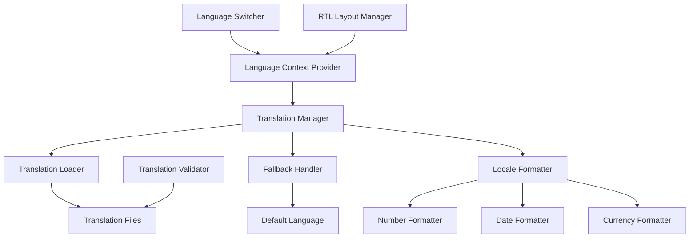

# Internationalization Enhancement Design

## Overview

This design document outlines the comprehensive enhancement of the existing internationalization (i18n) system for the JBC RWA DeFi 4.0 protocol application. The current system has a solid foundation with support for 8 languages but lacks complete translation coverage, proper language switching UI, and advanced features like RTL support and locale-specific formatting.

## Architecture

### Current System Analysis

**Strengths:**
- Well-structured translation object hierarchy
- React Context-based language management
- Type-safe translation access via `useLanguage` hook
- Support for 8 languages: zh, en, zh-TW, ja, ko, ar, ru, es

**Weaknesses:**
- Incomplete translations (many languages missing keys)
- Basic language switcher (only toggles between zh/en)
- No RTL support for Arabic
- Missing admin panel translations
- No locale-specific number/date formatting
- No translation validation or fallback system

### Enhanced Architecture



## Components and Interfaces

### 1. Enhanced Language Context

```typescript
interface LanguageContextType {
  language: Language;
  setLanguage: (lang: Language) => void;
  t: TranslationFunction;
  isRTL: boolean;
  formatNumber: (num: number) => string;
  formatCurrency: (amount: number, currency: string) => string;
  formatDate: (date: Date) => string;
}

interface TranslationFunction {
  (key: string, params?: Record<string, string | number>): string;
  [key: string]: any; // For nested access like t.nav.home
}
```

### 2. Language Switcher Component

```typescript
interface LanguageSwitcherProps {
  variant?: 'dropdown' | 'toggle' | 'menu';
  showFlags?: boolean;
  showNativeNames?: boolean;
}

interface LanguageOption {
  code: Language;
  name: string;
  nativeName: string;
  flag: string;
  rtl: boolean;
}
```

### 3. Translation Validation System

```typescript
interface TranslationValidator {
  validateCompleteness(): ValidationResult;
  findMissingKeys(): MissingKeyReport;
  validateParameterUsage(): ParameterValidationResult;
}

interface ValidationResult {
  isValid: boolean;
  errors: ValidationError[];
  warnings: ValidationWarning[];
}
```

### 4. RTL Layout Manager

```typescript
interface RTLLayoutManager {
  isRTL: boolean;
  getLayoutDirection(): 'ltr' | 'rtl';
  getTextAlign(): 'left' | 'right';
  getFlexDirection(): 'row' | 'row-reverse';
}
```

## Data Models

### Enhanced Translation Structure

```typescript
interface TranslationObject {
  // Navigation
  nav: {
    home: string;
    mining: string;
    team: string;
    swap: string;
    history: string;
    earnings: string;
    connect: string;
    connected: string;
  };
  
  // Admin Panel (NEW)
  admin: {
    title: string;
    subtitle: string;
    levelRewardPool: {
      title: string;
      description: string;
      currentBalance: string;
      manage: string;
    };
    superAdmin: {
      title: string;
      description: string;
      newOwnerAddress: string;
      transferOwnership: string;
      warning: string;
    };
    // ... existing admin translations
  };
  
  // Common UI Elements (NEW)
  common: {
    loading: string;
    error: string;
    success: string;
    cancel: string;
    confirm: string;
    save: string;
    edit: string;
    delete: string;
    copy: string;
    copied: string;
  };
  
  // Error Messages (NEW)
  errors: {
    networkError: string;
    transactionFailed: string;
    insufficientBalance: string;
    invalidAddress: string;
    contractError: string;
    unknownError: string;
  };
  
  // Existing sections...
  stats: { /* ... */ };
  mining: { /* ... */ };
  team: { /* ... */ };
  swap: { /* ... */ };
  history: { /* ... */ };
  earnings: { /* ... */ };
}
```

### Language Configuration

```typescript
interface LanguageConfig {
  code: Language;
  name: string;
  nativeName: string;
  flag: string;
  rtl: boolean;
  dateFormat: string;
  numberFormat: {
    decimal: string;
    thousands: string;
  };
  currencyFormat: {
    symbol: string;
    position: 'before' | 'after';
  };
}

const LANGUAGE_CONFIGS: Record<Language, LanguageConfig> = {
  zh: {
    code: 'zh',
    name: 'Chinese',
    nativeName: '中文',
    flag: '🇨🇳',
    rtl: false,
    dateFormat: 'YYYY-MM-DD',
    numberFormat: { decimal: '.', thousands: ',' },
    currencyFormat: { symbol: '¥', position: 'before' }
  },
  en: {
    code: 'en',
    name: 'English',
    nativeName: 'English',
    flag: '🇺🇸',
    rtl: false,
    dateFormat: 'MM/DD/YYYY',
    numberFormat: { decimal: '.', thousands: ',' },
    currencyFormat: { symbol: '$', position: 'before' }
  },
  ar: {
    code: 'ar',
    name: 'Arabic',
    nativeName: 'العربية',
    flag: '🇸🇦',
    rtl: true,
    dateFormat: 'DD/MM/YYYY',
    numberFormat: { decimal: '٫', thousands: '٬' },
    currencyFormat: { symbol: 'ر.س', position: 'after' }
  },
  // ... other languages
};
```

## Correctness Properties

*A property is a characteristic or behavior that should hold true across all valid executions of a system-essentially, a formal statement about what the system should do. Properties serve as the bridge between human-readable specifications and machine-verifiable correctness guarantees.*

### Property 1: Translation Completeness
*For any* supported language and any translation key used in the application, the translation system should either return a valid translation or fall back to the default language
**Validates: Requirements 1.2, 1.4**

### Property 2: Language Persistence
*For any* language selection made by a user, the system should persist this choice and restore it on subsequent visits
**Validates: Requirements 2.4, 2.5**

### Property 3: RTL Layout Consistency
*For any* RTL language selection, all UI components should consistently apply right-to-left layout rules
**Validates: Requirements 4.1, 4.2, 4.3**

### Property 4: Translation Key Validation
*For any* translation key referenced in the code, the key should exist in all supported language files
**Validates: Requirements 5.1, 5.2**

### Property 5: Locale Formatting Consistency
*For any* numeric value displayed in the UI, the formatting should match the selected locale's conventions
**Validates: Requirements 7.1, 7.2, 7.3**

### Property 6: Error Message Localization
*For any* error condition that occurs, the error message should be displayed in the user's selected language
**Validates: Requirements 8.1, 8.2, 8.4**

### Property 7: Language Switcher Functionality
*For any* language available in the system, the language switcher should allow selection and immediate application
**Validates: Requirements 2.1, 2.2, 2.3**

### Property 8: Admin Panel Translation Coverage
*For any* admin panel interface element, the text should be properly translated in all supported languages
**Validates: Requirements 3.1, 3.2, 3.3**

## Error Handling

### Translation Missing Fallback
```typescript
function getTranslation(key: string, language: Language): string {
  const translation = translations[language]?.[key];
  if (translation) return translation;
  
  // Fallback to default language (Chinese)
  const fallback = translations.zh[key];
  if (fallback) {
    console.warn(`Translation missing for key "${key}" in language "${language}"`);
    return fallback;
  }
  
  // Last resort: return key itself
  console.error(`Translation missing for key "${key}" in all languages`);
  return key;
}
```

### RTL Layout Error Handling
```typescript
function applyRTLLayout(isRTL: boolean): void {
  try {
    document.documentElement.dir = isRTL ? 'rtl' : 'ltr';
    document.documentElement.lang = getCurrentLanguage();
  } catch (error) {
    console.error('Failed to apply RTL layout:', error);
    // Fallback to LTR
    document.documentElement.dir = 'ltr';
  }
}
```

### Language Loading Error Handling
```typescript
async function loadLanguage(language: Language): Promise<void> {
  try {
    // In future: dynamic import for lazy loading
    // const translations = await import(`./translations/${language}.json`);
    setCurrentLanguage(language);
  } catch (error) {
    console.error(`Failed to load language ${language}:`, error);
    // Fallback to default language
    setCurrentLanguage('zh');
    throw new Error(`Language ${language} not available`);
  }
}
```

## Testing Strategy

### Unit Tests
- Translation key existence validation
- Fallback mechanism functionality
- Language persistence in localStorage
- RTL layout application
- Number/date formatting accuracy
- Error message localization

### Property-Based Tests
- **Translation Completeness Test**: Generate random translation keys and verify fallback behavior
- **Language Switching Test**: Test all language combinations for proper switching
- **RTL Layout Test**: Verify consistent RTL application across all components
- **Locale Formatting Test**: Test number formatting with various locales and values
- **Error Localization Test**: Generate various error conditions and verify proper translation

### Integration Tests
- Complete language switching workflow
- Admin panel translation coverage
- Cross-component translation consistency
- Performance impact of language switching
- Browser compatibility for RTL languages

### Manual Testing Scenarios
1. **Language Switching Flow**: Test switching between all 8 languages
2. **RTL Language Experience**: Complete user journey in Arabic
3. **Admin Panel Multilingual**: Test all admin functions in different languages
4. **Error Handling**: Trigger various errors and verify proper localization
5. **Mobile Responsiveness**: Test language switching on mobile devices
6. **Browser Compatibility**: Test RTL support across different browsers

## Implementation Notes

### Phase 1: Foundation Enhancement
1. Complete missing translations for all languages
2. Implement enhanced language switcher with dropdown
3. Add translation validation system
4. Implement fallback mechanism

### Phase 2: Advanced Features
1. Add RTL support for Arabic
2. Implement locale-specific formatting
3. Add admin panel translations
4. Enhance error message localization

### Phase 3: Optimization
1. Implement lazy loading for translations
2. Add translation caching
3. Performance optimization
4. Advanced validation and reporting

### Technical Considerations
- Bundle size impact: Consider lazy loading for less common languages
- Performance: Cache translations and avoid re-renders
- Accessibility: Ensure proper ARIA labels for language switcher
- SEO: Consider language-specific meta tags
- Testing: Comprehensive coverage for all language combinations