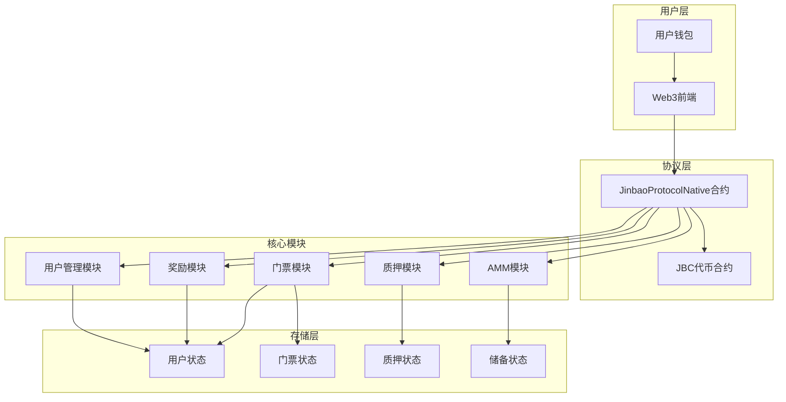
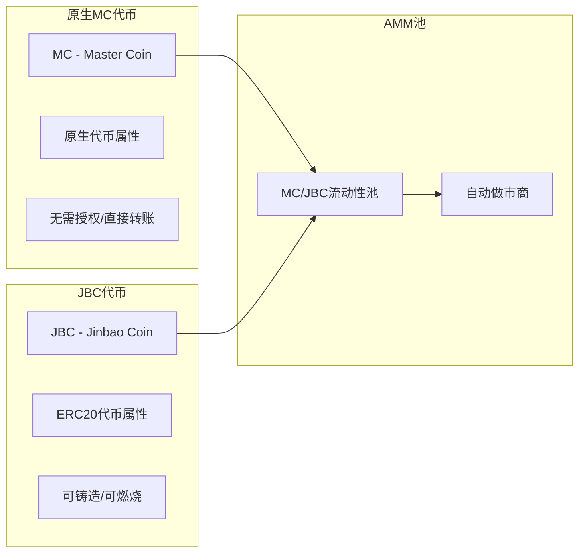
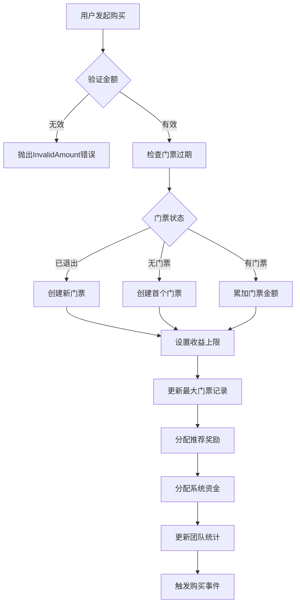
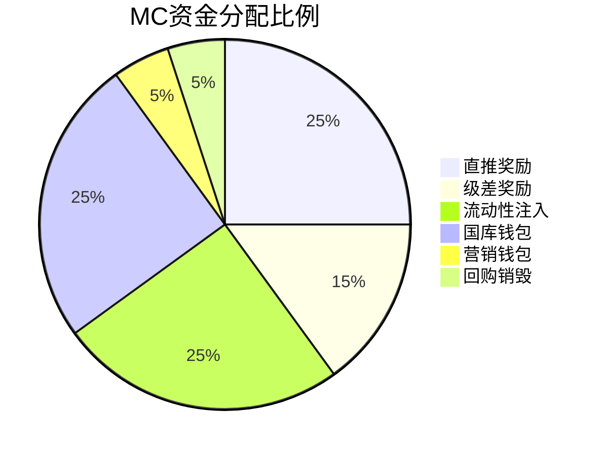
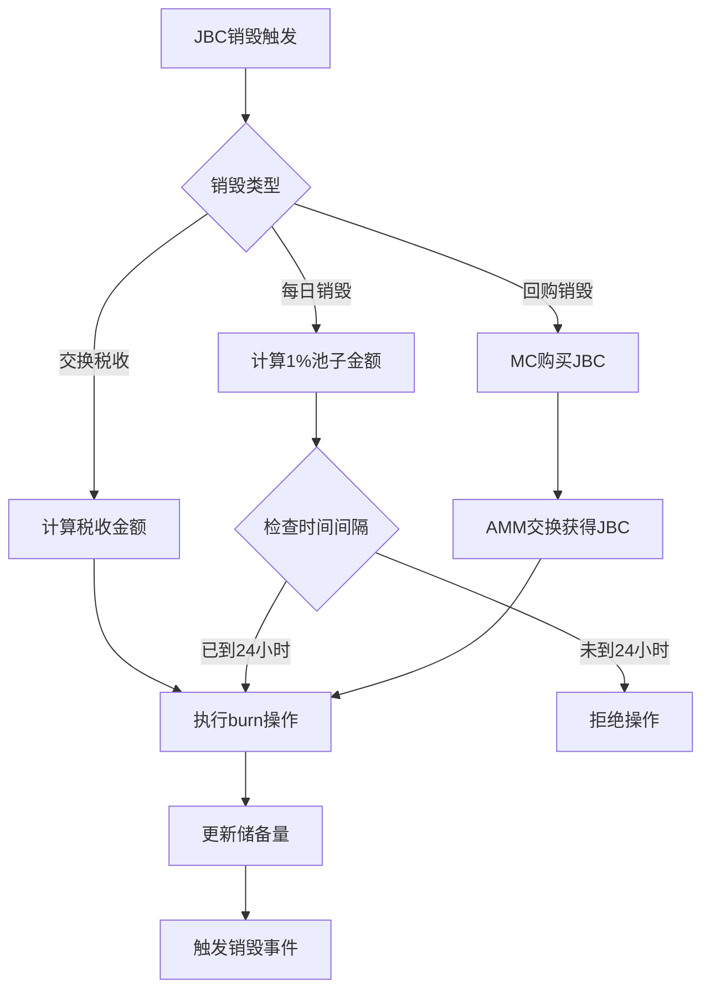
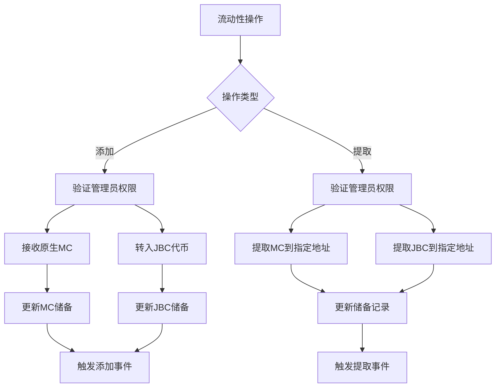
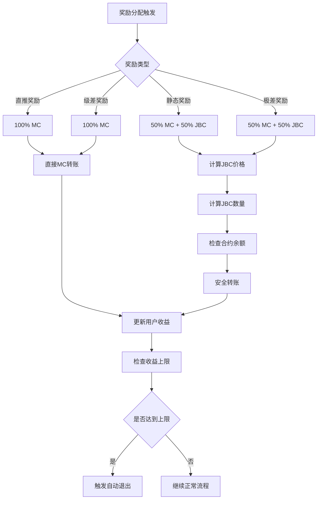
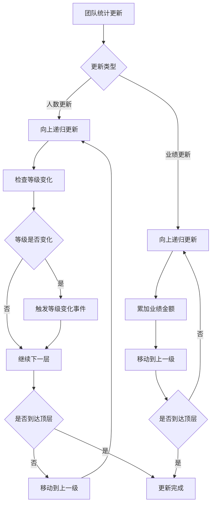
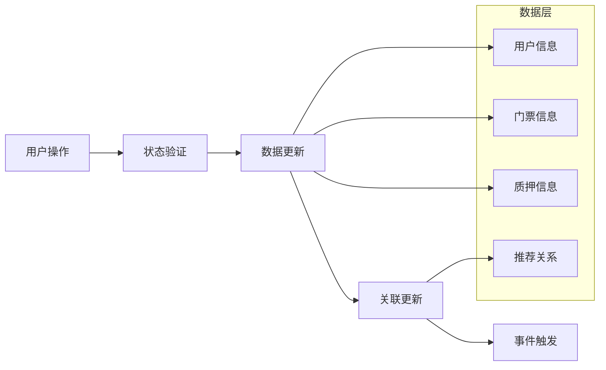
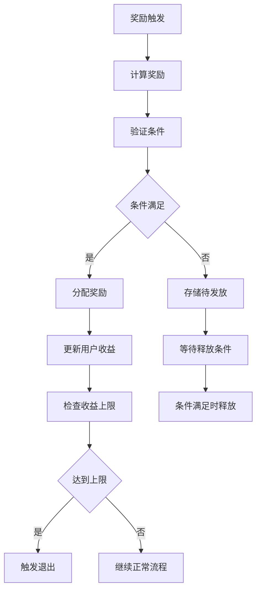

# Jinbao Protocol 业务逻辑设计文档

## 设计概述

本文档详细描述了Jinbao Protocol DeFi 4.0的完整系统设计，包括原生MC代币、JBC代币、AMM交换系统和多层奖励机制的技术实现。系统采用模块化设计，确保各组件之间的松耦合和高内聚。

## 系统架构

### 整体架构图



### 代币架构设计



## 组件设计

### 1. 门票系统组件

#### 1.1 门票数据结构
```solidity
struct Ticket {
    uint256 ticketId;        // 门票唯一ID
    uint256 amount;          // 门票金额
    uint256 purchaseTime;    // 购买时间
    bool exited;             // 是否已退出
}

struct UserInfo {
    address referrer;                // 推荐人地址
    uint256 activeDirects;          // 活跃直推数量
    uint256 teamCount;              // 团队总人数
    uint256 totalRevenue;           // 累计收益
    uint256 currentCap;             // 当前收益上限
    bool isActive;                  // 是否活跃
    uint256 refundFeeAmount;        // 待退还费用
    uint256 teamTotalVolume;        // 团队总业绩
    uint256 teamTotalCap;           // 团队总上限
    uint256 maxTicketAmount;        // 最大门票金额
    uint256 maxSingleTicketAmount;  // 最大单次门票
}
```

#### 1.2 门票购买流程设计


#### 1.3 门票过期机制设计
```solidity
function _expireTicketIfNeeded(address user) internal {
    Ticket storage t = userTicket[user];
    
    // 检查过期条件
    if (t.amount == 0 || t.exited) return;
    if (_getActiveStakeTotal(user) > 0) return;
    if (block.timestamp <= t.purchaseTime + ticketFlexibilityDuration) return;
    
    // 执行过期逻辑
    _clearTicketData(user);
    _updateReferrerStats(user, false);
    emit TicketExpired(user, t.ticketId, t.amount);
}
```

### 2. MC代币系统组件

#### 2.1 原生MC处理机制
```solidity
// 接收原生MC
receive() external payable {
    swapReserveMC += msg.value;
    emit NativeMCReceived(msg.sender, msg.value);
}

// 安全转账函数
function _transferNativeMC(address to, uint256 amount) internal {
    if (amount == 0) return;
    if (address(this).balance < amount) revert InsufficientNativeBalance();
    
    (bool success, ) = to.call{value: amount}("");
    if (!success) revert NativeTransferFailed();
}
```

#### 2.2 资金分配设计


#### 2.3 余额验证机制
```solidity
modifier hasNativeBalance(uint256 amount) {
    if (address(this).balance < amount) revert InsufficientNativeBalance();
    _;
}

function _validateUserBalance(address user, uint256 amount) internal view {
    uint256 userBalance = user.balance;
    uint256 estimatedGas = 100000; // 预估Gas费用
    uint256 gasPrice = tx.gasprice;
    uint256 totalRequired = amount + (estimatedGas * gasPrice);
    
    if (userBalance < totalRequired) {
        revert InsufficientBalance();
    }
}
```

### 3. JBC代币系统组件

#### 3.1 JBC代币接口设计
```solidity
interface IJBC is IERC20 {
    function burn(uint256 amount) external;
    function mint(address to, uint256 amount) external;
    function setMinter(address minter) external;
}
```

#### 3.2 JBC价格计算机制
```solidity
function _getCurrentJBCPrice() internal view returns (uint256) {
    // 检查最小流动性阈值
    if (swapReserveJBC == 0 || swapReserveMC < MIN_LIQUIDITY) {
        return 1 ether; // 默认1:1比例
    }
    
    // 计算原始价格
    uint256 rawPrice = (swapReserveMC * 1e18) / swapReserveJBC;
    
    // 应用价格保护
    return _applyPriceProtection(rawPrice);
}

function _applyPriceProtection(uint256 rawPrice) internal pure returns (uint256) {
    uint256 minPrice = 0.1 ether;  // 最低价格
    uint256 maxPrice = 10 ether;   // 最高价格
    
    if (rawPrice < minPrice) return minPrice;
    if (rawPrice > maxPrice) return maxPrice;
    return rawPrice;
}
```

#### 3.3 JBC销毁机制设计


### 4. AMM交换系统组件

#### 4.1 恒定乘积公式实现
```solidity
// MC → JBC 交换
function swapMCToJBC() external payable nonReentrant whenNotPaused {
    uint256 mcAmount = msg.value;
    
    // 计算输出量: (x * y) / (x + dx) = dy
    uint256 numerator = mcAmount * swapReserveJBC;
    uint256 denominator = swapReserveMC + mcAmount;
    uint256 jbcOutput = numerator / denominator;
    
    // 计算税收
    uint256 tax = (jbcOutput * swapBuyTax) / 100;
    uint256 amountToUser = jbcOutput - tax;
    
    // 更新储备
    swapReserveMC += mcAmount;
    swapReserveJBC -= jbcOutput;
    
    // 销毁税收并转账
    jbcToken.burn(tax);
    jbcToken.transfer(msg.sender, amountToUser);
}
```

#### 4.2 价格影响保护设计
```solidity
function _validatePriceImpact(uint256 inputAmount, uint256 inputReserve) internal pure {
    uint256 priceImpact = (inputAmount * 10000) / inputReserve;
    if (priceImpact > MAX_PRICE_IMPACT) {
        revert InvalidAmount();
    }
}

function _calculatePriceImpact(uint256 inputAmount, uint256 inputReserve) 
    internal pure returns (uint256) {
    return (inputAmount * 10000) / inputReserve; // 返回基点表示的价格影响
}
```

#### 4.3 流动性管理设计


### 5. 奖励系统组件

#### 5.1 静态奖励计算设计
```solidity
function _calculateStakeReward(Stake storage stake) internal view returns (uint256) {
    uint256 ratePerBillion = _getRate(stake.cycleDays);
    uint256 unitsPassed = (block.timestamp - stake.startTime) / SECONDS_IN_UNIT;
    
    // 限制在周期内
    if (unitsPassed > stake.cycleDays) unitsPassed = stake.cycleDays;
    if (unitsPassed == 0) return 0;
    
    // 计算应得总收益
    uint256 totalStaticShouldBe = (stake.amount * ratePerBillion * unitsPassed) / 1000000000;
    
    // 返回未支付部分
    if (totalStaticShouldBe > stake.paid) {
        return totalStaticShouldBe - stake.paid;
    }
    return 0;
}

function _getRate(uint256 cycleDays) private pure returns (uint256) {
    if (cycleDays == 7) return 13333334;   // 1.33%日收益
    if (cycleDays == 15) return 16666667;  // 1.67%日收益
    return 20000000;                       // 2.00%日收益
}
```

#### 5.2 奖励分配机制设计


#### 5.3 极差奖励存储和释放设计
```solidity
struct PendingReward {
    address upline;     // 上级地址
    uint256 amount;     // 奖励金额
}

function _calculateAndStoreDifferentialRewards(
    address user, 
    uint256 amount, 
    uint256 stakeId
) internal {
    address current = userInfo[user].referrer;
    uint256 previousPercent = 0;
    
    while (current != address(0) && iterations < 20) {
        if (!userInfo[current].isActive) {
            current = userInfo[current].referrer;
            continue;
        }
        
        (, uint256 percent) = _getLevel(userInfo[current].teamCount);
        
        if (percent > previousPercent) {
            uint256 diffPercent = percent - previousPercent;
            uint256 reward = (amount * diffPercent) / 100;
            
            // 存储待释放奖励
            stakePendingRewards[stakeId].push(PendingReward({
                upline: current,
                amount: reward
            }));
            
            previousPercent = percent;
        }
        
        current = userInfo[current].referrer;
    }
}
```

#### 5.4 团队等级系统设计
```solidity
function _getLevel(uint256 teamCount) private pure returns (uint256 level, uint256 percent) {
    if (teamCount >= 100000) return (9, 45);  // V9
    if (teamCount >= 30000) return (8, 40);   // V8
    if (teamCount >= 10000) return (7, 35);   // V7
    if (teamCount >= 3000) return (6, 30);    // V6
    if (teamCount >= 1000) return (5, 25);    // V5
    if (teamCount >= 300) return (4, 20);     // V4
    if (teamCount >= 100) return (3, 15);     // V3
    if (teamCount >= 30) return (2, 10);      // V2
    if (teamCount >= 10) return (1, 5);       // V1
    return (0, 0);                            // V0
}
```

### 6. 用户管理组件

#### 6.1 推荐关系管理设计
```solidity
function bindReferrer(address _referrer) external {
    // 验证条件
    if (userInfo[msg.sender].referrer != address(0)) revert AlreadyBound();
    if (_referrer == msg.sender) revert SelfReference();
    if (_referrer == address(0)) revert InvalidAddress();
    
    // 建立关系
    userInfo[msg.sender].referrer = _referrer;
    directReferrals[_referrer].push(msg.sender);
    
    // 更新统计
    _updateTeamStats(msg.sender, 0, true);
    
    emit BoundReferrer(msg.sender, _referrer);
}
```

#### 6.2 团队统计更新设计


#### 6.3 活跃状态管理设计
```solidity
function _updateActiveStatus(address user) internal {
    Ticket storage t = userTicket[user];
    bool shouldBeActive = t.amount > 0 && !t.exited;
    bool currentlyActive = userInfo[user].isActive;
    
    if (shouldBeActive == currentlyActive) return;
    
    userInfo[user].isActive = shouldBeActive;
    
    address referrer = userInfo[user].referrer;
    if (referrer == address(0)) return;
    
    // 更新推荐人的直推计数
    if (shouldBeActive) {
        userInfo[referrer].activeDirects++;
    } else if (userInfo[referrer].activeDirects > 0) {
        userInfo[referrer].activeDirects--;
    }
}
```

## 数据模型设计

### 1. 核心数据结构

#### 1.1 用户相关数据
```solidity
// 用户基础信息
mapping(address => UserInfo) public userInfo;

// 用户门票信息
mapping(address => Ticket) public userTicket;

// 用户质押列表
mapping(address => Stake[]) public userStakes;

// 直推关系
mapping(address => address[]) public directReferrals;
```

#### 1.2 奖励相关数据
```solidity
// 门票待发放奖励
mapping(uint256 => PendingReward[]) public ticketPendingRewards;

// 质押待发放奖励
mapping(uint256 => PendingReward[]) public stakePendingRewards;

// 门票拥有者
mapping(uint256 => address) public ticketOwner;

// 质押拥有者
mapping(uint256 => address) public stakeOwner;
```

#### 1.3 系统状态数据
```solidity
// AMM储备
uint256 public swapReserveMC;
uint256 public swapReserveJBC;

// 系统参数
uint256 public directRewardPercent;
uint256 public levelRewardPercent;
uint256 public marketingPercent;
uint256 public buybackPercent;
uint256 public lpInjectionPercent;
uint256 public treasuryPercent;

// 税费参数
uint256 public redemptionFeePercent;
uint256 public swapBuyTax;
uint256 public swapSellTax;
```

### 2. 数据流设计

#### 2.1 用户数据流


#### 2.2 奖励数据流


## 接口设计

### 1. 用户接口

#### 1.1 核心操作接口
```solidity
// 绑定推荐人
function bindReferrer(address _referrer) external;

// 购买门票
function buyTicket() external payable;

// 质押流动性
function stakeLiquidity(uint256 cycleDays) external payable;

// 领取奖励
function claimRewards() external;

// 赎回本金
function redeem() external;
```

#### 1.2 交换接口
```solidity
// MC换JBC
function swapMCToJBC() external payable;

// JBC换MC
function swapJBCToMC(uint256 jbcAmount) external;

// 每日销毁
function dailyBurn() external;
```

#### 1.3 查询接口
```solidity
// 获取用户信息
function userInfo(address user) external view returns (UserInfo memory);

// 获取门票信息
function userTicket(address user) external view returns (Ticket memory);

// 获取质押信息
function userStakes(address user, uint256 index) external view returns (Stake memory);

// 获取直推列表
function getDirectReferrals(address user) external view returns (address[] memory);

// 获取用户等级
function getUserLevel(address user) external view returns (uint256 level, uint256 percent, uint256 teamCount);
```

### 2. 管理员接口

#### 2.1 系统配置接口
```solidity
// 设置钱包地址
function setWallets(address _marketing, address _treasury, address _lpInjection, address _buyback) external onlyOwner;

// 设置分配比例
function setDistributionConfig(uint256 _direct, uint256 _level, uint256 _marketing, uint256 _buyback, uint256 _lpInjection, uint256 _treasury) external onlyOwner;

// 设置交换税费
function setSwapTaxes(uint256 _buyTax, uint256 _sellTax) external onlyOwner;

// 设置赎回费用
function setRedemptionFeePercent(uint256 _fee) external onlyOwner;
```

#### 2.2 流动性管理接口
```solidity
// 添加流动性
function addLiquidity(uint256 jbcAmount) external payable onlyOwner;

// 提取储备
function withdrawSwapReserves(address _toMC, uint256 _amountMC, address _toJBC, uint256 _amountJBC) external onlyOwner;

// 提取奖励池
function withdrawLevelRewardPool(address _to, uint256 _amount) external onlyOwner;
```

#### 2.3 紧急管理接口
```solidity
// 紧急暂停
function emergencyPause() external onlyOwner;

// 取消暂停
function emergencyUnpause() external onlyOwner;

// 紧急提取
function emergencyWithdrawNative(address _to, uint256 _amount) external onlyOwner;

// 救援代币
function rescueTokens(address _token, address _to, uint256 _amount) external onlyOwner;
```

## 安全设计

### 1. 重入保护设计
```solidity
// 使用OpenZeppelin的ReentrancyGuard
import "@openzeppelin/contracts-upgradeable/utils/ReentrancyGuardUpgradeable.sol";

// 在所有核心函数上应用nonReentrant修饰符
function buyTicket() external payable nonReentrant whenNotPaused {
    // 函数实现
}
```

### 2. 权限控制设计
```solidity
// 使用OpenZeppelin的Ownable
import "@openzeppelin/contracts-upgradeable/access/OwnableUpgradeable.sol";

// 管理员功能限制
modifier onlyOwner() {
    require(owner() == msg.sender, "Ownable: caller is not the owner");
    _;
}
```

### 3. 暂停机制设计
```solidity
bool public emergencyPaused;

modifier whenNotPaused() {
    if (emergencyPaused) revert ContractPaused();
    _;
}

function emergencyPause() external onlyOwner {
    emergencyPaused = true;
    emit EmergencyPaused();
}
```

### 4. 输入验证设计
```solidity
// 金额验证
function _validateTicketAmount(uint256 amount) internal pure {
    if (amount != 100 * 1e18 && amount != 300 * 1e18 && 
        amount != 500 * 1e18 && amount != 1000 * 1e18) {
        revert InvalidAmount();
    }
}

// 地址验证
function _validateAddress(address addr) internal pure {
    if (addr == address(0)) revert InvalidAddress();
}

// 周期验证
function _validateCycleDays(uint256 cycleDays) internal pure {
    if (cycleDays != 7 && cycleDays != 15 && cycleDays != 30) {
        revert InvalidCycle();
    }
}
```

## 错误处理设计

### 1. 自定义错误定义
```solidity
// 通用错误
error InvalidAmount();
error InvalidAddress();
error Unauthorized();

// 业务逻辑错误
error AlreadyBound();
error SelfReference();
error NotActive();
error AlreadyExited();
error NoRewards();
error NothingToRedeem();

// 系统状态错误
error ContractPaused();
error LowLiquidity();
error InsufficientBalance();
error InsufficientNativeBalance();
error NativeTransferFailed();
```

### 2. 错误处理策略
```solidity
// 安全转账with错误处理
function _safeTransferNativeMC(address to, uint256 amount) internal {
    if (amount == 0) return;
    
    if (address(this).balance < amount) {
        emit RewardTransferFailed(to, amount, 0, "Insufficient contract balance");
        return;
    }
    
    (bool success, ) = to.call{value: amount}("");
    if (!success) {
        emit RewardTransferFailed(to, amount, 0, "Native transfer failed");
        return;
    }
}
```

## 事件设计

### 1. 核心业务事件
```solidity
// 用户操作事件
event BoundReferrer(address indexed user, address indexed referrer);
event TicketPurchased(address indexed user, uint256 amount, uint256 ticketId);
event LiquidityStaked(address indexed user, uint256 amount, uint256 cycleDays, uint256 stakeId);
event RewardClaimed(address indexed user, uint256 mcAmount, uint256 jbcAmount, uint8 rewardType, uint256 ticketId);

// 奖励分配事件
event RewardPaid(address indexed user, uint256 amount, uint8 rewardType);
event ReferralRewardPaid(address indexed user, address indexed from, uint256 mcAmount, uint256 jbcAmount, uint8 rewardType, uint256 ticketId);
event DifferentialRewardDistributed(address indexed user, uint256 mcAmount, uint256 jbcAmount, uint256 jbcPrice, uint256 timestamp);

// 交换事件
event SwappedMCToJBC(address indexed user, uint256 mcAmount, uint256 jbcAmount, uint256 tax);
event SwappedJBCToMC(address indexed user, uint256 jbcAmount, uint256 mcAmount, uint256 tax);
event BuybackAndBurn(uint256 mcAmount, uint256 jbcBurned);
```

### 2. 系统管理事件
```solidity
// 管理员操作事件
event WalletsUpdated(address marketing, address treasury, address lpInjection, address buyback);
event DistributionConfigUpdated(uint256 direct, uint256 level, uint256 marketing, uint256 buyback, uint256 lpInjection, uint256 treasury);
event SwapTaxesUpdated(uint256 buyTax, uint256 sellTax);
event LiquidityAdded(uint256 mcAmount, uint256 jbcAmount);

// 系统状态事件
event EmergencyPaused();
event EmergencyUnpaused();
event TeamCountUpdated(address indexed user, uint256 oldCount, uint256 newCount);
event UserLevelChanged(address indexed user, uint256 oldLevel, uint256 newLevel, uint256 teamCount);
```

## 升级设计

### 1. UUPS代理模式
```solidity
import "@openzeppelin/contracts-upgradeable/proxy/utils/UUPSUpgradeable.sol";

contract JinbaoProtocolNative is UUPSUpgradeable {
    function _authorizeUpgrade(address newImplementation) internal override onlyOwner {}
}
```

### 2. 存储布局保护
```solidity
// 预留存储槽位
uint256[47] private __gap;

// 新版本添加变量时使用gap
// uint256 public newVariable;
// uint256[46] private __gap; // 减少gap数量
```

## 性能优化设计

### 1. Gas优化策略
```solidity
// 使用原生代币减少授权步骤
function buyTicket() external payable {
    uint256 amount = msg.value; // 直接获取原生代币
    // 无需approve步骤
}

// 批量操作优化
function _batchUpdateTeamStats(address[] memory users, uint256[] memory amounts) internal {
    for (uint256 i = 0; i < users.length; i++) {
        _updateTeamStats(users[i], amounts[i], false);
    }
}

// 循环限制保护
uint256 constant MAX_ITERATIONS = 30;
while (current != address(0) && iterations < MAX_ITERATIONS) {
    // 循环逻辑
    iterations++;
}
```

### 2. 存储优化
```solidity
// 紧凑存储结构
struct CompactUserInfo {
    address referrer;        // 20 bytes
    uint96 activeDirects;    // 12 bytes - 足够存储直推数量
    uint256 teamCount;       // 32 bytes
    uint256 totalRevenue;    // 32 bytes
    // ... 其他字段
}

// 使用mapping而非数组减少gas
mapping(address => bool) public isActiveUser;
// 而不是 address[] public activeUsers;
```

## 测试设计

### 1. 单元测试覆盖
```javascript
describe("JinbaoProtocolNative", function () {
    describe("门票系统", function () {
        it("应该正确购买门票");
        it("应该正确处理门票过期");
        it("应该正确计算收益上限");
    });
    
    describe("奖励系统", function () {
        it("应该正确分配直推奖励");
        it("应该正确计算静态奖励");
        it("应该正确处理极差奖励");
    });
    
    describe("AMM系统", function () {
        it("应该正确执行MC到JBC交换");
        it("应该正确执行JBC到MC交换");
        it("应该正确处理价格影响保护");
    });
});
```

### 2. 集成测试设计
```javascript
describe("完整用户流程", function () {
    it("应该完成完整的用户参与流程", async function () {
        // 1. 绑定推荐人
        await protocol.connect(user2).bindReferrer(user1.address);
        
        // 2. 购买门票
        await protocol.connect(user1).buyTicket({ value: ethers.parseEther("100") });
        
        // 3. 质押流动性
        await protocol.connect(user1).stakeLiquidity(7, { value: ethers.parseEther("150") });
        
        // 4. 领取奖励
        await ethers.provider.send("evm_increaseTime", [86400]);
        await protocol.connect(user1).claimRewards();
        
        // 5. 验证状态
        const userInfo = await protocol.userInfo(user1.address);
        expect(userInfo.totalRevenue).to.be.gt(0);
    });
});
```

## 部署设计

### 1. 部署脚本设计
```javascript
async function deployNativeMCProtocol() {
    // 1. 部署JBC代币
    const JBCv2 = await ethers.getContractFactory("JBCv2");
    const jbc = await JBCv2.deploy();
    
    // 2. 部署协议合约(使用代理)
    const JinbaoProtocolNative = await ethers.getContractFactory("JinbaoProtocolNative");
    const protocol = await upgrades.deployProxy(
        JinbaoProtocolNative,
        [jbcAddress, marketingWallet, treasuryWallet, lpWallet, buybackWallet],
        { kind: 'uups', initializer: 'initialize' }
    );
    
    // 3. 设置权限
    await jbc.setMinter(await protocol.getAddress());
    
    // 4. 添加初始流动性
    await protocol.addLiquidity(initialJBC, { value: initialMC });
    
    return { protocol, jbc };
}
```

### 2. 配置管理设计
```javascript
const deploymentConfig = {
    wallets: {
        marketing: process.env.MARKETING_WALLET,
        treasury: process.env.TREASURY_WALLET,
        lpInjection: process.env.LP_WALLET,
        buyback: process.env.BUYBACK_WALLET
    },
    initialLiquidity: {
        MC: ethers.parseEther("10000"),
        JBC: ethers.parseEther("10000")
    },
    parameters: {
        directRewardPercent: 25,
        levelRewardPercent: 15,
        marketingPercent: 5,
        buybackPercent: 5,
        lpInjectionPercent: 25,
        treasuryPercent: 25
    }
};
```

## 监控设计

### 1. 关键指标监控
```javascript
// 系统健康指标
const monitoringMetrics = {
    // 流动性指标
    mcReserve: () => protocol.swapReserveMC(),
    jbcReserve: () => protocol.swapReserveJBC(),
    
    // 用户活动指标
    activeUsers: () => getActiveUserCount(),
    totalTickets: () => getTotalTicketCount(),
    
    // 经济指标
    jbcPrice: () => getCurrentJBCPrice(),
    dailyVolume: () => getDailyTradingVolume(),
    
    // 奖励指标
    totalRewardsPaid: () => getTotalRewardsPaid(),
    levelRewardPool: () => protocol.levelRewardPool()
};
```

### 2. 异常检测设计
```javascript
// 异常检测规则
const alertRules = {
    lowLiquidity: (reserves) => reserves.mc < MIN_LIQUIDITY || reserves.jbc < MIN_LIQUIDITY,
    priceAnomaly: (price) => price < 0.1 || price > 10,
    highPriceImpact: (impact) => impact > MAX_PRICE_IMPACT,
    rewardPoolDepletion: (pool) => pool < MINIMUM_REWARD_POOL
};
```

---

**文档版本**: 1.0  
**最后更新**: 2024年12月29日  
**状态**: ✅ **设计完成，准备进入任务规划阶段**