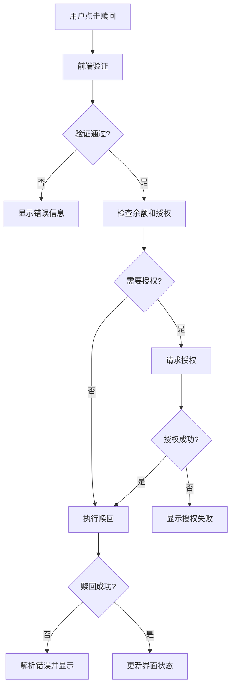

# 流动性赎回修复设计文档

## 概述

本设计文档旨在解决用户在赎回流动性质押时遇到的交易失败问题。通过分析现有代码，我们识别出了几个关键问题：赎回费用计算错误、授权机制不完善、错误处理不当以及前端交互流程存在缺陷。

## 架构



## 组件和接口

### 1. 赎回费用计算器 (RedemptionFeeCalculator)

**职责**: 准确计算赎回费用并处理边界情况

**接口**:
```typescript
interface RedemptionFeeCalculator {
  calculateFee(userInfo: UserInfo, userTicket: UserTicket, redemptionFeePercent: bigint): bigint;
  validateFeePayment(userBalance: bigint, requiredFee: bigint): boolean;
}
```

**实现逻辑**:
- 使用 `maxTicketAmount` 作为主要费用基础
- 当 `maxTicketAmount` 为0时，回退到 `userTicket.amount`
- 确保费用不超过用户余额
- 提供详细的费用计算日志

### 2. 授权管理器 (AuthorizationManager)

**职责**: 智能处理代币授权流程

**接口**:
```typescript
interface AuthorizationManager {
  checkAuthorization(userAddress: string, spenderAddress: string, requiredAmount: bigint): Promise<boolean>;
  requestAuthorization(tokenContract: Contract, spenderAddress: string, amount: bigint): Promise<boolean>;
  getAuthorizationStatus(userAddress: string, spenderAddress: string): Promise<bigint>;
}
```

**实现逻辑**:
- 检查当前授权额度是否足够
- 自动请求所需的授权额度
- 处理授权交易的各种状态
- 提供授权进度反馈

### 3. 质押状态验证器 (StakeValidator)

**职责**: 验证质押状态和赎回条件

**接口**:
```typescript
interface StakeValidator {
  validateStakeForRedemption(stake: StakePosition, currentTime: number): ValidationResult;
  checkRedemptionEnabled(protocolContract: Contract): Promise<boolean>;
  calculateStakeProgress(stake: StakePosition, currentTime: number): number;
}

interface ValidationResult {
  isValid: boolean;
  errorCode?: string;
  errorMessage?: string;
  timeRemaining?: number;
}
```

**实现逻辑**:
- 检查质押是否处于活跃状态
- 验证质押周期是否已完成
- 确认赎回功能是否启用
- 提供详细的验证结果

### 4. 错误处理器 (ErrorHandler)

**职责**: 解析合约错误并提供用户友好的反馈

**接口**:
```typescript
interface ErrorHandler {
  parseContractError(error: any): ParsedError;
  getLocalizedErrorMessage(errorCode: string, language: string): string;
  logError(error: any, context: ErrorContext): void;
}

interface ParsedError {
  code: string;
  message: string;
  isRetryable: boolean;
  suggestedAction?: string;
}
```

**实现逻辑**:
- 识别常见的合约错误类型
- 提供中英文错误消息
- 建议用户采取的修复行动
- 记录详细的错误日志

## 数据模型

### 赎回参数模型
```typescript
interface RedemptionParams {
  stakeId: string;
  userAddress: string;
  expectedFee: bigint;
  stakeAmount: bigint;
  isExpired: boolean;
}
```

### 赎回状态模型
```typescript
interface RedemptionState {
  phase: 'validating' | 'authorizing' | 'redeeming' | 'completed' | 'failed';
  progress: number;
  currentAction: string;
  error?: ParsedError;
}
```

### 用户状态模型
```typescript
interface UserRedemptionInfo {
  mcBalance: bigint;
  currentAllowance: bigint;
  maxTicketAmount: bigint;
  ticketAmount: bigint;
  activeStakes: StakePosition[];
}
```

## 正确性属性

现在我需要使用prework工具来分析验收标准的可测试性：

## 正确性属性

*属性是一个特征或行为，应该在系统的所有有效执行中保持为真——本质上是关于系统应该做什么的正式陈述。属性作为人类可读规范和机器可验证正确性保证之间的桥梁。*

基于对验收标准的分析，我们识别出以下可测试的正确性属性：

### 属性 1: 赎回费用计算正确性
*对于任何*用户状态和门票金额，赎回费用计算应该基于正确的费用基础（maxTicketAmount或userTicket.amount）和当前的费用比例
**验证需求: Requirements 1.1, 1.2, 1.3**

### 属性 2: 费用限制保护
*对于任何*质押金额和费用比例，计算出的赎回费用不应超过质押本金金额
**验证需求: Requirements 1.4**

### 属性 3: 余额验证保护
*对于任何*用户余额和所需费用，当余额不足时系统应该阻止交易并显示明确错误信息
**验证需求: Requirements 2.1**

### 属性 4: 授权自动化
*对于任何*授权不足的情况，前端应该自动请求足够的授权额度并显示进度状态
**验证需求: Requirements 2.2, 2.3**

### 属性 5: 质押状态验证
*对于任何*质押头寸，系统应该正确验证其是否满足赎回条件（已到期、处于活跃状态、功能已启用）
**验证需求: Requirements 3.1, 3.5**

### 属性 6: 错误消息本地化
*对于任何*合约错误，前端应该解析错误并显示相应的用户友好中文提示信息
**验证需求: Requirements 4.1**

### 属性 7: 流程顺序正确性
*对于任何*赎回操作，系统应该按照正确的顺序执行：验证前置条件 → 授权（如需要）→ 赎回 → 更新界面
**验证需求: Requirements 5.1, 5.2**

### 属性 8: UI状态一致性
*对于任何*交易状态变化，前端界面应该显示相应的进度指示器、禁用重复操作并在完成后刷新数据
**验证需求: Requirements 5.3, 5.4**

### 属性 9: 日志记录完整性
*对于任何*赎回操作和错误情况，系统应该记录详细的调试日志和错误信息
**验证需求: Requirements 6.1, 6.2, 6.3, 6.4**

## 错误处理

### 合约层错误处理
- **Invalid stake**: 质押ID无效或已被赎回
- **Not expired**: 质押周期尚未完成
- **Disabled**: 赎回功能被管理员禁用
- **Transfer failed**: 代币转账失败（余额不足或授权不足）

### 前端层错误处理
- **网络错误**: 显示网络连接问题提示
- **授权错误**: 提供重试授权选项
- **余额不足**: 显示具体的余额要求
- **参数错误**: 记录异常参数并提供错误报告

### 错误恢复策略
- 自动重试机制（网络错误）
- 用户引导修复（余额不足、授权问题）
- 状态重置（交易失败后清理UI状态）
- 错误报告（系统级错误）

## 测试策略

### 单元测试
- 费用计算函数的各种输入组合
- 授权检查和请求逻辑
- 错误解析和消息本地化
- 状态验证函数

### 属性测试
- 使用随机生成的用户状态和质押数据
- 验证费用计算的数学正确性
- 测试边界条件和异常情况
- 验证UI状态转换的一致性

### 集成测试
- 完整的赎回流程测试
- 合约交互测试
- 错误处理流程测试
- 用户界面交互测试

### 测试配置
- 每个属性测试运行最少100次迭代
- 使用真实的合约环境进行集成测试
- 模拟各种网络条件和错误场景
- 测试标签格式: **Feature: liquidity-redemption-fix, Property {number}: {property_text}**