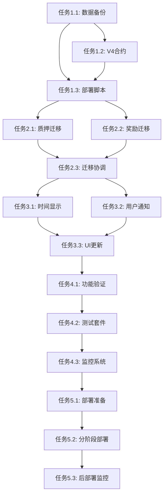

# P-prod环境时间单位修复与V4完整奖励机制实现任务清单

## 任务概述

本文档定义了将p-prod环境时间单位从60秒修复为86400秒，并完整实现V4合约四种奖励机制的具体实施任务，确保所有时间相关功能按照真实天数运行，同时实现完整的奖励体系。

## 阶段1: V4合约奖励机制实现任务

### 任务1.1: 完善V4合约奖励机制实现
**优先级**: 高
**预估时间**: 4小时
**负责人**: 智能合约开发者

#### 子任务
- [x] 确认燃烧机制为纯销毁 (不分红给用户)
  - [x] 燃烧JBC到黑洞地址 (0x...dEaD)
  - [x] 每24小时燃烧周期 (真实天数)
  - [x] 不分发奖励给用户
- [x] 确认AMM滑点手续费为纯销毁 (不分红给用户)
  - [x] MC→JBC兑换 (25%销毁)
  - [x] JBC→MC兑换 (50%销毁)
  - [x] 销毁到黑洞地址，不分红
- [x] 完善双币奖励分发机制
  - [x] 静态奖励: 50% MC + 50% JBC (通过兑换池)
  - [x] 级差奖励: 50% MC + 50% JBC (通过兑换池)
- [x] 确保动态和层级奖励为100% MC
- [x] 实现基于销毁价值的AMM交易奖励分红

#### 验收标准
- 燃烧机制为纯销毁，不分红给用户
- AMM滑点手续费为纯销毁，不分红给用户
- 双币奖励通过兑换池正确实现
- 所有奖励机制符合正确的商业逻辑
- AMM交易奖励基于销毁价值分红给生态参与者

#### 相关文件
- `contracts/JinbaoProtocolV4Ultimate.sol`
- `test/FourRewardMechanisms.test.js`

### 任务1.2: 修正收益率为基于流动性计算
**优先级**: 高
**预估时间**: 2小时
**负责人**: 智能合约开发者

#### 子任务
- [ ] 更新日收益率函数
  - [ ] 7天周期: 1.33333% (133基点)
  - [ ] 15天周期: 1.666666% (167基点)
  - [ ] 30天周期: 2.0% (200基点)
- [ ] 验证收益率计算正确性
- [ ] 更新相关测试用例

#### 验收标准
- 收益率符合基于流动性的计算
- 分层收益率正确实现
- 测试用例验证通过

#### 相关文件
- `contracts/JinbaoProtocolV4Ultimate.sol`
- `scripts/test-corrected-yield-rates.cjs`

### 任务1.3: 实现V等级系统完整功能
**优先级**: 中
**预估时间**: 3小时
**负责人**: 智能合约开发者

#### 子任务
- [ ] 完善V0-V9等级计算
- [ ] 实现基于团队人数的等级升级
- [ ] 添加级差奖励计算逻辑
- [ ] 实现30天解锁机制

#### 验收标准
- V等级系统正确计算
- 级差奖励按等级差额分发
- 30天解锁机制正常工作

#### 相关文件
- `contracts/JinbaoProtocolV4Ultimate.sol`
- `test/VLevelSystem.test.js`

## 阶段2: 准备和备份任务

### 任务2.1: 创建数据备份系统
**优先级**: 高
**预估时间**: 2小时
**负责人**: 开发团队

#### 子任务
- [ ] 创建合约状态备份脚本 `scripts/backup-contract-state.cjs`
- [ ] 备份所有用户质押记录
- [ ] 备份所有动态奖励数据
- [ ] 备份合约配置参数
- [ ] 创建备份验证机制
- [ ] 测试备份恢复流程

#### 验收标准
- 备份文件包含完整的合约状态
- 备份数据可以成功验证完整性
- 恢复流程经过测试验证

#### 相关文件
- `scripts/backup-contract-state.cjs`
- `scripts/verify-backup.cjs`
- `utils/BackupService.ts`

### 任务2.2: 创建V4升级合约
**优先级**: 高
**预估时间**: 4小时
**负责人**: 智能合约开发者

#### 子任务
- [ ] 创建 `JinbaoProtocolV3TimeUnitFix.sol` 合约
- [ ] 实现 `initializeV4()` 函数
- [ ] 添加 `getEffectiveSecondsInUnit()` 函数
- [ ] 实现用户数据迁移函数
- [ ] 添加批量迁移功能
- [ ] 实现升级状态跟踪
- [ ] 添加必要的事件定义

#### 验收标准
- 合约编译无错误
- 所有函数通过单元测试
- 升级机制符合UUPS标准
- 时间单位正确设置为86400

#### 相关文件
- `contracts/JinbaoProtocolV3TimeUnitFix.sol`
- `test/TimeUnitFix.test.js`

### 任务2.3: 创建升级部署脚本
**优先级**: 高
**预估时间**: 3小时
**负责人**: DevOps工程师

#### 子任务
- [ ] 创建 `scripts/deploy-time-unit-fix.cjs` 脚本
- [ ] 实现自动备份功能
- [ ] 添加升级前验证检查
- [ ] 实现UUPS代理升级
- [ ] 添加升级后验证
- [ ] 创建回滚机制
- [ ] 添加详细日志记录

#### 验收标准
- 脚本可以成功执行升级
- 包含完整的错误处理
- 支持安全回滚操作
- 生成详细的升级报告

#### 相关文件
- `scripts/deploy-time-unit-fix.cjs`
- `scripts/rollback-upgrade.cjs`
- `utils/UpgradeManager.ts`

## 阶段3: 数据迁移任务

### 任务3.1: 实现质押数据迁移器
**优先级**: 高
**预估时间**: 4小时
**负责人**: 后端开发者

#### 子任务
- [ ] 创建 `StakeDataMigrator` 类
- [ ] 实现质押到期时间重算逻辑
- [ ] 添加分钟到天的转换算法
- [ ] 实现批量迁移功能
- [ ] 添加迁移进度跟踪
- [ ] 创建迁移验证机制
- [ ] 添加错误处理和重试

#### 验收标准
- 质押时间转换算法正确
- 支持批量处理大量用户
- 迁移过程可以暂停和恢复
- 包含完整的验证机制

#### 相关文件
- `utils/StakeDataMigrator.ts`
- `scripts/migrate-stake-data.cjs`

### 任务3.2: 实现动态奖励迁移器
**优先级**: 高
**预估时间**: 3小时
**负责人**: 后端开发者

#### 子任务
- [ ] 创建 `DynamicRewardMigrator` 类
- [ ] 实现奖励解锁时间重算
- [ ] 处理30分钟到30天的转换
- [ ] 添加奖励状态更新
- [ ] 实现批量迁移
- [ ] 创建迁移验证
- [ ] 添加异常处理

#### 验收标准
- 奖励解锁时间计算正确
- 所有奖励类型正确处理
- 迁移状态准确跟踪
- 支持增量迁移

#### 相关文件
- `utils/DynamicRewardMigrator.ts`
- `scripts/migrate-reward-data.cjs`

### 任务3.3: 创建数据迁移协调器
**优先级**: 中
**预估时间**: 2小时
**负责人**: 系统架构师

#### 子任务
- [ ] 创建 `MigrationCoordinator` 类
- [ ] 实现迁移任务调度
- [ ] 添加进度监控和报告
- [ ] 实现并发控制
- [ ] 创建迁移状态持久化
- [ ] 添加迁移暂停/恢复功能
- [ ] 实现迁移完成验证

#### 验收标准
- 可以协调多个迁移任务
- 提供实时进度反馈
- 支持迁移过程控制
- 生成详细迁移报告

#### 相关文件
- `utils/MigrationCoordinator.ts`
- `scripts/coordinate-migration.cjs`

## 阶段4: 前端适配任务

### 任务4.1: 更新时间显示组件
**优先级**: 中
**预估时间**: 3小时
**负责人**: 前端开发者

#### 子任务
- [ ] 创建 `TimeDisplayFormatter` 类
- [ ] 更新质押倒计时显示格式
- [ ] 修改动态奖励解锁时间显示
- [ ] 更新历史记录时间格式
- [ ] 添加时间单位自动检测
- [ ] 实现向后兼容显示
- [ ] 添加时间格式测试

#### 验收标准
- 时间显示格式用户友好
- 支持天/小时/分钟格式
- 自动适配新旧时间单位
- 所有时间显示一致

#### 相关文件
- `utils/TimeDisplayFormatter.ts`
- `components/StakingCountdown.tsx`
- `components/RewardUnlockTimer.tsx`

### 任务4.2: 实现用户通知系统
**优先级**: 中
**预估时间**: 2小时
**负责人**: 前端开发者

#### 子任务
- [ ] 创建 `TimeUnitFixNotification` 组件
- [ ] 实现升级前通知
- [ ] 添加升级完成通知
- [ ] 创建迁移进度提示
- [ ] 实现FAQ帮助页面
- [ ] 添加通知历史记录
- [ ] 创建通知设置控制

#### 验收标准
- 通知内容清晰易懂
- 支持多种通知类型
- 用户可以控制通知显示
- 提供详细帮助信息

#### 相关文件
- `components/TimeUnitFixNotification.tsx`
- `components/UpgradeNoticeModal.tsx`
- `pages/TimeUnitFixFAQ.tsx`

### 任务4.3: 更新相关UI组件
**优先级**: 中
**预估时间**: 4小时
**负责人**: 前端开发者

#### 子任务
- [ ] 更新 `StatsPanel.tsx` 时间显示
- [ ] 修改 `MiningPanel.tsx` 倒计时
- [ ] 更新 `AdminPanel.tsx` 时间配置
- [ ] 修改历史记录组件
- [ ] 更新仪表板时间信息
- [ ] 添加时间单位状态指示器
- [ ] 创建时间单位切换动画

#### 验收标准
- 所有组件时间显示一致
- UI响应时间单位变化
- 用户体验流畅自然
- 视觉效果清晰明确

#### 相关文件
- `components/StatsPanel.tsx`
- `components/MiningPanel.tsx`
- `components/AdminPanel.tsx`
- `components/HistoryPanel.tsx`

### 任务4.4: 实现四种奖励机制前端展示
**优先级**: 高
**预估时间**: 4小时
**负责人**: 前端开发者

#### 子任务
- [ ] 更新 `RewardsDashboard.tsx` 显示四种奖励
  - [ ] 静态奖励展示 (双币显示)
  - [ ] 动态奖励展示 (单币MC)
  - [ ] 燃烧奖励状态 (显示为纯销毁，无分红)
  - [ ] 交易奖励展示 (AMM销毁分红)
- [ ] 添加双币奖励显示组件
  - [ ] MC部分显示
  - [ ] JBC部分显示 (标注通过兑换获得)
  - [ ] 兑换汇率显示
- [ ] 实现AMM兑换界面
  - [ ] MC→JBC兑换 (显示25%销毁)
  - [ ] JBC→MC兑换 (显示50%销毁)
  - [ ] 销毁数量实时计算
- [ ] 添加燃烧机制状态显示
  - [ ] 下次燃烧倒计时
  - [ ] 历史燃烧记录
  - [ ] 明确标注不分红给用户

#### 验收标准
- 四种奖励机制清晰展示
- 双币奖励正确显示MC和JBC部分
- AMM兑换界面功能完整
- 燃烧机制状态准确显示
- 用户界面友好易懂

#### 相关文件
- `components/RewardsDashboard.tsx`
- `components/SwapPanel.tsx`
- `components/BurnStatus.tsx`
- `components/DualTokenReward.tsx`

## 阶段5: 验证和测试任务

### 任务5.1: 创建功能验证器
**优先级**: 高
**预估时间**: 4小时
**负责人**: 测试工程师

#### 子任务
- [ ] 创建 `TimeUnitFixValidator` 类
- [ ] 实现时间单位验证
- [ ] 添加质押周期验证
- [ ] 创建奖励解锁验证
- [ ] 实现燃烧周期验证
- [ ] 添加数据完整性检查
- [ ] 创建自动化测试套件

#### 验收标准
- 验证覆盖所有时间相关功能
- 自动化测试可重复执行
- 提供详细验证报告
- 支持持续监控

#### 相关文件
- `utils/TimeUnitFixValidator.ts`
- `test/TimeUnitFixValidation.test.js`
- `scripts/validate-time-unit-fix.cjs`

### 任务5.2: 实现升级测试套件
**优先级**: 高
**预估时间**: 5小时
**负责人**: 测试工程师

#### 子任务
- [ ] 创建升级流程测试
- [ ] 实现数据迁移测试
- [ ] 添加回滚机制测试
- [ ] 创建性能影响测试
- [ ] 实现并发操作测试
- [ ] 添加边界条件测试
- [ ] 创建压力测试

#### 验收标准
- 测试覆盖所有升级场景
- 包含失败情况处理测试
- 性能影响在可接受范围
- 测试结果可重现

#### 相关文件
- `test/UpgradeProcess.test.js`
- `test/DataMigration.test.js`
- `test/RollbackMechanism.test.js`
- `test/PerformanceImpact.test.js`

### 任务4.3: 创建监控和报告系统
**优先级**: 中
**预估时间**: 3小时
**负责人**: DevOps工程师

#### 子任务
- [ ] 创建升级状态监控
- [ ] 实现迁移进度跟踪
- [ ] 添加性能指标监控
- [ ] 创建异常告警机制
- [ ] 实现自动报告生成
- [ ] 添加用户影响分析
- [ ] 创建恢复时间监控

#### 验收标准
- 实时监控升级状态
- 及时发现和报告问题
- 提供详细分析报告
- 支持历史数据查询

#### 相关文件
- `utils/UpgradeMonitor.ts`
- `scripts/generate-upgrade-report.cjs`
- `config/monitoring.json`

## 阶段5: 部署和发布任务

### 任务5.1: 准备生产环境部署
**优先级**: 高
**预估时间**: 2小时
**负责人**: DevOps工程师

#### 子任务
- [ ] 验证生产环境配置
- [ ] 准备部署检查清单
- [ ] 配置监控和告警
- [ ] 准备回滚计划
- [ ] 设置维护模式
- [ ] 准备用户通知
- [ ] 配置日志收集

#### 验收标准
- 生产环境配置正确
- 部署流程经过验证
- 监控系统正常运行
- 回滚计划可执行

#### 相关文件
- `config/production.json`
- `scripts/production-deploy.sh`
- `docs/deployment-checklist.md`

### 任务5.2: 执行分阶段部署
**优先级**: 高
**预估时间**: 8小时
**负责人**: 部署团队

#### 子任务
- [ ] 执行Phase 1: 准备阶段
  - [ ] 数据备份
  - [ ] 合约编译验证
  - [ ] 用户预通知
- [ ] 执行Phase 2: 升级阶段
  - [ ] 部署新实现合约
  - [ ] 执行UUPS升级
  - [ ] 初始化V4功能
- [ ] 执行Phase 3: 迁移阶段
  - [ ] 批量用户数据迁移
  - [ ] 迁移进度监控
- [ ] 执行Phase 4: 验证阶段
  - [ ] 全面功能测试
  - [ ] 数据一致性检查
- [ ] 执行Phase 5: 完成阶段
  - [ ] 用户通知发送
  - [ ] 文档更新

#### 验收标准
- 每个阶段按计划完成
- 所有验证检查通过
- 用户影响最小化
- 系统稳定运行

#### 相关文件
- `scripts/phase-1-prepare.cjs`
- `scripts/phase-2-upgrade.cjs`
- `scripts/phase-3-migrate.cjs`
- `scripts/phase-4-validate.cjs`
- `scripts/phase-5-complete.cjs`

### 任务5.3: 后部署监控和支持
**优先级**: 中
**预估时间**: 持续
**负责人**: 运维团队

#### 子任务
- [ ] 监控系统性能指标
- [ ] 跟踪用户反馈
- [ ] 处理技术支持请求
- [ ] 监控错误日志
- [ ] 分析用户行为变化
- [ ] 优化系统性能
- [ ] 准备后续改进

#### 验收标准
- 系统稳定运行
- 用户满意度良好
- 技术指标正常
- 问题及时解决

#### 相关文件
- `docs/post-deployment-monitoring.md`
- `scripts/health-check.cjs`
- `utils/UserFeedbackCollector.ts`

## 风险缓解任务

### 任务R.1: 创建紧急回滚机制
**优先级**: 高
**预估时间**: 3小时
**负责人**: 安全工程师

#### 子任务
- [ ] 创建快速回滚脚本
- [ ] 实现数据恢复机制
- [ ] 添加回滚验证
- [ ] 创建紧急联系流程
- [ ] 准备用户通知模板
- [ ] 测试回滚流程
- [ ] 创建回滚决策矩阵

#### 验收标准
- 回滚可在30分钟内完成
- 数据恢复100%成功
- 用户影响最小化
- 流程文档完整

#### 相关文件
- `scripts/emergency-rollback.cjs`
- `docs/rollback-procedure.md`
- `utils/EmergencyResponse.ts`

### 任务R.2: 实现渐进式升级
**优先级**: 中
**预估时间**: 4小时
**负责人**: 系统架构师

#### 子任务
- [ ] 设计分批升级策略
- [ ] 实现用户分组机制
- [ ] 创建A/B测试框架
- [ ] 添加升级暂停功能
- [ ] 实现动态配置切换
- [ ] 创建升级回退点
- [ ] 添加升级状态控制

#### 验收标准
- 支持分批用户升级
- 可以随时暂停升级
- 问题影响范围可控
- 升级过程可观测

#### 相关文件
- `utils/GradualUpgradeManager.ts`
- `config/upgrade-batches.json`
- `scripts/batch-upgrade.cjs`

## 任务依赖关系



## 完成标准

### 技术完成标准
- [ ] SECONDS_IN_UNIT成功修改为86400
- [ ] 所有用户数据成功迁移
- [ ] 质押周期按真实天数计算
- [ ] 动态奖励30天解锁正确
- [ ] 燃烧机制按日周期执行
- [ ] 前端时间显示格式正确
- [ ] 所有测试用例通过
- [ ] 性能指标在可接受范围

### 业务完成标准
- [ ] 用户投资体验符合预期
- [ ] 质押周期与商业模式匹配
- [ ] 奖励机制按设计运行
- [ ] 用户满意度良好
- [ ] 技术支持请求正常
- [ ] 系统稳定性良好
- [ ] 数据完整性100%
- [ ] 用户资产安全无损失

## 项目时间线

```
Week 1: 准备阶段
├── Day 1-2: 任务1.1, 1.2 (备份系统 + V4合约)
├── Day 3-4: 任务1.3, R.1 (部署脚本 + 回滚机制)
└── Day 5: 任务2.1, 2.2 开始 (数据迁移器)

Week 2: 开发阶段
├── Day 1-2: 任务2.1, 2.2, 2.3 (完成数据迁移)
├── Day 3-4: 任务3.1, 3.2, 3.3 (前端适配)
└── Day 5: 任务4.1 开始 (验证器)

Week 3: 测试阶段
├── Day 1-2: 任务4.1, 4.2 (验证和测试)
├── Day 3-4: 任务4.3, R.2 (监控 + 渐进升级)
└── Day 5: 任务5.1 (部署准备)

Week 4: 部署阶段
├── Day 1: 最终测试和准备
├── Day 2-3: 任务5.2 (分阶段部署)
├── Day 4-5: 任务5.3 (监控和支持)
└── 持续: 后部署优化
```

这个任务清单确保了p-prod环境时间单位修复的系统性和完整性，涵盖了从准备到部署再到后续监控的全过程。