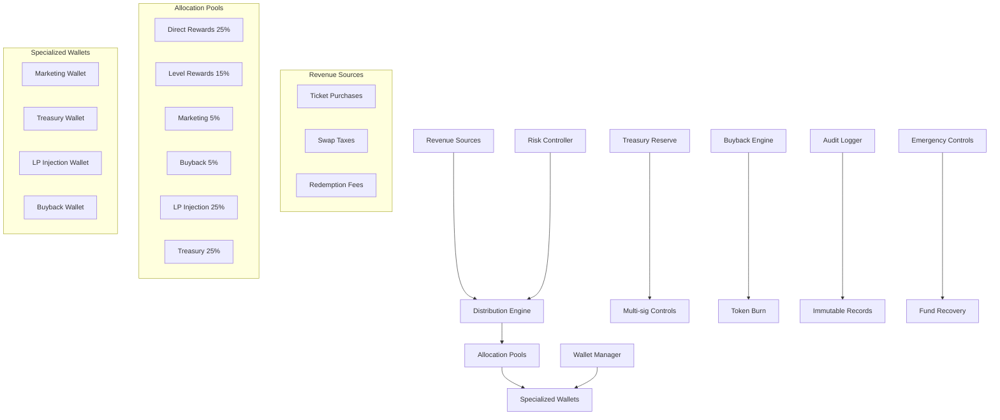

# Design Document

## Overview

The Protocol Fund Management System is a comprehensive financial management layer for the Jinbao RWA DeFi 4.0 protocol. It handles automated revenue collection, fund distribution, multi-wallet management, and risk controls to ensure sustainable protocol operations. The system processes multiple revenue streams including ticket purchases, swap taxes, and redemption fees, then distributes funds according to configurable allocation percentages across six main categories: direct rewards (25%), level rewards (15%), marketing (5%), buyback operations (5%), liquidity pool injection (25%), and treasury reserves (25%).

## Architecture

The system follows a modular architecture with clear separation of concerns:



The architecture ensures that funds flow automatically from collection points through the distribution engine to appropriate allocation pools, with comprehensive monitoring and control mechanisms at each stage.

## Components and Interfaces

### Distribution Engine

The core component responsible for fund allocation and distribution:

```typescript
interface IDistributionEngine {
    // Fund collection and categorization
    collectRevenue(amount: uint256, source: RevenueSource): void;
    categorizeRevenue(txHash: bytes32, category: RevenueCategory): void;
    
    // Automatic distribution
    distributeRevenue(amount: uint256): DistributionResult;
    updateAllocationPercentages(allocations: AllocationConfig): void;
    
    // Validation and safety
    validateAllocation(config: AllocationConfig): boolean;
    checkDistributionLimits(amount: uint256): boolean;
    
    // Events
    event RevenueCollected(uint256 amount, RevenueSource source, uint256 timestamp);
    event FundsDistributed(uint256 amount, AllocationBreakdown breakdown);
    event AllocationUpdated(AllocationConfig oldConfig, AllocationConfig newConfig);
}

struct AllocationConfig {
    uint256 directRewardPercent;    // 25%
    uint256 levelRewardPercent;     // 15%
    uint256 marketingPercent;       // 5%
    uint256 buybackPercent;         // 5%
    uint256 lpInjectionPercent;     // 25%
    uint256 treasuryPercent;        // 25%
}

struct DistributionResult {
    uint256 directRewardAmount;
    uint256 levelRewardAmount;
    uint256 marketingAmount;
    uint256 buybackAmount;
    uint256 lpInjectionAmount;
    uint256 treasuryAmount;
    bool success;
    string errorMessage;
}
```

### Wallet Manager

Manages specialized wallet addresses and fund routing:

```typescript
interface IWalletManager {
    // Wallet management
    setMarketingWallet(address wallet): void;
    setTreasuryWallet(address wallet): void;
    setLpInjectionWallet(address wallet): void;
    setBuybackWallet(address wallet): void;
    
    // Batch operations
    setAllWallets(WalletConfig config): void;
    validateWalletConfig(WalletConfig config): boolean;
    
    // Fund routing
    routeFunds(amount: uint256, destination: WalletType): void;
    
    // Queries
    getCurrentWallets(): WalletConfig;
    getWalletHistory(address wallet): WalletHistoryEntry[];
    
    // Events
    event WalletUpdated(WalletType walletType, address oldAddress, address newAddress);
    event FundsRouted(address destination, uint256 amount, WalletType walletType);
}

struct WalletConfig {
    address marketingWallet;
    address treasuryWallet;
    address lpInjectionWallet;
    address buybackWallet;
}

enum WalletType {
    MARKETING,
    TREASURY,
    LP_INJECTION,
    BUYBACK
}
```

### Risk Controller

Implements safety mechanisms and risk management:

```typescript
interface IRiskController {
    // Limit management
    setDailyWithdrawalLimits(WalletType walletType, uint256 limit): void;
    checkWithdrawalLimit(WalletType walletType, uint256 amount): boolean;
    
    // Balance monitoring
    checkTreasuryMinimum(): boolean;
    validateFundBalance(uint256 requestedAmount): boolean;
    
    // Emergency controls
    pauseFundOperations(): void;
    resumeFundOperations(): void;
    emergencyWithdraw(WalletType walletType, uint256 amount): void;
    
    // Risk assessment
    assessRiskLevel(): RiskLevel;
    getBalanceRatios(): BalanceRatios;
    
    // Events
    event RiskLevelChanged(RiskLevel oldLevel, RiskLevel newLevel);
    event EmergencyPauseActivated(string reason);
    event WithdrawalLimitExceeded(WalletType walletType, uint256 requested, uint256 limit);
}

enum RiskLevel {
    LOW,
    MEDIUM,
    HIGH,
    CRITICAL
}

struct BalanceRatios {
    uint256 treasuryToActiveDeposits;
    uint256 liquidityToTotalSupply;
    uint256 reserveToCirculating;
}
```

### Buyback Engine

Handles token buyback and burn operations:

```typescript
interface IBuybackEngine {
    // Buyback operations
    executeBuyback(uint256 mcAmount): BuybackResult;
    scheduleBuyback(uint256 interval): void;
    
    // Burn operations
    burnTokens(uint256 jbcAmount): void;
    
    // Configuration
    setBuybackSchedule(uint256 frequency): void;
    setMinimumBuybackAmount(uint256 amount): void;
    
    // Queries
    getBuybackHistory(): BuybackHistoryEntry[];
    getTotalBurned(): uint256;
    getPendingBuybackAmount(): uint256;
    
    // Events
    event BuybackExecuted(uint256 mcSpent, uint256 jbcPurchased, uint256 jbcBurned);
    event BuybackScheduled(uint256 nextExecutionTime, uint256 estimatedAmount);
}

struct BuybackResult {
    uint256 mcSpent;
    uint256 jbcPurchased;
    uint256 jbcBurned;
    uint256 newJbcPrice;
    bool success;
}
```

## Data Models

### Revenue Tracking

```typescript
struct RevenueEntry {
    uint256 id;
    uint256 amount;
    RevenueSource source;
    address contributor;
    uint256 timestamp;
    bytes32 transactionHash;
    bool distributed;
}

enum RevenueSource {
    TICKET_PURCHASE,
    SWAP_TAX_BUY,
    SWAP_TAX_SELL,
    REDEMPTION_FEE,
    LIQUIDITY_FEE
}
```

### Fund Allocation Records

```typescript
struct AllocationRecord {
    uint256 id;
    uint256 totalAmount;
    AllocationBreakdown breakdown;
    uint256 timestamp;
    address executor;
    bytes32 batchHash;
}

struct AllocationBreakdown {
    uint256 directRewards;
    uint256 levelRewards;
    uint256 marketing;
    uint256 buyback;
    uint256 lpInjection;
    uint256 treasury;
}
```

### Audit Trail

```typescript
struct AuditEntry {
    uint256 id;
    AuditEventType eventType;
    address actor;
    uint256 amount;
    address targetWallet;
    uint256 timestamp;
    bytes32 transactionHash;
    string metadata;
}

enum AuditEventType {
    REVENUE_COLLECTED,
    FUNDS_DISTRIBUTED,
    WALLET_UPDATED,
    ALLOCATION_CHANGED,
    EMERGENCY_ACTION,
    BUYBACK_EXECUTED
}
```

## Correctness Properties

*A property is a characteristic or behavior that should hold true across all valid executions of a system-essentially, a formal statement about what the system should do. Properties serve as the bridge between human-readable specifications and machine-verifiable correctness guarantees.*

### Property 1: Revenue Collection and Categorization Integrity
*For any* revenue transaction (ticket purchase, swap tax, or redemption fee), the Distribution_Engine should properly collect the amount, categorize it by source type, create an audit log entry with timestamp, and maintain separate accounting for each revenue stream type.
**Validates: Requirements 1.1, 1.2, 1.3, 1.4, 1.5**

### Property 2: Automatic Fund Distribution Correctness
*For any* primary revenue amount, the Distribution_Engine should automatically allocate exactly 25% to direct rewards, 15% to level rewards, 5% to marketing, 5% to buyback, 25% to LP injection, and 25% to treasury, with all percentages summing to exactly 100%.
**Validates: Requirements 2.1, 2.2, 2.3, 2.4, 2.5, 2.6, 2.7**

### Property 3: Configuration Management Validation
*For any* distribution percentage update, the system should validate that percentages sum to 100%, reject invalid configurations, apply changes immediately to new transactions, emit transparency events, and maintain historical records of all changes.
**Validates: Requirements 3.1, 3.2, 3.3, 3.4, 3.5**

### Property 4: Wallet Management Integrity
*For any* wallet configuration, the Wallet_Manager should maintain separate addresses for each wallet type, reject zero addresses, prevent duplicate addresses across purposes, and correctly route funds to the appropriate specialized wallets during distribution.
**Validates: Requirements 4.1, 4.2, 4.3, 4.5**

### Property 5: Liquidity Pool Management Correctness
*For any* liquidity operation (MC or JBC token addition), the Liquidity_Pool should increase the appropriate reserves, update swap ratios correctly, emit transparency events, enforce access controls, and maintain accurate reserve accounting.
**Validates: Requirements 5.1, 5.2, 5.3, 5.4, 5.5**

### Property 6: Risk Management Controls
*For any* fund operation, the Risk_Controller should enforce daily withdrawal limits, require additional authorization for large movements, monitor fund ratios with alerting, restrict distributions when treasury is low, and maintain functional emergency pause capabilities.
**Validates: Requirements 6.1, 6.2, 6.3, 6.4, 6.5**

### Property 7: Treasury Reserve Management
*For any* treasury operation, the Treasury_Reserve should accumulate exactly 25% of primary revenue, require multi-signature authorization for access, maintain minimum reserve ratios, notify administrators of significant changes, and support both MC and JBC token holdings.
**Validates: Requirements 7.1, 7.2, 7.3, 7.4, 7.5**

### Property 8: Buyback and Burn Operations
*For any* buyback operation, the Buyback_Engine should accumulate exactly 5% of primary revenue, purchase JBC tokens from the AMM pool, permanently burn purchased tokens, execute on schedule, and emit events showing burned amounts.
**Validates: Requirements 8.1, 8.2, 8.3, 8.4, 8.5**

### Property 9: Audit Trail Integrity
*For any* fund allocation or distribution, the system should create immutable audit log entries with timestamps and amounts, record recipient addresses and transaction hashes, and maintain comprehensive audit trails for regulatory compliance.
**Validates: Requirements 9.1, 9.2, 9.4**

### Property 10: Emergency Fund Recovery
*For any* emergency situation, the Fund_Manager should provide withdrawal functions for each fund category, require owner-level authorization, implement time delays for large withdrawals, emit high-priority events, and maintain separate procedures for different fund types.
**Validates: Requirements 10.1, 10.2, 10.3, 10.4, 10.5**

## Error Handling

The system implements comprehensive error handling across all components:

### Revenue Collection Errors
- **InvalidRevenueSource**: Thrown when an unrecognized revenue source is provided
- **ZeroAmountRevenue**: Thrown when attempting to collect zero or negative revenue
- **DuplicateTransaction**: Thrown when the same transaction hash is processed twice
- **CategoryMismatch**: Thrown when revenue categorization doesn't match the source

### Distribution Errors
- **AllocationSumError**: Thrown when allocation percentages don't sum to 100%
- **InsufficientFunds**: Thrown when there aren't enough funds for distribution
- **WalletNotSet**: Thrown when attempting to distribute to an unset wallet address
- **DistributionPaused**: Thrown when fund operations are paused

### Wallet Management Errors
- **ZeroAddressWallet**: Thrown when attempting to set a zero address as a wallet
- **DuplicateWalletAddress**: Thrown when the same address is used for multiple wallet types
- **UnauthorizedWalletUpdate**: Thrown when non-admin attempts wallet changes
- **InvalidWalletType**: Thrown when an invalid wallet type is specified

### Risk Control Errors
- **WithdrawalLimitExceeded**: Thrown when daily limits are exceeded
- **InsufficientAuthorization**: Thrown when additional authorization is required
- **TreasuryBelowMinimum**: Thrown when treasury reserves are too low
- **RiskLevelCritical**: Thrown when system risk level becomes critical

### Emergency Errors
- **EmergencyPauseActive**: Thrown when operations are attempted during emergency pause
- **TimelockNotExpired**: Thrown when attempting early withdrawal during timelock
- **InvalidEmergencyProcedure**: Thrown when wrong emergency procedure is used

## Testing Strategy

The testing strategy employs a dual approach combining unit tests for specific scenarios and property-based tests for comprehensive validation:

### Unit Testing Approach
- **Configuration Testing**: Verify correct setup of allocation percentages, wallet addresses, and system parameters
- **Edge Case Testing**: Test boundary conditions like zero amounts, maximum values, and limit thresholds
- **Error Condition Testing**: Validate proper error handling for invalid inputs and system states
- **Integration Testing**: Test interactions between components like Distribution Engine and Wallet Manager
- **Access Control Testing**: Verify that only authorized users can perform administrative functions

### Property-Based Testing Configuration
- **Framework**: Use Foundry's property testing capabilities for Solidity contracts
- **Test Iterations**: Minimum 100 iterations per property test to ensure comprehensive coverage
- **Input Generation**: Smart generators that create realistic fund amounts, wallet addresses, and allocation configurations
- **Invariant Testing**: Continuous validation of system invariants during fuzz testing
- **State Transition Testing**: Verify system behavior across different operational states

### Property Test Implementation
Each correctness property will be implemented as a separate property-based test:

- **Property 1 Test**: Generate random revenue amounts and sources, verify collection and categorization
- **Property 2 Test**: Generate random primary revenue amounts, verify exact percentage allocations
- **Property 3 Test**: Generate random allocation configurations, verify validation and application
- **Property 4 Test**: Generate random wallet configurations, verify management and routing
- **Property 5 Test**: Generate random liquidity operations, verify pool state updates
- **Property 6 Test**: Generate random fund operations, verify risk controls
- **Property 7 Test**: Generate random treasury operations, verify reserve management
- **Property 8 Test**: Generate random buyback scenarios, verify token purchase and burn
- **Property 9 Test**: Generate random fund operations, verify audit trail creation
- **Property 10 Test**: Generate random emergency scenarios, verify recovery procedures

### Test Tags and Organization
Each property test will be tagged with:
- **Feature: protocol-fund-management, Property X: [Property Description]**
- Tests will be organized by component (Distribution Engine, Wallet Manager, etc.)
- Separate test suites for unit tests and property tests
- Integration test suite for cross-component interactions

The testing strategy ensures both specific functionality validation through unit tests and comprehensive correctness verification through property-based testing, providing confidence in the system's reliability and security.
```

Now I need to use the prework tool to analyze the acceptance criteria before writing the correctness properties:

<function_calls>
<invoke name="prework">
<parameter name="featureName">protocol-fund-management