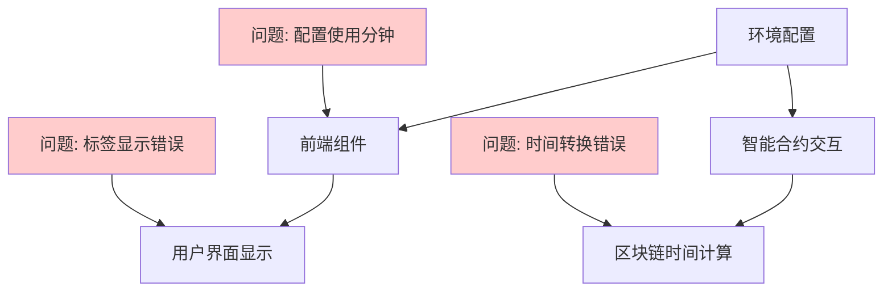
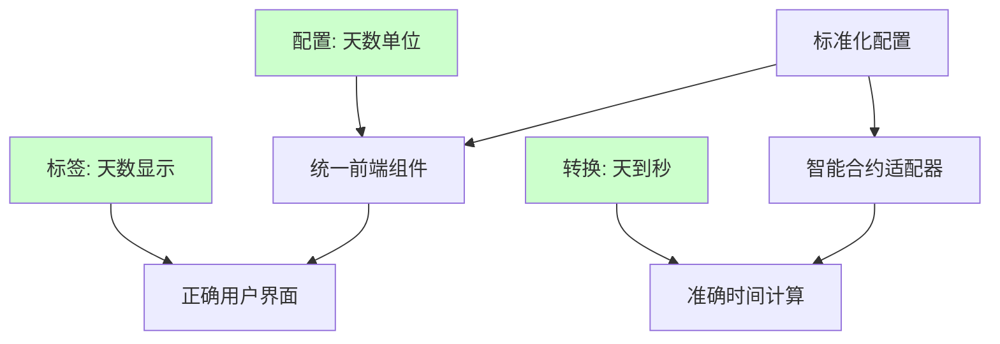

# 流动性质押周期单位标准化设计文档

## 概述

本设计文档详细说明如何修复Jinbao Protocol中流动性质押周期单位显示错误的问题。当前生产环境错误地显示"分钟"而不是"天"，这会严重误导用户。本设计提供了一个全面的解决方案，包括前端组件修复、配置文件更新、以及确保系统一致性的机制。

## 架构

### 当前架构问题分析



### 目标架构



## 组件和接口

### 1. 配置管理组件

#### 环境配置标准化
```typescript
// config/production.ts - 修复后的配置
export const PRODUCTION_CONFIG = {
  // 质押周期配置 (天数) - 修复显示单位
  STAKING_PERIODS: [
    {
      days: 7,
      label: "7天",           // 修复: 从"7分钟"改为"7天"
      labelEn: "7 days",
      rate: 1.3333334,
      rateDisplay: "1.33%"
    },
    {
      days: 15,
      label: "15天",          // 修复: 从"15分钟"改为"15天"
      labelEn: "15 days", 
      rate: 1.6666667,
      rateDisplay: "1.67%"
    },
    {
      days: 30,
      label: "30天",          // 修复: 从"30分钟"改为"30天"
      labelEn: "30 days",
      rate: 2.0,
      rateDisplay: "2.00%"
    }
  ],
  
  // 时间单位配置
  TIME_UNIT: "days",           // 确保使用天作为基础单位
  TIME_UNIT_SECONDS: 86400,    // 1天 = 86400秒
  DISPLAY_UNIT: "天",          // 中文显示单位
  DISPLAY_UNIT_EN: "days"      // 英文显示单位
};
```

#### 配置验证接口
```typescript
interface StakingPeriodConfig {
  days: number;
  label: string;
  labelEn: string;
  rate: number;
  rateDisplay: string;
}

interface TimeUnitConfig {
  TIME_UNIT: "days" | "minutes";
  TIME_UNIT_SECONDS: number;
  DISPLAY_UNIT: string;
  DISPLAY_UNIT_EN: string;
}

class ConfigValidator {
  static validateStakingPeriods(periods: StakingPeriodConfig[]): boolean;
  static validateTimeUnits(config: TimeUnitConfig): boolean;
  static ensureProductionCompliance(config: any): boolean;
}
```

### 2. 前端显示组件

#### 质押周期选择器修复
```typescript
// components/MiningPanel.tsx - 修复质押周期显示
const StakingPeriodSelector: React.FC = () => {
  const { t } = useLanguage();
  
  // 使用修复后的配置
  const stakingPeriods = PRODUCTION_CONFIG.STAKING_PERIODS;
  
  return (
    <div className="staking-period-selector">
      {stakingPeriods.map((period) => (
        <div key={period.days} className="period-option">
          <span className="period-label">
            {t.language === 'zh' ? period.label : period.labelEn}
          </span>
          <span className="period-rate">{period.rateDisplay}</span>
        </div>
      ))}
    </div>
  );
};
```

#### 倒计时显示修复
```typescript
// utils/timeFormatter.ts - 统一时间格式化
export class TimeFormatter {
  static formatRemainingTime(remainingSeconds: number, language: string): string {
    const days = Math.floor(remainingSeconds / 86400);
    const hours = Math.floor((remainingSeconds % 86400) / 3600);
    const minutes = Math.floor((remainingSeconds % 3600) / 60);
    const seconds = remainingSeconds % 60;
    
    if (language === 'zh') {
      if (days > 0) {
        return `${days}天 ${hours}时 ${minutes}分`;
      }
      return `${hours.toString().padStart(2, '0')}:${minutes.toString().padStart(2, '0')}:${seconds.toString().padStart(2, '0')}`;
    } else {
      if (days > 0) {
        return `${days}d ${hours}h ${minutes}m`;
      }
      return `${hours.toString().padStart(2, '0')}:${minutes.toString().padStart(2, '0')}:${seconds.toString().padStart(2, '0')}`;
    }
  }
  
  static formatStakingPeriod(days: number, language: string): string {
    return language === 'zh' ? `${days}天` : `${days} days`;
  }
}
```

### 3. 智能合约适配器

#### 时间转换接口
```typescript
// utils/contractTimeAdapter.ts - 智能合约时间转换
export class ContractTimeAdapter {
  // 将天数转换为智能合约期望的秒数
  static daysToSeconds(days: number): number {
    return days * 86400; // 1天 = 86400秒
  }
  
  // 将智能合约返回的秒数转换为天数
  static secondsToDays(seconds: number): number {
    return Math.floor(seconds / 86400);
  }
  
  // 验证质押周期是否有效
  static isValidStakingPeriod(days: number): boolean {
    const validPeriods = [7, 15, 30];
    return validPeriods.includes(days);
  }
  
  // 获取质押周期的秒数表示
  static getStakingPeriodSeconds(days: number): number {
    if (!this.isValidStakingPeriod(days)) {
      throw new Error(`Invalid staking period: ${days} days`);
    }
    return this.daysToSeconds(days);
  }
}
```

## 数据模型

### 质押周期数据模型
```typescript
interface StakingPeriod {
  id: string;
  days: number;                    // 实际天数
  displayLabel: string;            // 显示标签 (如 "7天")
  displayLabelEn: string;          // 英文显示标签 (如 "7 days")
  dailyRate: number;               // 日收益率
  rateDisplay: string;             // 收益率显示 (如 "1.33%")
  contractSeconds: number;         // 智能合约使用的秒数
  isActive: boolean;               // 是否可用
}

interface StakingPosition {
  id: string;
  userId: string;
  amount: string;                  // 质押金额
  stakingPeriod: StakingPeriod;    // 质押周期信息
  startTime: number;               // 开始时间 (秒)
  endTime: number;                 // 结束时间 (秒)
  remainingSeconds: number;        // 剩余秒数
  status: 'active' | 'completed' | 'expired';
}
```

### 时间显示数据模型
```typescript
interface TimeDisplay {
  days: number;
  hours: number;
  minutes: number;
  seconds: number;
  formattedString: string;         // 格式化后的显示字符串
  language: 'zh' | 'en';
}

interface StakingTimeInfo {
  period: StakingPeriod;
  startTime: Date;
  endTime: Date;
  remainingTime: TimeDisplay;
  progressPercentage: number;      // 进度百分比
}
```

## 错误处理

### 配置验证错误处理
```typescript
class ConfigurationError extends Error {
  constructor(message: string, public configKey: string) {
    super(`Configuration Error [${configKey}]: ${message}`);
    this.name = 'ConfigurationError';
  }
}

class TimeUnitValidator {
  static validateProductionConfig(): void {
    const config = PRODUCTION_CONFIG;
    
    // 验证时间单位必须是天
    if (config.TIME_UNIT !== 'days') {
      throw new ConfigurationError(
        `Production environment must use 'days', got '${config.TIME_UNIT}'`,
        'TIME_UNIT'
      );
    }
    
    // 验证时间单位秒数
    if (config.TIME_UNIT_SECONDS !== 86400) {
      throw new ConfigurationError(
        `Production environment must use 86400 seconds per day, got ${config.TIME_UNIT_SECONDS}`,
        'TIME_UNIT_SECONDS'
      );
    }
    
    // 验证质押周期标签
    config.STAKING_PERIODS.forEach((period, index) => {
      if (period.label.includes('分钟') || period.label.includes('minute')) {
        throw new ConfigurationError(
          `Staking period ${index} contains invalid time unit: ${period.label}`,
          `STAKING_PERIODS[${index}].label`
        );
      }
    });
  }
}
```

### 运行时错误处理
```typescript
class StakingTimeError extends Error {
  constructor(message: string, public context: any) {
    super(`Staking Time Error: ${message}`);
    this.name = 'StakingTimeError';
  }
}

class SafeTimeFormatter {
  static formatWithFallback(
    remainingSeconds: number, 
    language: string
  ): string {
    try {
      return TimeFormatter.formatRemainingTime(remainingSeconds, language);
    } catch (error) {
      console.error('Time formatting error:', error);
      // 降级显示方案
      const days = Math.floor(remainingSeconds / 86400);
      return language === 'zh' ? `约${days}天` : `~${days} days`;
    }
  }
}
```

## 正确性属性

*属性是一个特征或行为，应该在系统的所有有效执行中保持为真——本质上是关于系统应该做什么的正式声明。属性作为人类可读规范和机器可验证正确性保证之间的桥梁。*

### 属性 1: 时间单位显示一致性
*对于任何* 质押周期配置和语言设置，所有UI组件显示的时间单位应该都是天（或对应的本地化单位），而不包含分钟相关的文本
**验证需求: Requirements 1.1, 1.2, 3.1**

### 属性 2: 时间格式化正确性
*对于任何* 有效的剩余秒数，时间格式化函数应该返回包含正确天、小时、分钟格式的字符串，且格式符合指定语言的约定
**验证需求: Requirements 1.3, 3.2**

### 属性 3: 配置验证完整性
*对于任何* 系统配置，如果配置通过验证，则所有时间相关的配置项都应该使用天作为基础单位，且不包含分钟相关的设置
**验证需求: Requirements 2.1, 2.3**

### 属性 4: 时间转换双向一致性
*对于任何* 有效的天数值，将其转换为秒数再转换回天数应该得到原始值（天数转换的往返属性）
**验证需求: Requirements 4.2, 4.3**

### 属性 5: 多语言显示一致性
*对于任何* 支持的语言和质押周期，系统显示的时间单位应该是该语言中"天"的正确表达，且在同一语言环境下所有组件保持一致
**验证需求: Requirements 1.5, 3.3**

### 属性 6: 组件间时间显示统一性
*对于任何* 质押记录，在不同UI组件（质押面板、收益详情、历史记录）中显示的时间信息应该使用相同的格式和单位
**验证需求: Requirements 3.4, 3.5**

### 属性 7: 智能合约时间计算一致性
*对于任何* 质押周期，前端计算的时间（天数转秒数）应该与智能合约期望的时间参数完全匹配
**验证需求: Requirements 4.1, 4.4**

## 测试策略

### 双重测试方法
- **单元测试**: 验证具体示例、边界情况和错误条件
- **属性测试**: 验证所有输入的通用属性
- 两者互补且都是全面覆盖所必需的

### 单元测试策略
- **配置验证测试**: 测试特定配置文件的验证逻辑
- **时间转换测试**: 测试已知天数到秒数转换的准确性
- **显示格式测试**: 验证特定时间值的格式化输出
- **错误处理测试**: 测试无效输入的错误处理
- **边界情况测试**: 测试最小/最大质押周期的处理

### 属性测试策略
- **最少100次迭代**: 每个属性测试运行至少100次随机输入
- **智能生成器**: 生成有效的质押周期、时间值和语言设置
- **测试标记**: 每个属性测试标记为 **Feature: staking-period-unit-standardization, Property N: [属性文本]**
- **需求追溯**: 每个属性测试引用其验证的设计文档属性

### 集成测试策略
- **端到端显示测试**: 从配置加载到用户界面显示的完整流程
- **多语言切换测试**: 验证语言切换时时间显示的正确更新
- **智能合约交互测试**: 验证前端和合约的时间参数传递

### 用户验收测试
- **用户界面验证**: 确认用户看到正确的天数显示
- **功能完整性验证**: 确认修复后所有功能正常工作
- **性能影响验证**: 确认修复不影响系统性能