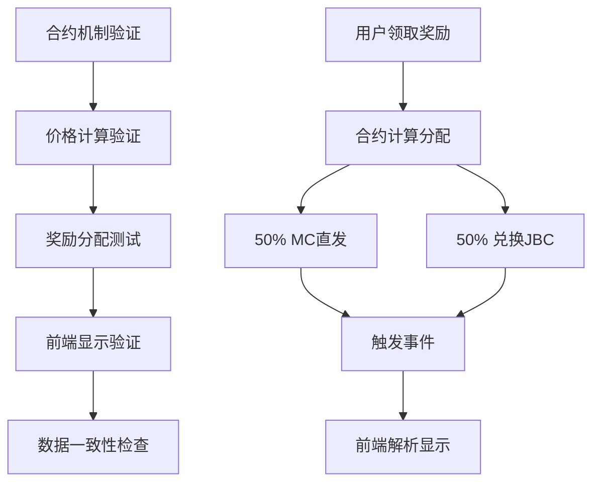
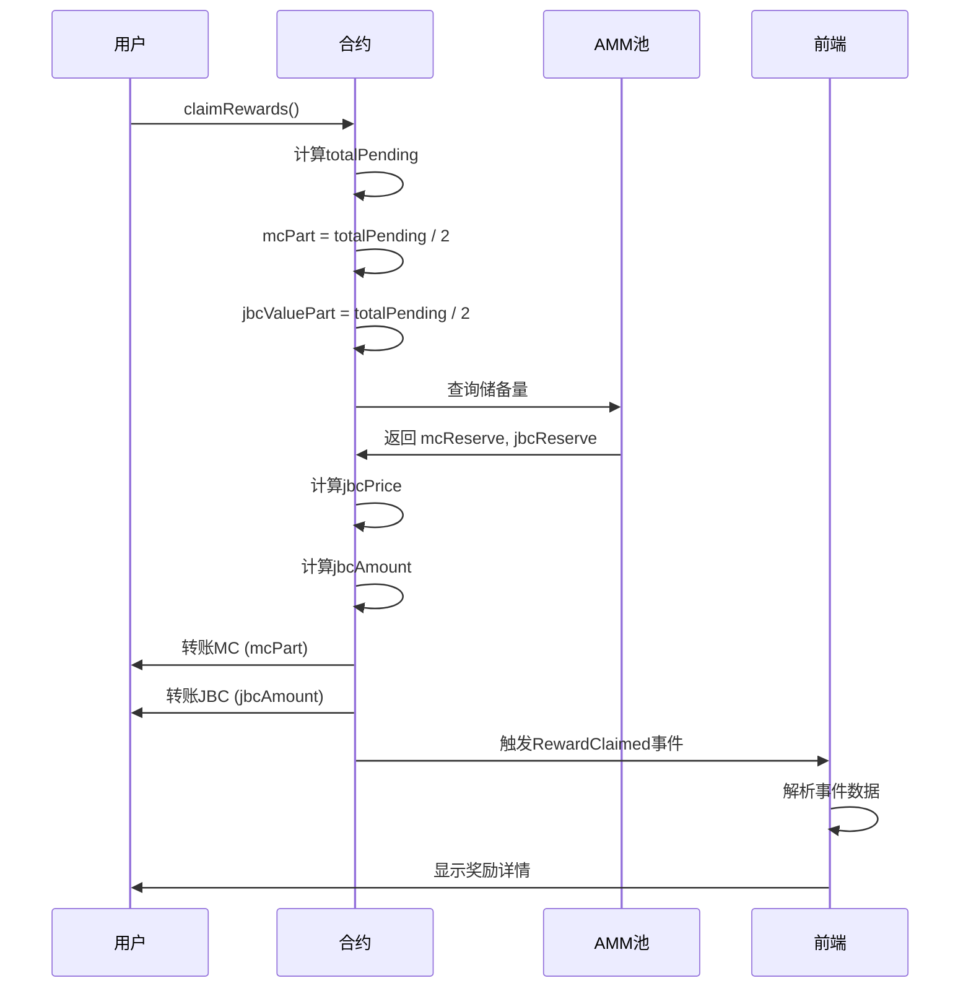
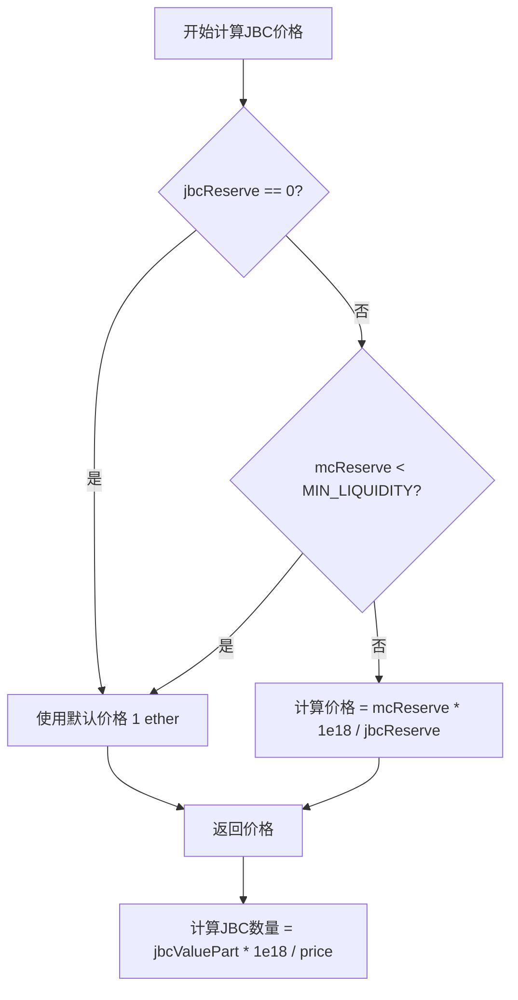

# 静态奖励机制验证与显示修复设计文档

## 概述

本设计文档旨在验证和修复静态奖励的 50% MC + 50% JBC 分配机制，确保合约实现正确且前端显示准确。通过全面的测试和验证，保证用户能够清楚地看到奖励分配的详细信息。

## 架构设计

### 验证流程架构



### 核心组件

1. **合约验证器**: 验证 claimRewards 函数的分配逻辑
2. **价格计算器**: 验证 JBC 价格计算的准确性
3. **前端解析器**: 验证事件解析和数据显示
4. **一致性检查器**: 确保合约和前端数据一致
5. **用户界面优化器**: 改进奖励显示的用户体验

## 组件和接口

### 1. 合约机制分析

#### 当前 claimRewards 实现
```solidity
function claimRewards() external nonReentrant {
    // ... 计算 totalPending ...
    
    // 50/50 分配逻辑
    uint256 mcPart = totalPending / 2;        // 50% MC
    uint256 jbcValuePart = totalPending / 2;  // 50% 等值JBC
    
    // JBC价格计算
    uint256 jbcPrice = swapReserveJBC == 0 || swapReserveMC < MIN_LIQUIDITY 
        ? 1 ether 
        : (swapReserveMC * 1e18) / swapReserveJBC;
    
    // JBC数量计算
    uint256 jbcAmount = (jbcValuePart * 1 ether) / jbcPrice;
    
    // 实际转账
    uint256 mcTransferred = 0;
    if (mcToken.balanceOf(address(this)) >= mcPart && mcPart > 0) {
        mcToken.transfer(msg.sender, mcPart);
        mcTransferred = mcPart;
    }
    
    uint256 jbcTransferred = 0;
    if (jbcToken.balanceOf(address(this)) >= jbcAmount && jbcAmount > 0) {
        jbcToken.transfer(msg.sender, jbcAmount);
        jbcTransferred = jbcAmount;
    }
    
    // 触发事件
    emit RewardClaimed(msg.sender, mcTransferred, jbcTransferred, REWARD_STATIC, ticket.ticketId);
}
```

### 2. 前端显示组件

#### 奖励显示接口
```typescript
interface StaticRewardDisplay {
    totalReward: string;           // 总奖励金额
    mcPart: string;               // MC部分（50%）
    jbcPart: string;              // JBC部分（50%）
    jbcAmount: string;            // 实际JBC数量
    currentPrice: string;         // 当前MC/JBC价格
    mechanism: "50% MC + 50% JBC"; // 分配机制标识
}

interface RewardRecord {
    hash: string;
    mcAmount: string;             // 实际收到的MC数量
    jbcAmount: string;            // 实际收到的JBC数量
    totalValue: string;           // 总价值（MC等值）
    timestamp: number;
    rewardType: number;
}
```

#### 价格计算函数
```typescript
const calculateJBCPrice = (mcReserve: bigint, jbcReserve: bigint): bigint => {
    if (jbcReserve === 0n || mcReserve < MIN_LIQUIDITY) {
        return parseEther("1"); // 默认 1:1
    }
    return (mcReserve * parseEther("1")) / jbcReserve;
};

const calculateJBCAmount = (mcValue: bigint, jbcPrice: bigint): bigint => {
    return (mcValue * parseEther("1")) / jbcPrice;
};
```

### 3. 验证测试组件

#### 合约测试接口
```typescript
interface RewardTestCase {
    stakingAmount: bigint;
    cycleDays: number;
    timeElapsed: number;
    expectedTotalReward: bigint;
    expectedMCPart: bigint;
    expectedJBCValue: bigint;
    mcReserve: bigint;
    jbcReserve: bigint;
}

interface ValidationResult {
    isValid: boolean;
    actualMC: bigint;
    actualJBC: bigint;
    expectedMC: bigint;
    expectedJBCAmount: bigint;
    priceUsed: bigint;
    errors: string[];
}
```

## 数据模型

### 奖励分配数据流



### 价格计算逻辑



## 正确性属性

*属性是系统在所有有效执行中应该保持为真的特征或行为——本质上是关于系统应该做什么的正式声明。*

### 属性1：50/50分配一致性
*对于任何*静态奖励总额，MC部分和JBC等值部分应该各占50%
**验证：需求 1.1, 1.2**

### 属性2：价格计算准确性
*对于任何*AMM池状态，JBC价格计算应该反映当前的储备比例
**验证：需求 3.1, 3.2, 3.3**

### 属性3：事件数据一致性
*对于任何*奖励发放，RewardClaimed事件中的数据应该与实际转账数量一致
**验证：需求 6.1, 6.2**

### 属性4：前端显示准确性
*对于任何*RewardClaimed事件，前端解析的数据应该与事件原始数据完全一致
**验证：需求 2.2, 6.3**

### 属性5：余额处理正确性
*对于任何*合约余额不足的情况，系统应该记录实际转账数量而非预期数量
**验证：需求 4.3, 4.4, 4.5**

### 属性6：价格实时性
*对于任何*储备量变化，前端显示的价格应该实时更新
**验证：需求 3.5, 2.4**

## 错误处理

### 常见问题场景

1. **价格计算异常**: 储备量为0或异常值
   - 解决：使用默认价格1:1，记录异常日志

2. **余额不足**: 合约MC或JBC余额不足
   - 解决：记录实际转账数量，触发余额不足事件

3. **事件解析失败**: 前端无法正确解析RewardClaimed事件
   - 解决：增强错误处理，提供降级显示方案

4. **数据不一致**: 前端显示与合约数据不符
   - 解决：增加数据验证，提供手动刷新功能

## 测试策略

### 单元测试
- 测试50/50分配逻辑的数学准确性
- 测试价格计算在各种储备量情况下的正确性
- 测试余额不足时的处理逻辑
- 测试事件触发和数据记录

### 集成测试
- 测试完整的领取→分配→显示流程
- 测试不同AMM池状态下的价格计算
- 测试前端事件监听和数据解析
- 测试用户界面的实时更新

### 属性测试

每个属性测试最少运行100次迭代，标签格式：**Feature: static-reward-mechanism-verification, Property {number}: {property_text}**

#### 测试数据生成
```typescript
// 生成随机奖励场景
function generateRewardScenario(): RewardTestCase {
    return {
        stakingAmount: randomBigInt(100n * 10n**18n, 1000n * 10n**18n),
        cycleDays: randomChoice([7, 15, 30]),
        timeElapsed: randomInt(1, 30),
        mcReserve: randomBigInt(1000n * 10n**18n, 100000n * 10n**18n),
        jbcReserve: randomBigInt(1000n * 10n**18n, 100000n * 10n**18n)
    };
}

// 生成边界情况
function generateEdgeCases(): RewardTestCase[] {
    return [
        { /* 零储备量 */ },
        { /* 最小流动性 */ },
        { /* 极大储备量 */ },
        { /* 奇数奖励 */ }
    ];
}
```

## 用户界面设计

### 奖励显示组件
```tsx
interface StaticRewardDisplayProps {
    totalReward: string;
    mcPart: string;
    jbcPart: string;
    jbcAmount: string;
    currentPrice: string;
}

const StaticRewardDisplay: React.FC<StaticRewardDisplayProps> = ({
    totalReward, mcPart, jbcPart, jbcAmount, currentPrice
}) => {
    return (
        <div className="reward-display">
            <div className="mechanism-label">
                静态奖励分配：50% MC + 50% JBC
            </div>
            <div className="reward-breakdown">
                <div className="mc-part">
                    MC部分：{mcPart} MC
                </div>
                <div className="jbc-part">
                    JBC部分：{jbcAmount} JBC (等值 {jbcPart} MC)
                </div>
            </div>
            <div className="current-price">
                当前汇率：1 MC = {formatPrice(currentPrice)} JBC
            </div>
        </div>
    );
};
```

### 历史记录显示
```tsx
const RewardHistoryItem: React.FC<{record: RewardRecord}> = ({record}) => {
    return (
        <div className="reward-record">
            <div className="amounts">
                <span className="mc-amount">{record.mcAmount} MC</span>
                <span className="plus">+</span>
                <span className="jbc-amount">{record.jbcAmount} JBC</span>
            </div>
            <div className="total-value">
                总价值：{record.totalValue} MC
            </div>
        </div>
    );
};
```

这个设计确保了静态奖励机制的验证和显示能够准确反映50% MC + 50% JBC的分配逻辑，同时提供清晰的用户界面和完善的错误处理。