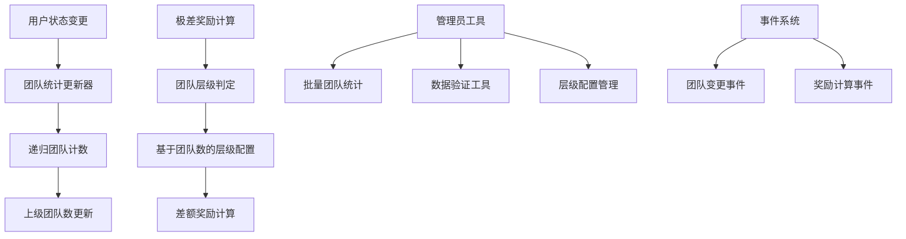
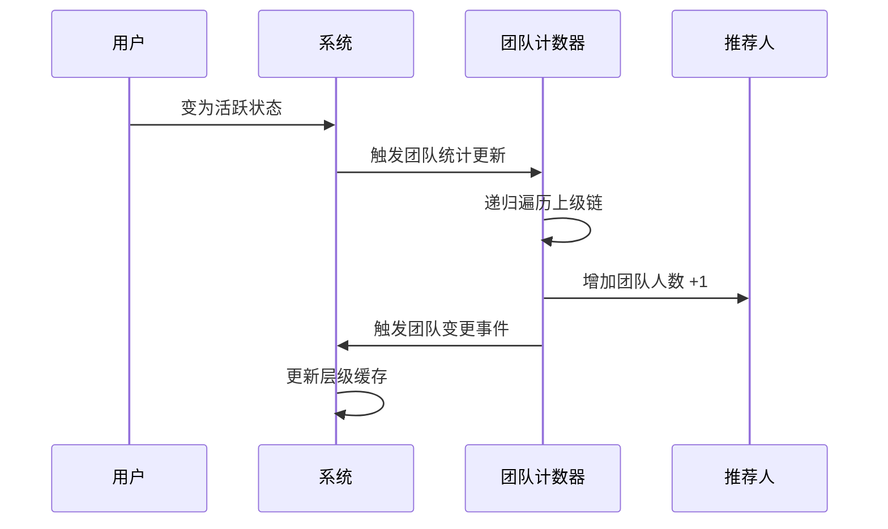
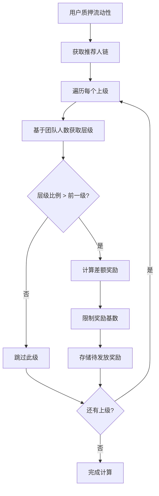

# 基于团队总人数的极差奖励系统设计文档

## 概述

本设计文档描述了将极差奖励系统从基于直接推荐人数改为基于团队总人数的完整方案。这一改进将使奖励机制更加公平，更好地激励深度团队建设，让大团队建设者获得应有的回报。

## 架构设计

### 系统架构图



### 核心组件

1. **团队统计管理器**: 负责维护每个用户的准确团队人数
2. **层级配置系统**: 管理基于团队人数的层级配置
3. **极差奖励计算器**: 基于团队人数计算极差奖励
4. **性能优化器**: 确保大团队操作的性能
5. **数据一致性验证器**: 验证和修正团队统计数据

## 组件和接口

### 数据结构

```solidity
struct UserInfo {
    address referrer;
    uint256 activeDirects;     // 保留用于层级奖励
    uint256 teamCount;         // 团队总人数（用于极差奖励）
    uint256 totalRevenue;
    uint256 currentCap;
    bool isActive;
    uint256 refundFeeAmount;
    uint256 teamTotalVolume;
    uint256 teamTotalCap;
    uint256 maxTicketAmount;
    uint256 maxSingleTicketAmount;
}

struct TeamUpdateBatch {
    address[] users;
    uint256[] newTeamCounts;
}
```

### 核心接口

```solidity
// 团队统计管理
function updateTeamCount(address user, int256 delta) internal;
function getTeamCount(address user) external view returns (uint256);
function batchUpdateTeamCounts(TeamUpdateBatch calldata batch) external onlyOwner;

// 基于团队的层级判定
function getLevelByTeamCount(uint256 teamCount) public view returns (uint256 level, uint256 percent);
function getTeamBasedDifferentialRewards(address user, uint256 amount) external view returns (PendingReward[] memory);

// 数据验证和修正
function validateTeamCounts(address[] calldata users) external view returns (bool[] memory);
function recalculateTeamCount(address user) external onlyOwner returns (uint256);
function getTeamLevelDistribution() external view returns (uint256[10] memory);
```

### 事件定义

```solidity
event TeamCountUpdated(address indexed user, uint256 oldCount, uint256 newCount);
event TeamLevelConfigUpdated();
event TeamBasedRewardCalculated(uint256 indexed stakeId, address indexed upline, uint256 amount, uint256 teamCount);
event BatchTeamCountsUpdated(uint256 usersUpdated);
event TeamCountValidationFailed(address indexed user, uint256 expected, uint256 actual);
```

## 数据模型

### 团队统计数据流



### 极差奖励计算流程



## 正确性属性

*属性是一个特征或行为，应该在系统的所有有效执行中保持为真——本质上是关于系统应该做什么的正式声明。属性作为人类可读规范和机器可验证正确性保证之间的桥梁。*

基于前面的需求分析，以下是系统必须满足的正确性属性：

### 属性1：团队统计一致性
*对于任何*用户，其团队人数应该等于其所有下级活跃用户的总数
**验证：需求 1.3**

### 属性2：团队统计递归更新
*对于任何*用户状态变更，所有上级用户的团队人数应该相应地增加或减少
**验证：需求 1.1, 1.2**

### 属性3：基于团队数的层级判定
*对于任何*极差奖励计算，系统应该使用团队总人数而非直接推荐人数来判定层级
**验证：需求 3.1**

### 属性4：极差奖励差额计算
*对于任何*推荐关系链中的上级，当其层级比例大于前一级时，应该获得相应的差额奖励
**验证：需求 3.3**

### 属性5：奖励基数限制
*对于任何*极差奖励计算，奖励基数不应该超过上级用户的门票金额
**验证：需求 3.4**

### 属性6：递归深度限制
*对于任何*团队统计操作，递归深度不应该超过20层，以防止无限循环和gas耗尽
**验证：需求 4.1**

### 属性7：配置即时生效
*对于任何*层级配置更新，新配置应该立即应用于后续的奖励计算
**验证：需求 2.3**

### 属性8：向后兼容性
*对于任何*现有功能，在系统升级后应该继续正常工作
**验证：需求 5.3, 5.5**

### 属性9：事件触发一致性
*对于任何*团队人数变更，应该触发相应的事件记录
**验证：需求 1.5, 4.5**

### 属性10：数据修正有效性
*对于任何*不一致的团队统计数据，修正机制应该能够将其恢复到正确状态
**验证：需求 6.3**

## 错误处理

### 错误类型定义

```solidity
error TeamCountOverflow();
error RecursionDepthExceeded();
error InvalidTeamCountUpdate();
error TeamCountMismatch(address user, uint256 expected, uint256 actual);
error BatchUpdateSizeMismatch();
```

### 错误处理策略

1. **递归深度保护**: 限制团队统计递归深度，防止栈溢出
2. **数据一致性检查**: 在关键操作前验证团队统计数据
3. **优雅降级**: 当团队统计失败时，不影响主要功能
4. **事务回滚**: 确保部分失败时的数据一致性

## 测试策略

### 双重测试方法

本系统将采用**单元测试**和**基于属性的测试**相结合的方法：

- **单元测试**: 验证特定示例、边界情况和错误条件
- **属性测试**: 验证所有输入下的通用属性
- 两者互补，确保全面覆盖

### 单元测试重点

- 团队统计的基本增减操作
- 层级配置的正确应用
- 管理员工具的功能验证
- 错误处理的边界情况

### 属性测试配置

- 每个属性测试最少运行100次迭代
- 每个属性测试必须引用其设计文档属性
- 标签格式：**Feature: team-based-differential-rewards, Property {number}: {property_text}**

### 测试数据生成

```solidity
// 生成随机推荐关系网络
function generateReferralNetwork(uint256 size) internal returns (address[] memory);

// 生成随机团队配置
function generateTeamConfiguration(uint256 levels, uint256 maxTeamSize) internal returns (TeamConfig memory);

// 生成随机质押场景
function generateStakingScenario(address[] memory users, uint256[] memory amounts) internal returns (StakingScenario memory);
```

## 性能考虑

### 优化策略

1. **批量操作**: 提供批量更新团队统计的功能
2. **缓存机制**: 缓存频繁查询的层级信息
3. **增量更新**: 只更新受影响的用户数据
4. **异步处理**: 对于大型团队，考虑分批处理

### Gas优化

- 限制单次交易中的递归操作数量
- 使用packed结构减少存储成本
- 优化循环逻辑减少计算复杂度

## 部署和迁移

### 升级策略

1. **数据迁移**: 计算并初始化所有现有用户的团队人数
2. **功能切换**: 逐步启用基于团队数的功能
3. **验证阶段**: 并行运行新旧逻辑进行对比验证
4. **完全切换**: 确认无误后完全切换到新逻辑

### 迁移脚本

```solidity
function migrateTeamCounts() external onlyOwner {
    // 批量计算和设置所有用户的团队人数
    // 验证迁移结果的准确性
    // 触发迁移完成事件
}
```

这个设计确保了基于团队总人数的极差奖励系统能够公平、高效、可靠地运行，同时保持与现有系统的兼容性。