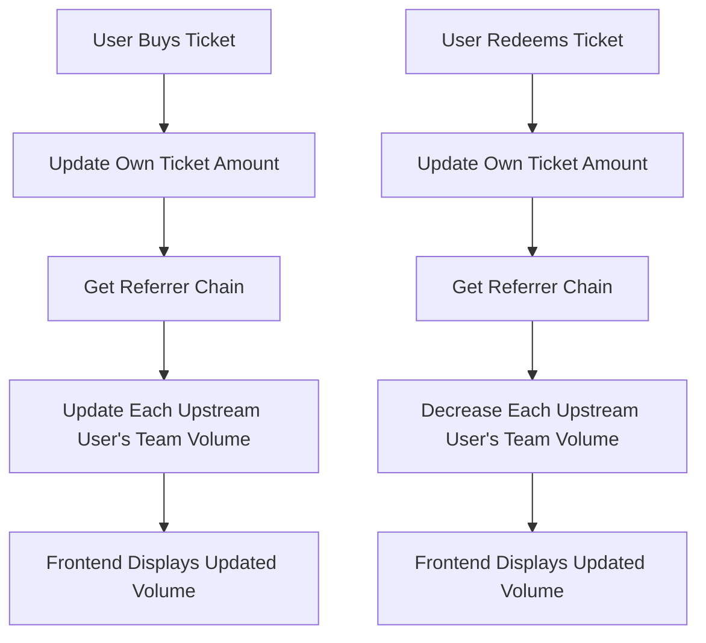

# Design Document

## Overview

This design implements a comprehensive team volume calculation system that accurately tracks and displays the total ticket amounts from all downstream team members. The solution involves both smart contract modifications and frontend updates to provide real-time, accurate team performance metrics.

## Architecture

The system follows a hierarchical update pattern where ticket purchases and redemptions propagate upward through the referral chain, updating cached team volume data at each level.



## Components and Interfaces

### Smart Contract Components

#### 1. Team Volume Calculator
```solidity
contract TeamVolumeCalculator {
    function updateUpstreamTeamVolumes(address user, uint256 volumeChange, bool isIncrease) internal;
    function calculateTeamTotalVolume(address user) public view returns (uint256);
    function getUpstreamChain(address user, uint256 maxDepth) internal view returns (address[] memory);
}
```

#### 2. Enhanced UserInfo Structure
The existing `UserInfo` struct already contains `teamTotalVolume` field which will be utilized:
```solidity
struct UserInfo {
    // ... existing fields
    uint256 teamTotalVolume; // Community Ticket Total Volume
    // ... existing fields
}
```

#### 3. Volume Update Events
```solidity
event TeamVolumeUpdated(address indexed user, uint256 newVolume, uint256 volumeChange, bool isIncrease);
event TeamVolumeCalculationError(address indexed user, string reason);
```

### Frontend Components

#### 1. Enhanced TeamLevel Component
- Displays real team volume from contract data
- Handles loading states and error conditions
- Formats large numbers appropriately

#### 2. Real-time Data Fetching
- Subscribes to contract events for volume updates
- Refreshes team data when relevant transactions occur

## Data Models

### Contract Data Flow

1. **Ticket Purchase Flow**:
   ```
   buyTicket() → updateUpstreamTeamVolumes() → emit TeamVolumeUpdated()
   ```

2. **Ticket Redemption Flow**:
   ```
   redeem() → updateUpstreamTeamVolumes() → emit TeamVolumeUpdated()
   ```

3. **Team Volume Query**:
   ```
   Frontend → userInfo.teamTotalVolume → Display
   ```

### Data Consistency Rules

- Team volume updates must complete within the same transaction as ticket operations
- Failed volume updates should not block main operations
- Circular reference detection prevents infinite loops
- Maximum recursion depth of 20 levels

## Error Handling

### Contract Level Error Handling

1. **Circular Reference Detection**:
   ```solidity
   mapping(address => bool) private _processingUsers;
   
   modifier preventCircularReference(address user) {
       require(!_processingUsers[user], "Circular reference detected");
       _processingUsers[user] = true;
       _;
       _processingUsers[user] = false;
   }
   ```

2. **Gas Limit Protection**:
   ```solidity
   uint256 constant MAX_UPSTREAM_UPDATES = 20;
   ```

3. **Safe Volume Updates**:
   ```solidity
   function safeUpdateTeamVolume(address user, uint256 change, bool isIncrease) internal {
       try this.updateTeamVolume(user, change, isIncrease) {
           // Success
       } catch {
           emit TeamVolumeCalculationError(user, "Volume update failed");
       }
   }
   ```

### Frontend Error Handling

1. **Loading States**: Display loading indicators during data fetching
2. **Error States**: Show error messages for failed calculations
3. **Fallback Values**: Display "0 MC" when data is unavailable
4. **Retry Logic**: Automatic retry for failed network requests

## Correctness Properties

*A property is a characteristic or behavior that should hold true across all valid executions of a system-essentially, a formal statement about what the system should do. Properties serve as the bridge between human-readable specifications and machine-verifiable correctness guarantees.*

### Property 1: Complete Team Volume Inclusion
*For any* user with a referral network, calculating their team total volume should include ticket amounts from all downstream members regardless of referral level depth
**Validates: Requirements 1.1**

### Property 2: Active Ticket Filtering
*For any* team volume calculation, only active (non-expired, non-exited) ticket amounts should be included in the total
**Validates: Requirements 1.3**

### Property 3: Upstream Propagation Consistency
*For any* ticket purchase by a downstream member, all upstream users in the referral chain should have their team total volume increased by the same ticket amount
**Validates: Requirements 2.1**

### Property 4: Downstream Reduction Consistency
*For any* ticket redemption or exit by a downstream member, all upstream users in the referral chain should have their team total volume decreased by the same ticket amount
**Validates: Requirements 2.2**

### Property 5: Ticket Accumulation Reflection
*For any* user who accumulates additional tickets, all upstream users should have their team total volume increased by the additional amount
**Validates: Requirements 2.3**

### Property 6: Transaction Atomicity
*For any* ticket operation that triggers team volume updates, either all upstream volume updates succeed or the entire operation fails atomically
**Validates: Requirements 2.4**

### Property 7: Error Isolation
*For any* ticket purchase where upstream volume updates fail, the original user's ticket purchase should still complete successfully
**Validates: Requirements 2.5**

### Property 8: Frontend Contract Consistency
*For any* team volume displayed in the frontend, the value should match the teamTotalVolume stored in the contract for that user
**Validates: Requirements 3.1**

### Property 9: Real-time Update Propagation
*For any* contract event that changes team volume, the frontend should automatically refresh to display the updated value
**Validates: Requirements 3.4**

### Property 10: Number Formatting Consistency
*For any* large team volume number displayed in the frontend, it should include appropriate thousand separators for readability
**Validates: Requirements 3.5**

### Property 11: Cached Value Usage
*For any* team volume query, the system should return the cached value from UserInfo.teamTotalVolume rather than recalculating
**Validates: Requirements 4.1**

### Property 12: Gas Efficiency
*For any* team volume calculation, the gas usage should remain within reasonable limits regardless of team size
**Validates: Requirements 4.3**

### Property 13: Circular Reference Detection
*For any* referral network with circular relationships, the system should detect and handle them without entering infinite loops
**Validates: Requirements 5.1**

### Property 14: Referrer Change Volume Updates
*For any* user whose referrer changes, both the old and new upstream chains should have their team volumes updated correctly
**Validates: Requirements 5.2**

### Property 15: Graceful Error Handling
*For any* team volume calculation that encounters errors, the system should log the error and continue operation without blocking
**Validates: Requirements 5.3, 5.4**

### Property 16: Invalid Address Handling
*For any* referral chain containing invalid user addresses, the system should skip invalid addresses and continue processing valid ones
**Validates: Requirements 5.5**

## Testing Strategy

### Unit Testing Approach
- Test individual volume calculation functions with various team structures
- Verify upstream propagation logic with multi-level referral chains
- Validate error handling scenarios with forced failures
- Test edge cases including circular references and deep hierarchies

### Property-Based Testing Configuration
- Minimum 100 iterations per property test
- Generate random referral networks with varying depths and structures
- Test with random ticket amounts and user states
- Validate properties across different execution scenarios

### Integration Testing
- End-to-end ticket purchase and volume update flow testing
- Frontend display accuracy verification with real contract data
- Performance testing with large team hierarchies (1000+ members)
- Real-time update testing with concurrent transactions