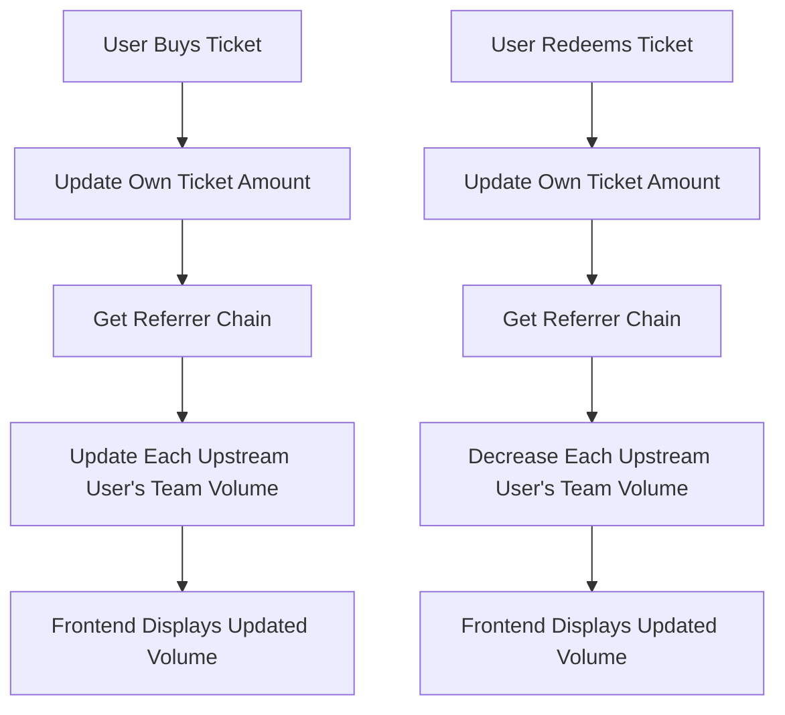

# Design Document

## Overview

This design implements a comprehensive team volume calculation system that accurately tracks and displays the total ticket amounts from all downstream team members. The solution involves both smart contract modifications and frontend updates to provide real-time, accurate team performance metrics.

## Architecture

The system follows a hierarchical update pattern where ticket purchases and redemptions propagate upward through the referral chain, updating cached team volume data at each level.



## Components and Interfaces

### Smart Contract Components

#### 1. Team Volume Calculator
```solidity
contract TeamVolumeCalculator {
    function updateUpstreamTeamVolumes(address user, uint256 volumeChange, bool isIncrease) internal;
    function calculateTeamTotalVolume(address user) public view returns (uint256);
    function getUpstreamChain(address user, uint256 maxDepth) internal view returns (address[] memory);
}
```

#### 2. Enhanced UserInfo Structure
The existing `UserInfo` struct already contains `teamTotalVolume` field which will be utilized:
```solidity
struct UserInfo {
    // ... existing fields
    uint256 teamTotalVolume; // Community Ticket Total Volume
    // ... existing fields
}
```

#### 3. Volume Update Events
```solidity
event TeamVolumeUpdated(address indexed user, uint256 newVolume, uint256 volumeChange, bool isIncrease);
event TeamVolumeCalculationError(address indexed user, string reason);
```

### Frontend Components

#### 1. Enhanced TeamLevel Component
- Displays real team volume from contract data
- Handles loading states and error conditions
- Formats large numbers appropriately

#### 2. Real-time Data Fetching
- Subscribes to contract events for volume updates
- Refreshes team data when relevant transactions occur

## Data Models

### Contract Data Flow

1. **Ticket Purchase Flow**:
   ```
   buyTicket() → updateUpstreamTeamVolumes() → emit TeamVolumeUpdated()
   ```

2. **Ticket Redemption Flow**:
   ```
   redeem() → updateUpstreamTeamVolumes() → emit TeamVolumeUpdated()
   ```

3. **Team Volume Query**:
   ```
   Frontend → userInfo.teamTotalVolume → Display
   ```

### Data Consistency Rules

- Team volume updates must complete within the same transaction as ticket operations
- Failed volume updates should not block main operations
- Circular reference detection prevents infinite loops
- Maximum recursion depth of 20 levels

## Error Handling

### Contract Level Error Handling

1. **Circular Reference Detection**:
   ```solidity
   mapping(address => bool) private _processingUsers;
   
   modifier preventCircularReference(address user) {
       require(!_processingUsers[user], "Circular reference detected");
       _processingUsers[user] = true;
       _;
       _processingUsers[user] = false;
   }
   ```

2. **Gas Limit Protection**:
   ```solidity
   uint256 constant MAX_UPSTREAM_UPDATES = 20;
   ```

3. **Safe Volume Updates**:
   ```solidity
   function safeUpdateTeamVolume(address user, uint256 change, bool isIncrease) internal {
       try this.updateTeamVolume(user, change, isIncrease) {
           // Success
       } catch {
           emit TeamVolumeCalculationError(user, "Volume update failed");
       }
   }
   ```

### Frontend Error Handling

1. **Loading States**: Display loading indicators during data fetching
2. **Error States**: Show error messages for failed calculations
3. **Fallback Values**: Display "0 MC" when data is unavailable
4. **Retry Logic**: Automatic retry for failed network requests

## Testing Strategy

### Unit Testing Approach
- Test individual volume calculation functions
- Verify upstream propagation logic
- Validate error handling scenarios
- Test edge cases (circular references, deep hierarchies)

### Property-Based Testing
- Volume calculations should be consistent across different execution paths
- Team volume should always equal sum of downstream ticket amounts
- Volume updates should maintain referential integrity

### Integration Testing
- End-to-end ticket purchase and volume update flow
- Frontend display accuracy with real contract data
- Performance testing with large team hierarchies