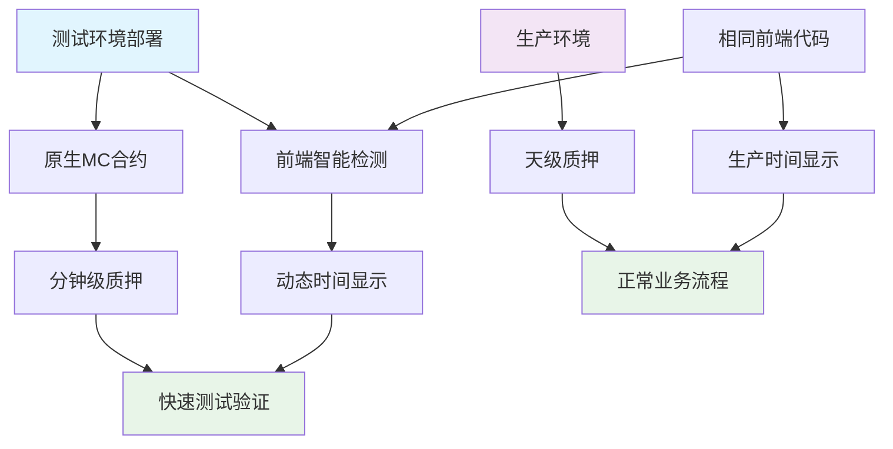
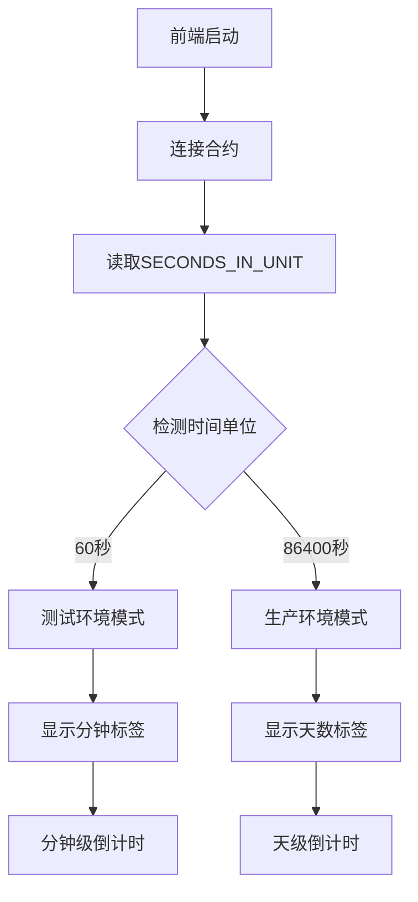

# 测试环境时间单位转换设计文档

## 概述

本设计文档详细说明如何为Jinbao Protocol创建一个快速测试环境，将质押周期从生产环境的"天"转换为测试环境的"分钟"。这个设计包括智能合约部署、前端自适应检测、原生MC代币集成，以及确保测试环境能够准确模拟生产环境业务逻辑的机制。

## 架构

### 整体架构设计



### 时间单位检测机制



## 组件和接口

### 1. 智能合约层

#### 原生MC测试合约
```solidity
// contracts/JinbaoProtocolNative.sol - 测试环境版本
contract JinbaoProtocolNative is Initializable, UUPSUpgradeable, OwnableUpgradeable {
    // 测试环境时间单位: 60秒 = 1分钟
    uint256 public constant SECONDS_IN_UNIT = 60;
    
    // 原生MC代币支持 - 无需ERC20 MC代币
    IERC20 public jbcToken;
    
    // 质押函数 - 使用原生MC
    function stakeLiquidity(uint256 cycleDays) external payable {
        require(msg.value > 0, "Amount must be greater than 0");
        require(isValidCycle(cycleDays), "Invalid cycle");
        
        // 使用原生MC代币 (msg.value)
        uint256 stakeId = _createStake(msg.sender, msg.value, cycleDays);
        
        emit LiquidityStaked(msg.sender, msg.value, cycleDays, stakeId);
    }
    
    // 门票购买 - 使用原生MC
    function buyTicket() external payable {
        require(msg.value > 0, "Ticket amount must be greater than 0");
        
        // 直接使用原生MC代币
        _processTicketPurchase(msg.sender, msg.value);
        
        emit TicketPurchased(msg.sender, msg.value, block.timestamp);
    }
}
```

#### 部署配置接口
```typescript
interface DeploymentConfig {
  timeUnit: 'minutes' | 'days';
  secondsInUnit: 60 | 86400;
  contractType: 'JinbaoProtocolNative' | 'JinbaoProtocol';
  network: 'test' | 'production';
  useNativeMC: boolean;
}

class ContractDeployer {
  static async deployTestEnvironment(config: DeploymentConfig): Promise<string>;
  static async verifyDeployment(contractAddress: string): Promise<boolean>;
  static async getTimeUnitConfig(contractAddress: string): Promise<number>;
}
```

### 2. 前端智能检测系统

#### 时间单位检测工具
```typescript
// src/utils/timeUtils.ts - 智能时间检测
export interface TimeConfig {
  TIME_UNIT: 'minutes' | 'days';
  UNIT_LABEL: string;
  SECONDS_IN_UNIT: number;
  DISPLAY_FORMAT: 'minute' | 'day';
}

export class TimeDetector {
  /**
   * 自动检测合约时间单位配置
   */
  static async detectTimeConfig(protocolContract: ethers.Contract): Promise<TimeConfig> {
    try {
      const secondsInUnit = await protocolContract.SECONDS_IN_UNIT();
      const seconds = Number(secondsInUnit);
      
      if (seconds === 60) {
        return {
          TIME_UNIT: 'minutes',
          UNIT_LABEL: '分钟',
          SECONDS_IN_UNIT: 60,
          DISPLAY_FORMAT: 'minute'
        };
      } else if (seconds === 86400) {
        return {
          TIME_UNIT: 'days',
          UNIT_LABEL: '天',
          SECONDS_IN_UNIT: 86400,
          DISPLAY_FORMAT: 'day'
        };
      } else {
        throw new Error(`Unsupported time unit: ${seconds} seconds`);
      }
    } catch (error) {
      console.error('Failed to detect time config:', error);
      // 默认使用生产环境配置
      return {
        TIME_UNIT: 'days',
        UNIT_LABEL: '天',
        SECONDS_IN_UNIT: 86400,
        DISPLAY_FORMAT: 'day'
      };
    }
  }
}
```

#### 动态时间显示组件
```typescript
// src/components/AdaptiveTimeDisplay.tsx
interface AdaptiveTimeDisplayProps {
  remainingSeconds: number;
  timeConfig: TimeConfig;
  language: 'zh' | 'en';
}

export const AdaptiveTimeDisplay: React.FC<AdaptiveTimeDisplayProps> = ({
  remainingSeconds,
  timeConfig,
  language
}) => {
  const formatTime = useMemo(() => {
    if (timeConfig.TIME_UNIT === 'minutes') {
      return TimeUtils.formatMinuteCountdown(remainingSeconds, language);
    } else {
      return TimeUtils.formatDayCountdown(remainingSeconds, language);
    }
  }, [remainingSeconds, timeConfig, language]);

  return (
    <div className="adaptive-time-display">
      <span className="time-value">{formatTime}</span>
      <span className="time-unit">{timeConfig.UNIT_LABEL}</span>
    </div>
  );
};
```

### 3. 时间计算工具类

#### 统一时间计算接口
```typescript
// src/utils/timeCalculator.ts
export class TimeCalculator {
  /**
   * 计算质押剩余时间 (自适应单位)
   */
  static calculateRemainingTime(
    startTime: number,
    cyclePeriod: number,
    timeConfig: TimeConfig
  ): TimeRemaining {
    const now = Math.floor(Date.now() / 1000);
    const endTime = startTime + (cyclePeriod * timeConfig.SECONDS_IN_UNIT);
    const remaining = Math.max(0, endTime - now);

    if (timeConfig.TIME_UNIT === 'minutes') {
      return this.calculateMinuteRemaining(remaining);
    } else {
      return this.calculateDayRemaining(remaining);
    }
  }

  /**
   * 计算分钟级剩余时间
   */
  private static calculateMinuteRemaining(remainingSeconds: number): TimeRemaining {
    const minutes = Math.floor(remainingSeconds / 60);
    const seconds = remainingSeconds % 60;

    return {
      primary: minutes,
      secondary: seconds,
      primaryUnit: '分钟',
      secondaryUnit: '秒',
      isExpired: remainingSeconds <= 0,
      displayFormat: 'minute'
    };
  }

  /**
   * 计算天级剩余时间
   */
  private static calculateDayRemaining(remainingSeconds: number): TimeRemaining {
    const days = Math.floor(remainingSeconds / 86400);
    const hours = Math.floor((remainingSeconds % 86400) / 3600);
    const minutes = Math.floor((remainingSeconds % 3600) / 60);

    return {
      primary: days,
      secondary: hours,
      tertiary: minutes,
      primaryUnit: '天',
      secondaryUnit: '小时',
      tertiaryUnit: '分钟',
      isExpired: remainingSeconds <= 0,
      displayFormat: 'day'
    };
  }
}
```

### 4. 原生MC代币集成

#### 原生代币余额管理
```typescript
// src/hooks/useNativeMCBalance.ts
export const useNativeMCBalance = () => {
  const { provider, account } = useWeb3();
  const [balance, setBalance] = useState<bigint | null>(null);
  const [loading, setLoading] = useState(false);

  const refreshBalance = useCallback(async () => {
    if (!provider || !account) {
      setBalance(null);
      return;
    }

    setLoading(true);
    try {
      const nativeBalance = await provider.getBalance(account);
      setBalance(nativeBalance);
    } catch (error) {
      console.error('Failed to fetch native MC balance:', error);
      setBalance(null);
    } finally {
      setLoading(false);
    }
  }, [provider, account]);

  useEffect(() => {
    refreshBalance();
  }, [refreshBalance]);

  return {
    balance,
    loading,
    refreshBalance,
    formattedBalance: balance ? ethers.formatEther(balance) : '0'
  };
};
```

#### 原生代币交易处理
```typescript
// src/utils/nativeTransactionHandler.ts
export class NativeTransactionHandler {
  /**
   * 处理原生MC代币质押
   */
  static async handleStaking(
    protocolContract: ethers.Contract,
    amount: string,
    cycleDays: number
  ): Promise<ethers.TransactionResponse> {
    const amountWei = ethers.parseEther(amount);
    
    // 直接发送原生代币，无需授权
    const tx = await protocolContract.stakeLiquidity(cycleDays, {
      value: amountWei,
      gasLimit: 300000 // 预估gas限制
    });
    
    return tx;
  }

  /**
   * 处理门票购买
   */
  static async handleTicketPurchase(
    protocolContract: ethers.Contract,
    ticketAmount: string
  ): Promise<ethers.TransactionResponse> {
    const amountWei = ethers.parseEther(ticketAmount);
    
    const tx = await protocolContract.buyTicket({
      value: amountWei,
      gasLimit: 250000
    });
    
    return tx;
  }
}
```

## 数据模型

### 时间配置数据模型
```typescript
interface TimeRemaining {
  primary: number;                    // 主要时间单位数值
  secondary: number;                  // 次要时间单位数值
  tertiary?: number;                  // 第三时间单位数值 (仅天模式)
  primaryUnit: string;                // 主要单位标签
  secondaryUnit: string;              // 次要单位标签
  tertiaryUnit?: string;              // 第三单位标签
  isExpired: boolean;                 // 是否已过期
  displayFormat: 'minute' | 'day';    // 显示格式类型
}

interface StakingPeriodConfig {
  period: number;                     // 周期数值 (7, 15, 30)
  label: string;                      // 显示标签
  labelEn: string;                    // 英文标签
  rate: number;                       // 每单位时间收益率
  totalReturn: number;                // 总收益率
  contractSeconds: number;            // 合约使用的总秒数
}
```

### 测试环境配置模型
```typescript
interface TestEnvironmentConfig {
  // 合约配置
  contracts: {
    protocol: string;                 // 测试合约地址
    jbcToken: string;                // JBC代币地址
    dailyBurnManager: string;        // 燃烧管理器地址
  };
  
  // 时间配置
  timeConfig: TimeConfig;
  
  // 质押周期配置
  stakingPeriods: StakingPeriodConfig[];
  
  // 网络配置
  network: {
    chainId: number;
    rpcUrl: string;
    explorerUrl: string;
  };
  
  // 功能开关
  features: {
    useNativeMC: boolean;
    enableFastTesting: boolean;
    autoTimeDetection: boolean;
  };
}
```

## 错误处理

### 时间检测错误处理
```typescript
class TimeDetectionError extends Error {
  constructor(message: string, public contractAddress: string, public detectedValue?: number) {
    super(`Time Detection Error [${contractAddress}]: ${message}`);
    this.name = 'TimeDetectionError';
  }
}

class TimeConfigValidator {
  /**
   * 验证时间配置的有效性
   */
  static validateTimeConfig(config: TimeConfig): void {
    if (config.SECONDS_IN_UNIT !== 60 && config.SECONDS_IN_UNIT !== 86400) {
      throw new TimeDetectionError(
        `Invalid SECONDS_IN_UNIT: ${config.SECONDS_IN_UNIT}. Expected 60 or 86400.`,
        'unknown'
      );
    }
    
    if (config.TIME_UNIT === 'minutes' && config.SECONDS_IN_UNIT !== 60) {
      throw new TimeDetectionError(
        `Time unit mismatch: TIME_UNIT is 'minutes' but SECONDS_IN_UNIT is ${config.SECONDS_IN_UNIT}`,
        'unknown'
      );
    }
    
    if (config.TIME_UNIT === 'days' && config.SECONDS_IN_UNIT !== 86400) {
      throw new TimeDetectionError(
        `Time unit mismatch: TIME_UNIT is 'days' but SECONDS_IN_UNIT is ${config.SECONDS_IN_UNIT}`,
        'unknown'
      );
    }
  }
}
```

### 原生代币交易错误处理
```typescript
class NativeTransactionError extends Error {
  constructor(message: string, public txHash?: string, public reason?: string) {
    super(`Native Transaction Error: ${message}`);
    this.name = 'NativeTransactionError';
  }
}

class SafeTransactionHandler {
  /**
   * 安全的原生代币交易处理
   */
  static async safeStaking(
    protocolContract: ethers.Contract,
    amount: string,
    cycleDays: number
  ): Promise<ethers.TransactionResponse> {
    try {
      // 验证输入参数
      if (!amount || parseFloat(amount) <= 0) {
        throw new NativeTransactionError('Invalid staking amount');
      }
      
      if (![7, 15, 30].includes(cycleDays)) {
        throw new NativeTransactionError(`Invalid cycle days: ${cycleDays}`);
      }
      
      // 执行交易
      return await NativeTransactionHandler.handleStaking(
        protocolContract,
        amount,
        cycleDays
      );
    } catch (error) {
      if (error instanceof NativeTransactionError) {
        throw error;
      }
      
      // 包装其他错误
      throw new NativeTransactionError(
        `Staking transaction failed: ${error.message}`,
        undefined,
        error.code
      );
    }
  }
}
```

## 正确性属性

*属性是一个特征或行为，应该在系统的所有有效执行中保持为真——本质上是关于系统应该做什么的正式声明。属性作为人类可读规范和机器可验证正确性保证之间的桥梁。*

### 属性 1: 时间单位检测准确性
*对于任何* 有效的智能合约地址，时间检测系统应该能够准确识别合约的SECONDS_IN_UNIT值，并返回对应的正确时间配置
**验证需求: Requirements 3.1, 3.2**

### 属性 2: 时间转换一致性
*对于任何* 质押周期和时间配置，前端计算的时间应该与智能合约的时间逻辑完全一致，确保显示时间与实际锁定时间匹配
**验证需求: Requirements 2.4, 5.4**

### 属性 3: 原生代币交易完整性
*对于任何* 有效的原生MC代币交易，系统应该能够正确处理交易而无需ERC20代币授权，且交易金额应该准确反映在合约状态中
**验证需求: Requirements 4.1, 4.2, 4.3**

### 属性 4: 环境自适应性
*对于任何* 支持的环境配置（测试或生产），前端应该能够自动检测并适配正确的时间单位显示，无需手动配置修改
**验证需求: Requirements 3.3, 3.4**

### 属性 5: 时间显示格式正确性
*对于任何* 剩余时间值和时间配置，时间格式化函数应该返回符合指定格式的时间字符串，且格式与检测到的时间单位一致
**验证需求: Requirements 5.1, 5.3**

### 属性 6: 收益计算准确性
*对于任何* 质押金额和周期，在测试环境中的分钟级收益计算应该与生产环境的天级收益计算保持相同的比例关系
**验证需求: Requirements 2.4, 5.2**

### 属性 7: 配置验证完整性
*对于任何* 环境配置，配置验证系统应该能够检测出时间单位不一致或无效的配置，并提供明确的错误信息
**验证需求: Requirements 6.1, 6.2**

## 测试策略

### 双重测试方法
- **单元测试**: 验证具体的时间转换、合约交互和显示格式
- **属性测试**: 验证所有可能输入下的系统行为正确性
- **集成测试**: 验证完整的测试环境部署和使用流程

### 单元测试策略
- **时间检测测试**: 测试不同SECONDS_IN_UNIT值的检测准确性
- **时间转换测试**: 验证分钟到秒、天到秒的转换正确性
- **原生代币测试**: 测试原生MC代币的交易处理
- **显示格式测试**: 验证不同时间配置下的显示格式
- **错误处理测试**: 测试各种异常情况的处理

### 属性测试策略
- **最少100次迭代**: 每个属性测试运行至少100次随机输入
- **智能生成器**: 生成有效的时间值、质押金额和周期配置
- **测试标记**: 每个属性测试标记为 **Feature: test-environment-time-unit-conversion, Property N: [属性文本]**
- **需求追溯**: 每个属性测试引用其验证的设计文档属性

### 集成测试策略
- **端到端部署测试**: 从合约部署到前端配置的完整流程
- **环境切换测试**: 验证测试和生产环境的切换功能
- **用户流程测试**: 完整的购票、质押、领取流程验证

### 性能测试策略
- **时间检测性能**: 验证时间单位检测的响应时间
- **倒计时更新性能**: 测试分钟级倒计时的性能影响
- **批量时间计算**: 验证多个质押记录的时间计算性能