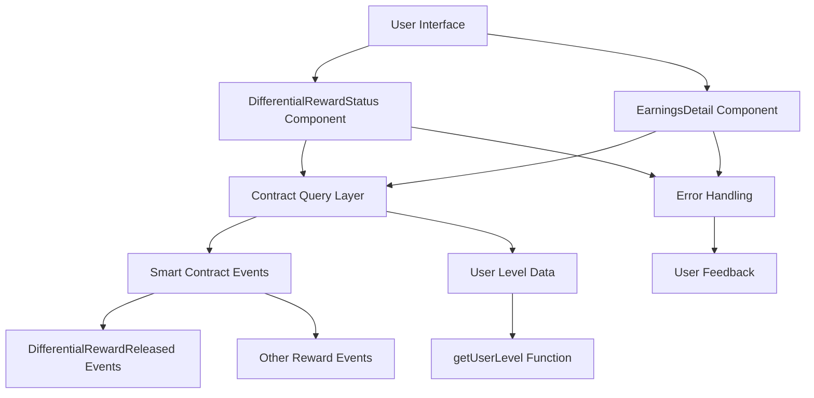

# Design Document: User Dynamic Rewards Display Fix

## Overview

This design addresses the issue where user `0x2D68a5850a4805C6Fe6648E5870b68456e2A7c82` cannot see dynamic rewards in their interface. The investigation reveals that "dynamic rewards" (rewardType === 1) have been deprecated in favor of "differential rewards" which are displayed through the `DifferentialRewardStatus` component. The issue likely stems from either component loading failures, network connectivity problems, or user account state issues.

## Architecture

The reward display system consists of multiple layers:

1. **Smart Contract Layer**: Stores reward events and user level information
2. **Blockchain Query Layer**: Fetches events and contract state via ethers.js
3. **Component Layer**: React components that display reward information
4. **Error Handling Layer**: Manages failures and provides user feedback



## Components and Interfaces

### DifferentialRewardStatus Component Enhancement

The existing component needs improvements in error handling and diagnostic capabilities:

```typescript
interface DiagnosticInfo {
  userAddress: string;
  networkStatus: {
    chainId: number;
    blockNumber: number;
    latency: number;
  };
  contractAccess: {
    isAccessible: boolean;
    error?: string;
  };
  userLevel: {
    level: number;
    percent: number;
    teamCount: number;
    error?: string;
  };
  rewardEvents: {
    count: number;
    latestEvent?: any;
    queryError?: string;
  };
}

interface EnhancedDifferentialRewardStatusProps {
  className?: string;
  diagnosticMode?: boolean;
  targetUser?: string; // For admin diagnostics
}
```

### Diagnostic Service

A new service to perform comprehensive user diagnostics:

```typescript
interface UserDiagnosticService {
  performDiagnostic(userAddress: string): Promise<DiagnosticInfo>;
  checkNetworkConnectivity(): Promise<NetworkStatus>;
  verifyContractAccess(): Promise<ContractAccessStatus>;
  queryUserLevel(userAddress: string): Promise<UserLevelInfo>;
  queryDifferentialRewards(userAddress: string): Promise<RewardEventInfo>;
  generateDiagnosticReport(info: DiagnosticInfo): string;
}
```

### Error Recovery Component

A new component to handle and display error states with recovery options:

```typescript
interface ErrorRecoveryProps {
  error: Error | null;
  onRetry: () => void;
  onRefresh: () => void;
  diagnosticInfo?: DiagnosticInfo;
}
```

## Data Models

### Enhanced Error Information

```typescript
interface RewardDisplayError {
  type: 'network' | 'contract' | 'user_state' | 'component';
  severity: 'low' | 'medium' | 'high' | 'critical';
  message: string;
  details?: any;
  timestamp: number;
  userAddress?: string;
  suggestedActions: string[];
}
```

### User Reward State

```typescript
interface UserRewardState {
  address: string;
  levelInfo: {
    level: number;
    percent: number;
    teamCount: number;
    nextLevelRequirement?: number;
  };
  recentRewards: DifferentialReward[];
  totalRewards: {
    count: number;
    totalAmount: string;
  };
  lastUpdated: number;
  errors: RewardDisplayError[];
}
```

## Correctness Properties

Now I need to use the prework tool to analyze the acceptance criteria before writing the correctness properties:

*A property is a characteristic or behavior that should hold true across all valid executions of a system-essentially, a formal statement about what the system should do. Properties serve as the bridge between human-readable specifications and machine-verifiable correctness guarantees.*

### Property Reflection

After analyzing the acceptance criteria, I identified several properties that can be consolidated:
- Properties related to user diagnostics (1.1, 2.1, 2.3) can be combined into a comprehensive diagnostic property
- Properties about event querying (1.2, 2.2, 2.5) can be unified into a single event query property  
- Properties about error handling (4.1, 4.2, 4.3, 4.4, 4.5) can be consolidated into comprehensive error handling properties
- Properties about component loading (3.1, 3.2, 3.3) can be combined into a single component behavior property

### Correctness Properties

**Property 1: User Diagnostic Completeness**
*For any* user address, when running comprehensive diagnostics, the system should successfully complete all diagnostic checks (network status, contract access, user level, reward events) and return identifiable results or specific error information
**Validates: Requirements 1.1, 2.1, 2.3**

**Property 2: Blockchain Event Query Consistency**
*For any* user address, when querying blockchain events (reward history, differential rewards, recent transactions), the system should return consistent and accurate results or handle query failures gracefully with specific error messages
**Validates: Requirements 1.2, 2.2, 2.5**

**Property 3: Reward Type Classification Accuracy**
*For any* reward record, the system should correctly distinguish between legacy dynamic rewards (rewardType === 1) and current differential rewards, applying proper filtering and classification logic
**Validates: Requirements 1.3, 1.4**

**Property 4: Component Loading Reliability**
*For any* user state, when the DifferentialRewardStatus component loads, it should either successfully display the user's V-level information and recent rewards, or show appropriate error states with recovery options
**Validates: Requirements 3.1, 3.2, 3.3, 3.4**

**Property 5: Error Handling Comprehensiveness**
*For any* error condition (network failures, contract query failures, component errors), the system should display specific error messages, provide manual refresh options, and log detailed debugging information
**Validates: Requirements 4.1, 4.2, 4.3, 4.4, 4.5**

**Property 6: Network Connectivity Resilience**
*For any* network condition (slow, timeout, disconnected), the system should identify connectivity issues, show appropriate loading states, and provide actionable feedback to users
**Validates: Requirements 2.4, 4.2**

**Property 7: UI Terminology Consistency**
*For any* reward type display across all components, the system should use consistent terminology and clear labeling to distinguish between different reward types
**Validates: Requirements 5.4, 5.5**

## Error Handling

### Error Classification System

```typescript
enum ErrorType {
  NETWORK_CONNECTIVITY = 'network',
  CONTRACT_ACCESS = 'contract', 
  USER_STATE = 'user_state',
  COMPONENT_LOADING = 'component'
}

enum ErrorSeverity {
  LOW = 'low',           // Minor display issues
  MEDIUM = 'medium',     // Partial functionality loss
  HIGH = 'high',         // Major feature unavailable
  CRITICAL = 'critical'  // Complete system failure
}
```

### Recovery Strategies

1. **Network Issues**: Automatic retry with exponential backoff, manual refresh option
2. **Contract Access**: Switch network prompt, contract status verification
3. **User State Issues**: Account verification, diagnostic report generation
4. **Component Failures**: Error boundary with fallback UI, detailed error logging

### User Feedback Mechanisms

- **Loading States**: Progressive loading indicators with timeout handling
- **Error Messages**: Specific, actionable error descriptions
- **Recovery Options**: Manual refresh, retry buttons, diagnostic tools
- **Status Indicators**: Network health, contract accessibility, data freshness

## Testing Strategy

### Dual Testing Approach

The testing strategy combines unit tests for specific scenarios with property-based tests for comprehensive coverage:

**Unit Tests**:
- Specific user account scenarios (including the reported user `0x2D68a5850a4805C6Fe6648E5870b68456e2A7c82`)
- Error boundary behavior with known error conditions
- Component rendering with empty states
- Network timeout handling with simulated delays

**Property-Based Tests**:
- User diagnostic completeness across random user addresses
- Event query consistency with various blockchain states
- Error handling comprehensiveness with generated error conditions
- Component loading reliability with random user states

**Property Test Configuration**:
- Minimum 100 iterations per property test
- Each test tagged with format: **Feature: user-dynamic-rewards-display-fix, Property {number}: {property_text}**
- Use React Testing Library with MSW for API mocking
- Use Hardhat for blockchain state simulation

### Integration Testing

- End-to-end user flow testing with real blockchain interactions
- Cross-component communication verification
- Error propagation and recovery testing
- Performance testing under various network conditions

### User-Specific Testing

- Dedicated test suite for user `0x2D68a5850a4805C6Fe6648E5870b68456e2A7c82`
- Verification of fix effectiveness for this specific account
- Regression testing to ensure fix doesn't break other users
- Manual testing with actual user account on testnet

The testing approach ensures both general system reliability and specific resolution of the reported issue.