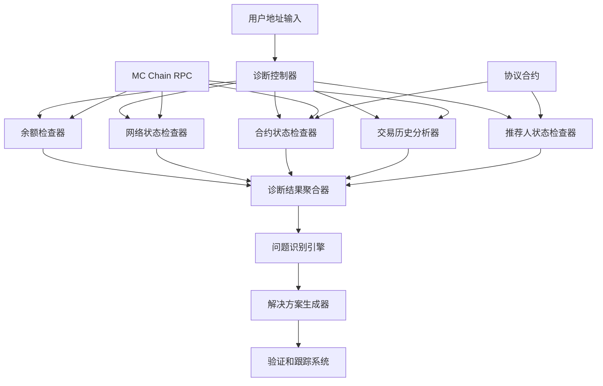

# Design Document

## Overview

本设计文档描述了针对用户 0x7eFaD6Bef04631BE34De71b2Df9378C727f185b7 购票问题的诊断和解决系统。该系统将提供全面的用户状态分析、问题识别和解决方案生成功能。

## Architecture

### 系统架构图



## Components and Interfaces

### 1. 诊断控制器 (DiagnosticController)

**职责**: 协调所有诊断组件的执行

```typescript
interface DiagnosticController {
  diagnoseUser(userAddress: string): Promise<DiagnosticReport>;
  runFullDiagnosis(userAddress: string): Promise<ComprehensiveReport>;
  generateSolution(diagnosticResult: DiagnosticResult): SolutionPlan;
}

class UserDiagnosticController implements DiagnosticController {
  private balanceChecker: BalanceChecker;
  private networkChecker: NetworkStatusChecker;
  private contractChecker: ContractStatusChecker;
  private historyAnalyzer: TransactionHistoryAnalyzer;
  private referrerChecker: ReferrerStatusChecker;
  
  async diagnoseUser(userAddress: string): Promise<DiagnosticReport> {
    const results = await Promise.all([
      this.balanceChecker.checkBalance(userAddress),
      this.networkChecker.checkNetworkStatus(),
      this.contractChecker.checkContractStatus(),
      this.historyAnalyzer.analyzeTransactionHistory(userAddress),
      this.referrerChecker.checkReferrerStatus(userAddress)
    ]);
    
    return this.aggregateResults(results);
  }
}
```

### 2. 余额检查器 (BalanceChecker)

**职责**: 检查用户MC余额和Gas费用充足性

```typescript
interface BalanceCheckResult {
  currentBalance: bigint;
  requiredForTicket: bigint;
  estimatedGasCost: bigint;
  totalRequired: bigint;
  isBalanceSufficient: boolean;
  shortfall?: bigint;
}

class BalanceChecker {
  constructor(private provider: ethers.Provider) {}
  
  async checkBalance(userAddress: string, ticketAmount: bigint = ethers.parseEther("100")): Promise<BalanceCheckResult> {
    const currentBalance = await this.provider.getBalance(userAddress);
    const gasEstimate = await this.estimateGasCost(ticketAmount);
    const totalRequired = ticketAmount + gasEstimate;
    
    return {
      currentBalance,
      requiredForTicket: ticketAmount,
      estimatedGasCost: gasEstimate,
      totalRequired,
      isBalanceSufficient: currentBalance >= totalRequired,
      shortfall: currentBalance < totalRequired ? totalRequired - currentBalance : undefined
    };
  }
  
  private async estimateGasCost(ticketAmount: bigint): Promise<bigint> {
    // 估算购票交易的Gas费用
    try {
      const contract = new ethers.Contract(PROTOCOL_ADDRESS, PROTOCOL_ABI, this.provider);
      const gasEstimate = await contract.buyTicket.estimateGas({ value: ticketAmount });
      const feeData = await this.provider.getFeeData();
      return gasEstimate * (feeData.gasPrice || ethers.parseUnits("20", "gwei"));
    } catch (error) {
      // 使用默认估算值
      return ethers.parseEther("0.01");
    }
  }
}
```

### 3. 网络状态检查器 (NetworkStatusChecker)

**职责**: 验证网络连接和MC Chain配置

```typescript
interface NetworkStatusResult {
  isConnectedToMCChain: boolean;
  currentChainId: number;
  rpcLatency: number;
  blockNumber: number;
  networkHealth: 'good' | 'slow' | 'poor';
}

class NetworkStatusChecker {
  constructor(private provider: ethers.Provider) {}
  
  async checkNetworkStatus(): Promise<NetworkStatusResult> {
    const startTime = Date.now();
    
    try {
      const [network, blockNumber] = await Promise.all([
        this.provider.getNetwork(),
        this.provider.getBlockNumber()
      ]);
      
      const rpcLatency = Date.now() - startTime;
      
      return {
        isConnectedToMCChain: network.chainId === 88813n,
        currentChainId: Number(network.chainId),
        rpcLatency,
        blockNumber,
        networkHealth: this.assessNetworkHealth(rpcLatency)
      };
    } catch (error) {
      throw new Error(`Network check failed: ${error.message}`);
    }
  }
  
  private assessNetworkHealth(latency: number): 'good' | 'slow' | 'poor' {
    if (latency < 1000) return 'good';
    if (latency < 3000) return 'slow';
    return 'poor';
  }
}
```

### 4. 合约状态检查器 (ContractStatusChecker)

**职责**: 检查协议合约的运行状态

```typescript
interface ContractStatusResult {
  isContractAccessible: boolean;
  isPaused: boolean;
  isEmergencyPaused: boolean;
  contractBalance: bigint;
  lastBlockUpdate: number;
}

class ContractStatusChecker {
  constructor(
    private provider: ethers.Provider,
    private contractAddress: string
  ) {}
  
  async checkContractStatus(): Promise<ContractStatusResult> {
    try {
      const contract = new ethers.Contract(
        this.contractAddress,
        PROTOCOL_ABI,
        this.provider
      );
      
      const [isPaused, emergencyPaused, contractBalance, blockNumber] = await Promise.all([
        contract.paused().catch(() => false),
        contract.emergencyPaused().catch(() => false),
        this.provider.getBalance(this.contractAddress),
        this.provider.getBlockNumber()
      ]);
      
      return {
        isContractAccessible: true,
        isPaused,
        isEmergencyPaused: emergencyPaused,
        contractBalance,
        lastBlockUpdate: blockNumber
      };
    } catch (error) {
      return {
        isContractAccessible: false,
        isPaused: true,
        isEmergencyPaused: true,
        contractBalance: 0n,
        lastBlockUpdate: 0
      };
    }
  }
}
```

### 5. 交易历史分析器 (TransactionHistoryAnalyzer)

**职责**: 分析用户的交易历史和失败模式

```typescript
interface TransactionAnalysisResult {
  totalTransactions: number;
  failedTransactions: FailedTransaction[];
  lastSuccessfulPurchase?: Transaction;
  commonFailureReasons: string[];
  gasUsagePattern: GasUsageAnalysis;
}

interface FailedTransaction {
  hash: string;
  timestamp: number;
  failureReason: string;
  gasUsed: bigint;
  gasPrice: bigint;
  value: bigint;
}

class TransactionHistoryAnalyzer {
  constructor(private provider: ethers.Provider) {}
  
  async analyzeTransactionHistory(userAddress: string): Promise<TransactionAnalysisResult> {
    const currentBlock = await this.provider.getBlockNumber();
    const fromBlock = Math.max(0, currentBlock - 100000); // 最近10万个区块
    
    // 获取用户的所有交易
    const transactions = await this.getUserTransactions(userAddress, fromBlock);
    
    // 分析失败的购票交易
    const failedTransactions = await this.analyzeFailedTransactions(transactions);
    
    // 查找最后一次成功的购票
    const lastSuccessfulPurchase = await this.findLastSuccessfulPurchase(userAddress);
    
    return {
      totalTransactions: transactions.length,
      failedTransactions,
      lastSuccessfulPurchase,
      commonFailureReasons: this.extractCommonFailureReasons(failedTransactions),
      gasUsagePattern: this.analyzeGasUsage(transactions)
    };
  }
  
  private async getUserTransactions(userAddress: string, fromBlock: number): Promise<Transaction[]> {
    // 实现获取用户交易历史的逻辑
    // 这里需要使用区块链浏览器API或者事件过滤
    return [];
  }
  
  private async analyzeFailedTransactions(transactions: Transaction[]): Promise<FailedTransaction[]> {
    const failedTxs: FailedTransaction[] = [];
    
    for (const tx of transactions) {
      try {
        const receipt = await this.provider.getTransactionReceipt(tx.hash);
        if (receipt && receipt.status === 0) {
          // 交易失败，尝试获取失败原因
          const failureReason = await this.getFailureReason(tx.hash);
          failedTxs.push({
            hash: tx.hash,
            timestamp: (await this.provider.getBlock(receipt.blockNumber))?.timestamp || 0,
            failureReason,
            gasUsed: receipt.gasUsed,
            gasPrice: tx.gasPrice || 0n,
            value: tx.value || 0n
          });
        }
      } catch (error) {
        console.error(`Error analyzing transaction ${tx.hash}:`, error);
      }
    }
    
    return failedTxs;
  }
}
```

### 6. 推荐人状态检查器 (ReferrerStatusChecker)

**职责**: 检查用户的推荐人绑定状态

```typescript
interface ReferrerStatusResult {
  hasReferrer: boolean;
  referrerAddress?: string;
  isReferrerActive?: boolean;
  isOwner: boolean;
  bindingTimestamp?: number;
}

class ReferrerStatusChecker {
  constructor(
    private provider: ethers.Provider,
    private contractAddress: string
  ) {}
  
  async checkReferrerStatus(userAddress: string): Promise<ReferrerStatusResult> {
    try {
      const contract = new ethers.Contract(
        this.contractAddress,
        PROTOCOL_ABI,
        this.provider
      );
      
      const [userInfo, owner] = await Promise.all([
        contract.userInfo(userAddress),
        contract.owner()
      ]);
      
      const isOwner = userAddress.toLowerCase() === owner.toLowerCase();
      const hasReferrer = userInfo.referrer !== ethers.ZeroAddress;
      
      let isReferrerActive = false;
      if (hasReferrer) {
        const referrerInfo = await contract.userInfo(userInfo.referrer);
        isReferrerActive = referrerInfo.isActive;
      }
      
      return {
        hasReferrer,
        referrerAddress: hasReferrer ? userInfo.referrer : undefined,
        isReferrerActive,
        isOwner,
        bindingTimestamp: hasReferrer ? await this.getReferrerBindingTime(userAddress) : undefined
      };
    } catch (error) {
      throw new Error(`Referrer status check failed: ${error.message}`);
    }
  }
  
  private async getReferrerBindingTime(userAddress: string): Promise<number> {
    // 通过事件日志查找推荐人绑定时间
    try {
      const contract = new ethers.Contract(
        this.contractAddress,
        PROTOCOL_ABI,
        this.provider
      );
      
      const filter = contract.filters.BoundReferrer(userAddress);
      const events = await contract.queryFilter(filter);
      
      if (events.length > 0) {
        const block = await this.provider.getBlock(events[0].blockNumber);
        return block?.timestamp || 0;
      }
    } catch (error) {
      console.error('Error getting referrer binding time:', error);
    }
    
    return 0;
  }
}

### 7. 前端错误处理器 (FrontendErrorHandler)

**职责**: 处理前端购票流程中的错误和用户体验优化

```typescript
interface PurchaseError {
  type: 'balance' | 'network' | 'contract' | 'referrer' | 'gas' | 'validation';
  code: string;
  message: string;
  chineseMessage: string;
  solution: string;
  actionRequired: boolean;
}

interface PurchasePreCheck {
  canPurchase: boolean;
  errors: PurchaseError[];
  warnings: PurchaseError[];
  estimatedGas: bigint;
  totalCost: bigint;
}

class FrontendErrorHandler {
  constructor(
    private provider: ethers.Provider,
    private contract: ethers.Contract,
    private translator: ChineseErrorTranslator
  ) {}
  
  async performPrePurchaseCheck(
    userAddress: string, 
    ticketAmount: bigint
  ): Promise<PurchasePreCheck> {
    const errors: PurchaseError[] = [];
    const warnings: PurchaseError[] = [];
    
    // 1. 检查余额
    const balanceCheck = await this.checkBalance(userAddress, ticketAmount);
    if (!balanceCheck.sufficient) {
      errors.push({
        type: 'balance',
        code: 'INSUFFICIENT_BALANCE',
        message: 'Insufficient balance for ticket purchase',
        chineseMessage: `余额不足，需要 ${ethers.formatEther(balanceCheck.required)} MC，当前余额 ${ethers.formatEther(balanceCheck.current)} MC`,
        solution: `请充值至少 ${ethers.formatEther(balanceCheck.shortfall)} MC 到您的钱包`,
        actionRequired: true
      });
    }
    
    // 2. 检查推荐人状态
    const referrerCheck = await this.checkReferrerStatus(userAddress);
    if (!referrerCheck.hasReferrer) {
      errors.push({
        type: 'referrer',
        code: 'NO_REFERRER',
        message: 'No referrer bound',
        chineseMessage: '您还未绑定推荐人，这是购票的必要条件',
        solution: '请先绑定推荐人，然后再尝试购票',
        actionRequired: true
      });
    }
    
    // 3. 检查合约状态
    const contractCheck = await this.checkContractStatus();
    if (contractCheck.isPaused) {
      errors.push({
        type: 'contract',
        code: 'CONTRACT_PAUSED',
        message: 'Contract is paused',
        chineseMessage: '协议合约当前已暂停，暂时无法购票',
        solution: '请等待合约恢复运行，或联系技术支持了解详情',
        actionRequired: false
      });
    }
    
    // 4. 检查网络状态
    const networkCheck = await this.checkNetworkStatus();
    if (networkCheck.chainId !== 88813) {
      errors.push({
        type: 'network',
        code: 'WRONG_NETWORK',
        message: 'Wrong network',
        chineseMessage: '请切换到 MC Chain 网络 (Chain ID: 88813)',
        solution: '在钱包中切换到 MC Chain 网络后重试',
        actionRequired: true
      });
    }
    
    // 5. 估算Gas费用
    let estimatedGas = 0n;
    try {
      estimatedGas = await this.contract.buyTicket.estimateGas({
        value: ticketAmount,
        from: userAddress
      });
    } catch (error) {
      errors.push({
        type: 'gas',
        code: 'GAS_ESTIMATION_FAILED',
        message: 'Gas estimation failed',
        chineseMessage: '无法估算交易费用，可能存在其他问题',
        solution: '请检查网络连接和合约状态',
        actionRequired: true
      });
    }
    
    const totalCost = ticketAmount + (estimatedGas * 20000000000n); // 20 gwei
    
    return {
      canPurchase: errors.length === 0,
      errors,
      warnings,
      estimatedGas,
      totalCost
    };
  }
  
  translateError(error: any): PurchaseError {
    return this.translator.translateContractError(error);
  }
  
  private async checkBalance(userAddress: string, amount: bigint) {
    const balance = await this.provider.getBalance(userAddress);
    const gasEstimate = await this.estimateGasCost(amount);
    const required = amount + gasEstimate;
    
    return {
      current: balance,
      required,
      sufficient: balance >= required,
      shortfall: balance < required ? required - balance : 0n
    };
  }
}

### 8. 中文错误翻译器 (ChineseErrorTranslator)

**职责**: 将合约错误和系统错误翻译为用户友好的中文提示

```typescript
interface ErrorTranslation {
  originalError: string;
  chineseMessage: string;
  solution: string;
  category: 'balance' | 'permission' | 'contract' | 'network' | 'validation';
}

class ChineseErrorTranslator {
  private errorMappings: Map<string, ErrorTranslation> = new Map([
    ['insufficient funds', {
      originalError: 'insufficient funds',
      chineseMessage: '余额不足，无法支付门票和Gas费用',
      solution: '请充值MC代币到您的钱包',
      category: 'balance'
    }],
    ['execution reverted: No referrer', {
      originalError: 'execution reverted: No referrer',
      chineseMessage: '您还未绑定推荐人',
      solution: '请先绑定推荐人，这是购票的必要条件',
      category: 'permission'
    }],
    ['execution reverted: Paused', {
      originalError: 'execution reverted: Paused',
      chineseMessage: '协议合约已暂停，暂时无法购票',
      solution: '请等待合约恢复运行',
      category: 'contract'
    }],
    ['network changed', {
      originalError: 'network changed',
      chineseMessage: '网络已切换，请确保连接到MC Chain',
      solution: '请在钱包中切换到MC Chain网络 (Chain ID: 88813)',
      category: 'network'
    }],
    ['user rejected transaction', {
      originalError: 'user rejected transaction',
      chineseMessage: '您取消了交易',
      solution: '如需购票，请重新点击购买按钮并确认交易',
      category: 'validation'
    }]
  ]);
  
  translateContractError(error: any): PurchaseError {
    const errorMessage = error.message || error.toString();
    
    // 尝试匹配已知错误
    for (const [key, translation] of this.errorMappings) {
      if (errorMessage.includes(key)) {
        return {
          type: translation.category,
          code: key.toUpperCase().replace(/\s+/g, '_'),
          message: errorMessage,
          chineseMessage: translation.chineseMessage,
          solution: translation.solution,
          actionRequired: translation.category !== 'contract'
        };
      }
    }
    
    // 默认错误处理
    return {
      type: 'validation',
      code: 'UNKNOWN_ERROR',
      message: errorMessage,
      chineseMessage: '购票过程中发生未知错误',
      solution: '请检查网络连接和钱包状态，或联系技术支持',
      actionRequired: true
    };
  }
  
  getErrorSolution(errorType: string, context?: any): string {
    const solutions = {
      'balance': '请充值足够的MC代币到您的钱包',
      'referrer': '请先绑定推荐人，然后重试购票',
      'contract': '请等待合约服务恢复，或联系技术支持',
      'network': '请在钱包中切换到MC Chain网络',
      'gas': '请增加Gas费用或等待网络拥堵缓解'
    };
    
    return solutions[errorType] || '请联系技术支持获取帮助';
  }
}

### 9. 购票流程管理器 (PurchaseFlowManager)

**职责**: 管理完整的购票流程和状态跟踪

```typescript
interface PurchaseFlowState {
  step: 'validation' | 'confirmation' | 'transaction' | 'success' | 'error';
  progress: number; // 0-100
  message: string;
  canRetry: boolean;
  transactionHash?: string;
}

class PurchaseFlowManager {
  private currentState: PurchaseFlowState = {
    step: 'validation',
    progress: 0,
    message: '正在验证购票条件...',
    canRetry: false
  };
  
  constructor(
    private errorHandler: FrontendErrorHandler,
    private contract: ethers.Contract,
    private onStateChange: (state: PurchaseFlowState) => void
  ) {}
  
  async startPurchaseFlow(userAddress: string, ticketAmount: bigint): Promise<void> {
    try {
      // 步骤1: 预检查
      this.updateState({
        step: 'validation',
        progress: 10,
        message: '正在检查购票条件...',
        canRetry: false
      });
      
      const preCheck = await this.errorHandler.performPrePurchaseCheck(userAddress, ticketAmount);
      
      if (!preCheck.canPurchase) {
        this.updateState({
          step: 'error',
          progress: 0,
          message: preCheck.errors[0].chineseMessage,
          canRetry: true
        });
        return;
      }
      
      // 步骤2: 用户确认
      this.updateState({
        step: 'confirmation',
        progress: 30,
        message: `确认购买 ${ethers.formatEther(ticketAmount)} MC 门票，预计费用 ${ethers.formatEther(preCheck.totalCost)} MC`,
        canRetry: true
      });
      
      // 步骤3: 发送交易
      this.updateState({
        step: 'transaction',
        progress: 50,
        message: '正在发送交易，请在钱包中确认...',
        canRetry: false
      });
      
      const tx = await this.contract.buyTicket({ value: ticketAmount });
      
      this.updateState({
        step: 'transaction',
        progress: 70,
        message: '交易已发送，等待区块确认...',
        canRetry: false,
        transactionHash: tx.hash
      });
      
      // 等待交易确认
      const receipt = await tx.wait();
      
      if (receipt.status === 1) {
        this.updateState({
          step: 'success',
          progress: 100,
          message: '购票成功！门票已激活',
          canRetry: false,
          transactionHash: tx.hash
        });
      } else {
        throw new Error('Transaction failed');
      }
      
    } catch (error) {
      const translatedError = this.errorHandler.translateError(error);
      this.updateState({
        step: 'error',
        progress: 0,
        message: translatedError.chineseMessage,
        canRetry: translatedError.actionRequired
      });
    }
  }
  
  private updateState(newState: Partial<PurchaseFlowState>): void {
    this.currentState = { ...this.currentState, ...newState };
    this.onStateChange(this.currentState);
  }
  
  getCurrentState(): PurchaseFlowState {
    return this.currentState;
  }
  
  canRetry(): boolean {
    return this.currentState.canRetry;
  }
}
```

## Data Models

### 诊断报告数据模型

```typescript
interface DiagnosticReport {
  userAddress: string;
  timestamp: number;
  balanceCheck: BalanceCheckResult;
  networkStatus: NetworkStatusResult;
  contractStatus: ContractStatusResult;
  transactionAnalysis: TransactionAnalysisResult;
  referrerStatus: ReferrerStatusResult;
  overallStatus: 'healthy' | 'issues_detected' | 'critical_issues';
  identifiedProblems: Problem[];
}

interface Problem {
  type: 'balance' | 'network' | 'contract' | 'referrer' | 'transaction';
  severity: 'low' | 'medium' | 'high' | 'critical';
  description: string;
  solution: string;
  estimatedFixTime: number; // 分钟
}

interface SolutionPlan {
  problems: Problem[];
  recommendedActions: Action[];
  estimatedTotalTime: number;
  successProbability: number; // 0-100
}

interface Action {
  step: number;
  description: string;
  type: 'user_action' | 'wait' | 'contact_support';
  details: string;
  verificationMethod?: string;
}
```

## Correctness Properties

*A property is a characteristic or behavior that should hold true across all valid executions of a system-essentially, a formal statement about what the system should do. Properties serve as the bridge between human-readable specifications and machine-verifiable correctness guarantees.*

### Property 1: 诊断完整性
*For any* 用户地址输入，诊断系统应该检查所有必要的状态项目并生成完整的报告
**Validates: Requirements 1.1, 1.2, 1.3, 1.4, 1.5**

### Property 2: 余额计算准确性
*For any* 门票金额和Gas价格，余额检查器应该准确计算所需的总金额
**Validates: Requirements 1.1, 1.2**

### Property 3: 网络状态一致性
*For any* 网络检查请求，系统应该返回与实际网络状态一致的结果
**Validates: Requirements 1.3**

### Property 4: 交易分析可靠性
*For any* 用户交易历史，分析器应该正确识别失败交易及其原因
**Validates: Requirements 2.1, 2.2, 2.3, 2.4**

### Property 5: 解决方案有效性
*For any* 识别出的问题，系统应该生成可执行且有效的解决方案
**Validates: Requirements 4.1, 4.2, 4.3, 4.4, 4.5**

### Property 6: 验证准确性
*For any* 提供的解决方案，验证系统应该准确检测问题是否已解决
**Validates: Requirements 5.1, 5.2, 5.3, 5.4**

### Property 7: 前端错误翻译准确性
*For any* 合约错误或系统错误，中文翻译器应该提供准确的中文错误信息和解决方案
**Validates: Requirements 7.2, 7.3, 7.4**

### Property 8: 预检查完整性
*For any* 购票请求，前端错误处理器应该在交易发送前检查所有必要条件
**Validates: Requirements 7.1, 8.1, 8.2, 8.3, 8.4, 8.5**

### Property 9: 购票流程状态一致性
*For any* 购票流程状态变化，流程管理器应该正确更新进度和用户提示
**Validates: Requirements 9.1, 9.2, 9.3, 9.4**

### Property 10: 错误恢复能力
*For any* 可恢复的错误情况，系统应该提供重试机制和明确的操作指导
**Validates: Requirements 7.5, 9.3, 9.5**

## Error Handling

### 错误分类和处理策略

```typescript
enum DiagnosticErrorType {
  NETWORK_CONNECTION_FAILED = 'network_connection_failed',
  CONTRACT_CALL_FAILED = 'contract_call_failed',
  INSUFFICIENT_DATA = 'insufficient_data',
  INVALID_USER_ADDRESS = 'invalid_user_address',
  RPC_TIMEOUT = 'rpc_timeout'
}

class DiagnosticErrorHandler {
  handleError(error: DiagnosticErrorType, context: any): DiagnosticResult {
    switch (error) {
      case DiagnosticErrorType.NETWORK_CONNECTION_FAILED:
        return this.createNetworkErrorResult(context);
      case DiagnosticErrorType.CONTRACT_CALL_FAILED:
        return this.createContractErrorResult(context);
      case DiagnosticErrorType.INVALID_USER_ADDRESS:
        return this.createAddressErrorResult(context);
      default:
        return this.createGenericErrorResult(error, context);
    }
  }
}
```

## Testing Strategy

### 单元测试策略
- **BalanceChecker**: 测试余额计算的准确性和边界情况
- **NetworkStatusChecker**: 测试网络连接检测和延迟测量
- **ContractStatusChecker**: 测试合约状态检查的可靠性
- **TransactionHistoryAnalyzer**: 测试交易历史分析的准确性

### 集成测试策略
- **完整诊断流程**: 测试从用户地址输入到解决方案生成的完整流程
- **错误处理**: 测试各种错误情况下的系统行为
- **性能测试**: 测试诊断系统在高负载下的性能

### 属性测试策略
- **诊断一致性**: 对同一用户多次诊断应该产生一致的结果
- **解决方案有效性**: 生成的解决方案应该能够解决识别出的问题
- **数据完整性**: 诊断报告应该包含所有必要的信息

每个属性测试将运行最少100次迭代，使用随机生成的用户地址和网络状态进行测试。