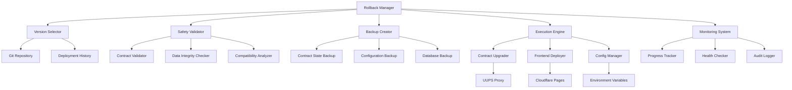

# Design Document: Version Rollback System

## Overview

The Version Rollback System provides a comprehensive solution for safely reverting the Jinbao Protocol to previous stable versions. The system handles smart contract upgrades, frontend deployments, configuration changes, and data migrations while maintaining system integrity and user safety.

The design follows a multi-layered approach with automated safety checks, comprehensive backup mechanisms, and detailed audit trails. The system integrates with existing infrastructure including Hardhat for contract management, Cloudflare Pages for frontend deployment, and GitHub Actions for automation.

## Architecture

The system consists of several interconnected components that work together to provide safe and reliable version rollback capabilities:



## Components and Interfaces

### Rollback Manager

The central orchestrator that coordinates all rollback operations:

```typescript
interface RollbackManager {
  initiateRollback(targetVersion: string, options: RollbackOptions): Promise<RollbackResult>
  getAvailableVersions(): Promise<VersionInfo[]>
  validateRollback(targetVersion: string): Promise<ValidationResult>
  executeEmergencyRollback(): Promise<RollbackResult>
  getRollbackHistory(): Promise<RollbackHistoryEntry[]>
}

interface RollbackOptions {
  skipNonCriticalChecks: boolean
  createBackup: boolean
  notifyStakeholders: boolean
  rollbackComponents: ComponentType[]
}

interface RollbackResult {
  success: boolean
  rollbackId: string
  componentsRolledBack: ComponentType[]
  errors: RollbackError[]
  duration: number
  backupLocation?: string
}
```

### Version Selector

Manages version identification and compatibility checking:

```typescript
interface VersionSelector {
  getVersionInfo(commitHash: string): Promise<VersionInfo>
  checkCompatibility(currentVersion: string, targetVersion: string): Promise<CompatibilityResult>
  getStableVersions(): Promise<VersionInfo[]>
  getVersionDiff(fromVersion: string, toVersion: string): Promise<VersionDiff>
}

interface VersionInfo {
  commitHash: string
  timestamp: Date
  description: string
  deploymentStatus: DeploymentStatus
  testResults: TestResult[]
  stabilityScore: number
  contractVersions: ContractVersion[]
}

interface CompatibilityResult {
  compatible: boolean
  issues: CompatibilityIssue[]
  requiredMigrations: Migration[]
  riskLevel: RiskLevel
}
```

### Safety Validator

Performs comprehensive safety checks before rollback execution:

```typescript
interface SafetyValidator {
  validateSystemState(): Promise<ValidationResult>
  checkContractCompatibility(targetVersion: string): Promise<ContractValidationResult>
  validateDataIntegrity(): Promise<DataValidationResult>
  checkExternalDependencies(): Promise<DependencyValidationResult>
}

interface ValidationResult {
  valid: boolean
  warnings: ValidationWarning[]
  errors: ValidationError[]
  recommendations: string[]
}

interface ContractValidationResult extends ValidationResult {
  contractIssues: ContractIssue[]
  migrationRequired: boolean
  dataLossRisk: RiskLevel
}
```

### Backup Creator

Creates comprehensive system backups before rollback execution:

```typescript
interface BackupCreator {
  createFullBackup(): Promise<BackupResult>
  createContractStateBackup(): Promise<ContractBackupResult>
  createConfigurationBackup(): Promise<ConfigBackupResult>
  restoreFromBackup(backupId: string): Promise<RestoreResult>
}

interface BackupResult {
  backupId: string
  timestamp: Date
  components: BackupComponent[]
  size: number
  location: string
  verificationHash: string
}

interface ContractBackupResult extends BackupResult {
  contractStates: ContractState[]
  userBalances: UserBalance[]
  stakingPositions: StakingPosition[]
}
```

### Contract Upgrader

Handles smart contract version changes using UUPS proxy pattern:

```typescript
interface ContractUpgrader {
  upgradeContract(contractName: string, targetVersion: string): Promise<UpgradeResult>
  validateUpgrade(contractName: string, targetVersion: string): Promise<UpgradeValidationResult>
  executeStateMigration(migration: Migration): Promise<MigrationResult>
  rollbackUpgrade(contractName: string): Promise<RollbackResult>
}

interface UpgradeResult {
  success: boolean
  transactionHash: string
  gasUsed: number
  newImplementationAddress: string
  migrationExecuted: boolean
}

interface Migration {
  id: string
  description: string
  fromVersion: string
  toVersion: string
  migrationScript: string
  reversible: boolean
}
```

### Frontend Deployer

Manages frontend application rollbacks to Cloudflare Pages:

```typescript
interface FrontendDeployer {
  deployVersion(version: string): Promise<DeploymentResult>
  updateConfiguration(config: FrontendConfig): Promise<ConfigUpdateResult>
  updateCloudflareFunction(functionName: string, code: string): Promise<FunctionUpdateResult>
  validateDeployment(deploymentId: string): Promise<DeploymentValidationResult>
}

interface DeploymentResult {
  deploymentId: string
  url: string
  status: DeploymentStatus
  buildTime: number
  errors: DeploymentError[]
}

interface FrontendConfig {
  contractAddresses: Record<string, string>
  networkConfig: NetworkConfig
  apiEndpoints: Record<string, string>
  environmentVariables: Record<string, string>
}
```

## Data Models

### Rollback Execution Plan

```typescript
interface RollbackPlan {
  id: string
  targetVersion: string
  currentVersion: string
  components: ComponentRollbackPlan[]
  estimatedDuration: number
  riskAssessment: RiskAssessment
  backupStrategy: BackupStrategy
  rollbackSteps: RollbackStep[]
}

interface ComponentRollbackPlan {
  component: ComponentType
  currentVersion: string
  targetVersion: string
  migrationRequired: boolean
  estimatedDowntime: number
  dependencies: string[]
}

interface RollbackStep {
  id: string
  description: string
  component: ComponentType
  action: RollbackAction
  prerequisites: string[]
  rollbackAction?: RollbackAction
  timeout: number
}
```

### System State Snapshot

```typescript
interface SystemSnapshot {
  id: string
  timestamp: Date
  version: string
  contractStates: ContractSnapshot[]
  configuration: ConfigurationSnapshot
  deploymentInfo: DeploymentSnapshot
  userMetrics: UserMetricsSnapshot
}

interface ContractSnapshot {
  contractName: string
  address: string
  implementationAddress: string
  version: string
  state: Record<string, any>
  userBalances: UserBalance[]
  totalSupply: string
}

interface ConfigurationSnapshot {
  networkConfig: NetworkConfig
  contractAddresses: Record<string, string>
  apiEndpoints: Record<string, string>
  environmentVariables: Record<string, string>
  cloudflareConfig: CloudflareConfig
}
```

Now I need to use the prework tool to analyze the acceptance criteria before writing the correctness properties:

<function_calls>
<invoke name="prework">
<parameter name="featureName">version-rollback

## Correctness Properties

*A property is a characteristic or behavior that should hold true across all valid executions of a system-essentially, a formal statement about what the system should do. Properties serve as the bridge between human-readable specifications and machine-verifiable correctness guarantees.*

After analyzing the acceptance criteria, I've identified several key properties that can be validated through property-based testing. These properties ensure the system behaves correctly across all possible inputs and scenarios.

### Property Reflection

Before defining the final properties, I performed a reflection to eliminate redundancy:

- Properties related to display functionality (1.1, 1.4, 8.2) can be combined into comprehensive UI validation properties
- Validation properties (1.2, 1.3, 2.1, 2.3) can be consolidated into broader validation correctness properties  
- Error handling properties (2.4, 3.5, 4.5, 6.4) share common patterns and can be unified
- Backup and restoration properties (2.2, 3.2) represent critical invariants that should be tested together
- Configuration management properties (5.1, 5.2, 5.4, 5.5) can be combined into comprehensive configuration consistency properties

### Core Properties

**Property 1: Version Information Display Completeness**
*For any* set of available versions, the rollback interface display should contain commit hashes, timestamps, descriptions, deployment status, test results, and stability indicators for each version
**Validates: Requirements 1.1, 1.4**

**Property 2: Version Compatibility Validation**
*For any* current version and target version pair, compatibility checking should correctly identify incompatibilities, required migrations, and data loss risks
**Validates: Requirements 1.2, 1.3, 2.3**

**Property 3: Safety Check Failure Prevention**
*For any* system state where safety checks fail, the rollback system should prevent execution and provide detailed error information with recovery options
**Validates: Requirements 2.4, 6.4**

**Property 4: Backup Completeness and Integrity**
*For any* system state, created backups should contain all contract states, user data, configurations, and be verifiable through integrity checks
**Validates: Requirements 2.2**

**Property 5: Contract Data Preservation Invariant**
*For any* contract upgrade or rollback operation, all user balances, stakes, and transaction history should be preserved exactly
**Validates: Requirements 3.2**

**Property 6: UUPS Upgrade Execution**
*For any* valid contract version transition, the Contract_Upgrader should successfully execute the upgrade using UUPS proxy pattern and validate post-upgrade functionality
**Validates: Requirements 3.1, 3.4**

**Property 7: Rollback Failure Recovery**
*For any* rollback operation that fails at any step, the system should automatically restore the previous stable state and provide detailed error logs
**Validates: Requirements 3.5, 4.5**

**Property 8: Frontend Deployment Consistency**
*For any* frontend version deployment, all configuration files, environment variables, and API endpoints should be updated consistently across all environments
**Validates: Requirements 4.1, 4.2, 4.4**

**Property 9: Configuration Synchronization**
*For any* configuration rollback, all deployment environments (development, staging, production) should be updated synchronously with matching configurations
**Validates: Requirements 5.1, 5.2, 5.4, 5.5**

**Property 10: Progress Monitoring Completeness**
*For any* rollback execution, real-time progress updates should be provided for each step with detailed status information and verification results
**Validates: Requirements 6.1, 6.2**

**Property 11: Emergency Mode Prioritization**
*For any* emergency rollback scenario, the system should bypass non-critical checks, automatically select stable versions, and prioritize critical infrastructure over frontend changes
**Validates: Requirements 7.1, 7.2, 7.3**

**Property 12: Audit Trail Completeness**
*For any* rollback operation, complete audit logs should be recorded including administrator identity, timestamp, justification, and be exportable in standard formats
**Validates: Requirements 8.1, 8.4**

**Property 13: Rollback History Analysis**
*For any* rollback history dataset, the system should correctly identify patterns, calculate success rates, and generate meaningful preventive recommendations
**Validates: Requirements 8.3, 8.5**

## Error Handling

The system implements comprehensive error handling at multiple levels:

### Validation Errors
- **Compatibility Issues**: When version compatibility checks fail, provide detailed migration requirements and risk assessments
- **Data Integrity Violations**: When data integrity checks detect corruption, halt rollback and provide recovery options
- **Dependency Conflicts**: When external dependencies are incompatible, suggest alternative rollback strategies

### Execution Errors
- **Contract Upgrade Failures**: Automatic rollback to previous contract version with detailed transaction logs
- **Frontend Deployment Failures**: Automatic restoration of previous frontend version with error diagnostics
- **Configuration Update Failures**: Partial rollback with component-level recovery options

### Recovery Mechanisms
- **Automatic Backup Restoration**: When rollback fails, automatically restore from the most recent backup
- **Component-Level Recovery**: Allow selective recovery of individual system components
- **Manual Override Options**: Provide administrator tools for manual intervention in critical scenarios

## Testing Strategy

The testing strategy employs a dual approach combining unit tests for specific scenarios and property-based tests for comprehensive validation:

### Property-Based Testing
- **Testing Framework**: Use fast-check for TypeScript/JavaScript components and Hypothesis for Python components
- **Test Configuration**: Minimum 100 iterations per property test to ensure comprehensive coverage
- **Test Tagging**: Each property test tagged with format: **Feature: version-rollback, Property {number}: {property_text}**

### Unit Testing
- **Specific Scenarios**: Test concrete examples of version rollbacks, emergency procedures, and error conditions
- **Integration Points**: Validate interactions between components, external services, and blockchain networks
- **Edge Cases**: Test boundary conditions, network failures, and resource constraints

### Test Categories

**Contract Upgrade Tests**:
- UUPS proxy upgrade mechanics with various contract versions
- State migration validation across different data structures
- Gas optimization and transaction failure scenarios

**Frontend Deployment Tests**:
- Cloudflare Pages deployment with different build configurations
- Environment variable synchronization across multiple environments
- API endpoint updates and connectivity validation

**Configuration Management Tests**:
- Network configuration updates with various blockchain networks
- External integration updates with different API providers
- Database schema migrations with complex data transformations

**Emergency Procedure Tests**:
- Emergency rollback execution under various failure scenarios
- Automatic version selection with different stability criteria
- Critical infrastructure prioritization with resource constraints

### Continuous Integration
- **Automated Testing**: All property tests run on every commit and pull request
- **Performance Benchmarks**: Track rollback execution times and resource usage
- **Security Validation**: Automated security scans for rollback procedures and access controls