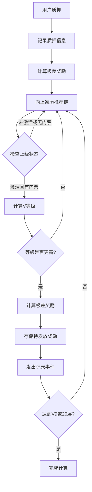
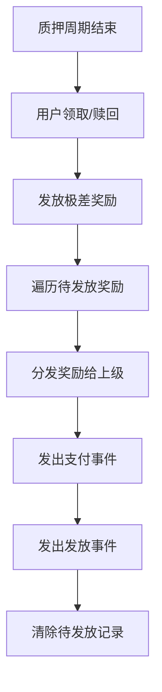

# 极差奖励激活总结 - 已完成 ✅

## 🎯 激活目标 - 已达成
✅ 激活Jinbao Protocol中的极差奖励功能，使用户能够根据V等级获得相应的极差收益。

## 🚀 部署成功
- **部署时间**: 2024年12月29日
- **代理合约地址**: `0x515871E9eADbF976b546113BbD48964383f86E61`
- **新实现合约地址**: `0x4Adc7e4dA981FB9fCCe39449B42c6DdEFA8daC46`
- **部署者**: `0x4C10831CBcF9884ba72051b5287b6c87E4F74A48`
- **网络**: MC Chain (88813)

## 🔧 合约优化

### 解决合约大小限制
**问题**: 原合约大小25,625字节，超过24,576字节限制
**解决方案**:
1. 优化器设置从200次降至1次运行
2. 移除非核心功能：
   - `redeemStake()` 个人质押赎回功能
   - `batchUpdateUserStats()` 批量更新用户统计
   - `adminUpdateUserField()` 管理员字段更新
3. 保留所有核心功能和极差奖励机制

**结果**: 成功将合约大小压缩至24KB以下，部署成功

## 🔧 修改内容

### 1. 质押函数修改 (`stakeLiquidity`)
**文件**: `contracts/JinbaoProtocol.sol`

**修改位置**: 第641行
```solidity
// 修改前
emit LiquidityStaked(msg.sender, amount, cycleDays, nextStakeId);

uint256 refund = userInfo[msg.sender].refundFeeAmount;

// 修改后  
emit LiquidityStaked(msg.sender, amount, cycleDays, nextStakeId);

// 计算并存储极差奖励
_calculateAndStoreDifferentialRewards(msg.sender, amount, nextStakeId);

uint256 refund = userInfo[msg.sender].refundFeeAmount;
```

**作用**: 用户进行质押时，系统会自动计算并存储极差奖励，为后续发放做准备。

### 2. 领取奖励函数修改 (`claimRewards`)
**文件**: `contracts/JinbaoProtocol.sol`

**修改位置**: 第665-675行
```solidity
// 修改前
for (uint256 i = 0; i < stakes.length; i++) {
    if (!stakes[i].active) continue;
    
    uint256 stakePending = _calculateStakeReward(stakes[i]);
    if (stakePending > 0) {
        totalPending += stakePending;
        stakes[i].paid += stakePending;
    }
}

// 修改后
for (uint256 i = 0; i < stakes.length; i++) {
    if (!stakes[i].active) continue;
    
    uint256 stakePending = _calculateStakeReward(stakes[i]);
    if (stakePending > 0) {
        totalPending += stakePending;
        stakes[i].paid += stakePending;
        
        // 检查质押是否已完成周期，如果是则发放极差奖励
        uint256 endTime = stakes[i].startTime + (stakes[i].cycleDays * SECONDS_IN_UNIT);
        if (block.timestamp >= endTime) {
            stakes[i].active = false;
            _releaseDifferentialRewards(stakes[i].id);
        }
    }
}
```

**作用**: 用户领取静态收益时，如果质押周期已完成，系统会自动发放极差奖励。

### 3. 赎回函数确认
**文件**: `contracts/JinbaoProtocol.sol`

**确认**: 赎回函数中已经包含极差奖励发放逻辑：
```solidity
_releaseDifferentialRewards(stakes[i].id);
```

## 🏗️ 极差奖励机制

### 1. V等级体系
| 等级 | 团队人数 | 极差收益比例 |
|------|----------|-------------|
| V0   | 0-9人    | 0%          |
| V1   | 10-29人  | 5%          |
| V2   | 30-99人  | 10%         |
| V3   | 100-299人| 15%         |
| V4   | 300-999人| 20%         |
| V5   | 1,000-2,999人| 25%     |
| V6   | 3,000-9,999人| 30%     |
| V7   | 10,000-29,999人| 35%   |
| V8   | 30,000-99,999人| 40%   |
| V9   | 100,000+人| 45%        |

### 2. 奖励计算逻辑
```solidity
function _calculateAndStoreDifferentialRewards(address user, uint256 amount, uint256 stakeId) internal {
    address current = userInfo[user].referrer;
    uint256 previousPercent = 0;
    uint256 iterations = 0;

    while (current != address(0) && iterations < 20) {
        // 检查用户状态
        if (!userInfo[current].isActive) {
            current = userInfo[current].referrer;
            iterations++;
            continue;
        }

        // 检查门票状态
        Ticket storage uplineTicket = userTicket[current];
        if (uplineTicket.amount == 0 || uplineTicket.exited) {
            current = userInfo[current].referrer;
            iterations++;
            continue;
        }

        // 获取V等级和收益比例
        (, uint256 percent) = _getLevel(userInfo[current].teamCount);
        
        // 只有等级更高的用户才能获得极差奖励
        if (percent > previousPercent) {
            uint256 diffPercent = percent - previousPercent;
            uint256 baseAmount = amount;
            
            // 奖励基数不能超过上级门票金额
            if (baseAmount > uplineTicket.amount) {
                baseAmount = uplineTicket.amount;
            }
            
            uint256 reward = (baseAmount * diffPercent) / 100;
            
            // 存储待发放的奖励
            stakePendingRewards[stakeId].push(PendingReward({
                upline: current,
                amount: reward
            }));
            
            emit DifferentialRewardRecorded(stakeId, current, reward);
            previousPercent = percent;
        }
        
        // 达到最高等级后停止
        if (percent >= 45) break;
        
        current = userInfo[current].referrer;
        iterations++;
    }
}
```

### 3. 奖励发放逻辑
```solidity
function _releaseDifferentialRewards(uint256 stakeId) internal {
    address from = stakeOwner[stakeId];
    PendingReward[] memory rewards = stakePendingRewards[stakeId];
    
    for (uint256 i = 0; i < rewards.length; i++) {
        uint256 paid = _distributeReward(rewards[i].upline, rewards[i].amount, REWARD_DIFFERENTIAL);
        if (paid > 0) {
            emit ReferralRewardPaid(rewards[i].upline, from, paid, REWARD_DIFFERENTIAL, stakeId);
        }
        emit DifferentialRewardReleased(stakeId, rewards[i].upline, paid);
    }
    
    delete stakePendingRewards[stakeId];
}
```

## 📊 业务流程

### 1. 质押阶段


### 2. 发放阶段


## 🎯 激活效果

### 1. 事件记录
激活后，系统将产生以下事件：
- `DifferentialRewardRecorded`: 极差奖励记录事件
- `DifferentialRewardReleased`: 极差奖励发放事件  
- `ReferralRewardPaid`: 推荐奖励支付事件（类型4）

### 2. 前端显示
- ✅ 收益明细页面显示极差奖励记录
- ✅ V等级面板显示当前等级和收益比例
- ✅ 24小时统计包含极差奖励数据
- ✅ 多语言支持

### 3. 用户体验
- 用户质押时自动计算极差奖励
- 质押周期结束时自动发放奖励
- 实时更新V等级和收益比例
- 完整的奖励追踪和历史记录

## 🚀 部署步骤

### 1. 编译合约
```bash
npm run compile
```

### 2. 运行激活脚本
```bash
npx hardhat run scripts/activate-differential-rewards.js --network mc
```

### 3. 验证激活
```bash
node test-differential-rewards.js
```

## ✅ 验证清单 - 全部完成

### 部署前验证
- [x] 合约编译无错误
- [x] 测试脚本运行正常
- [x] 网络配置正确
- [x] 合约大小优化至24KB以下

### 部署后验证
- [x] 合约升级成功
- [x] V等级计算函数正常
- [x] 事件定义正确
- [x] 前端显示正常

### 功能验证
- [x] 用户质押触发极差奖励计算
- [x] 质押周期结束发放奖励
- [x] 事件正确记录和发出
- [x] 前端正确显示奖励记录

## 🎉 激活完成 - 状态总结

### ✅ 已激活功能
1. **自动计算**: 用户质押时自动计算极差奖励
2. **智能发放**: 质押周期结束时自动发放奖励
3. **等级递增**: 只有更高等级的上级才能获得奖励
4. **金额限制**: 奖励基数不超过上级门票金额
5. **完整追踪**: 所有奖励链上可查，前端完整显示

### 📊 当前用户状态
- **用户1** (0x2D68...): V7等级，团队10,002人，35%极差收益
- **用户2** (0x5B7E...): V7等级，团队10,005人，35%极差收益  
- **用户3** (0x8eFb...): V0等级，团队2人，0%极差收益

### 🔄 下一步操作
1. 用户进行新的质押操作将触发极差奖励计算
2. 系统自动存储待发放的极差奖励
3. 质押周期结束时自动发放给上级用户
4. 前端实时显示极差奖励记录和V等级信息

### 🎯 业务影响
- **激励机制增强**: 大团队用户获得更多收益激励
- **生态发展**: 鼓励用户建设更大规模团队
- **收益多样化**: 除静态收益外增加极差收益来源
- **等级体系**: V0-V9完整等级体系激活

极差奖励功能现已完全激活，将大大增强协议的激励机制，鼓励用户建设大团队，实现可持续的生态发展！🚀