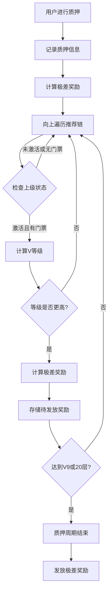

# 极差奖励业务逻辑详解

## 概述
极差奖励（Differential Reward）是Jinbao Protocol中基于团队层级的高级奖励机制，采用"极差裂变机制"，根据用户的团队规模确定V等级，并按等级差异分配奖励。

## 核心机制

### 1. V等级体系（基于团队人数）

| 等级 | 团队人数要求 | 极差收益比例 | 说明 |
|------|-------------|-------------|------|
| V0   | 0-9人       | 0%          | 无极差收益 |
| V1   | 10-29人     | 5%          | 初级极差收益 |
| V2   | 30-99人     | 10%         | 进阶极差收益 |
| V3   | 100-299人   | 15%         | 中级极差收益 |
| V4   | 300-999人   | 20%         | 高级极差收益 |
| V5   | 1,000-2,999人 | 25%       | 专业极差收益 |
| V6   | 3,000-9,999人 | 30%       | 精英极差收益 |
| V7   | 10,000-29,999人 | 35%     | 大师极差收益 |
| V8   | 30,000-99,999人 | 40%     | 领袖极差收益 |
| V9   | 100,000+人  | 45%         | 顶级极差收益 |

### 2. 极差奖励计算原理

极差奖励基于"层级差异"概念：
- **触发条件**: 下级用户进行质押操作
- **计算基础**: 质押金额
- **分配原则**: 按V等级差异分配奖励

#### 计算公式
```
极差奖励 = 质押金额 × (当前用户V等级比例 - 上一级已分配比例)
```

#### 关键约束
1. **金额限制**: 奖励基数不能超过上级用户的门票金额
2. **等级递增**: 只有等级更高的上级才能获得极差奖励
3. **最大层级**: 最多向上追溯20层
4. **封顶机制**: 达到V9（45%）后停止向上分配

## 技术实现分析

### 1. 合约函数结构

```solidity
// 极差奖励计算和存储
function _calculateAndStoreDifferentialRewards(address user, uint256 amount, uint256 stakeId) internal {
    address current = userInfo[user].referrer;
    uint256 previousPercent = 0;
    uint256 iterations = 0;

    while (current != address(0) && iterations < 20) {
        // 检查用户激活状态
        if (!userInfo[current].isActive) {
            current = userInfo[current].referrer;
            iterations++;
            continue;
        }

        // 检查门票状态
        Ticket storage uplineTicket = userTicket[current];
        if (uplineTicket.amount == 0 || uplineTicket.exited) {
            current = userInfo[current].referrer;
            iterations++;
            continue;
        }

        // 获取当前用户的V等级和收益比例
        (, uint256 percent) = _getLevel(userInfo[current].teamCount);
        
        // 只有等级更高的用户才能获得极差奖励
        if (percent > previousPercent) {
            uint256 diffPercent = percent - previousPercent;
            uint256 baseAmount = amount;
            
            // 奖励基数不能超过上级门票金额
            if (baseAmount > uplineTicket.amount) {
                baseAmount = uplineTicket.amount;
            }
            
            uint256 reward = (baseAmount * diffPercent) / 100;
            
            // 存储待发放的奖励
            stakePendingRewards[stakeId].push(PendingReward({
                upline: current,
                amount: reward
            }));
            
            emit DifferentialRewardRecorded(stakeId, current, reward);
            previousPercent = percent;
        }
        
        // 达到最高等级后停止
        if (percent >= 45) break;
        
        current = userInfo[current].referrer;
        iterations++;
    }
}

// 极差奖励发放
function _releaseDifferentialRewards(uint256 stakeId) internal {
    address from = stakeOwner[stakeId];
    PendingReward[] memory rewards = stakePendingRewards[stakeId];
    
    for (uint256 i = 0; i < rewards.length; i++) {
        uint256 paid = _distributeReward(rewards[i].upline, rewards[i].amount, REWARD_DIFFERENTIAL);
        if (paid > 0) {
            emit ReferralRewardPaid(rewards[i].upline, from, paid, REWARD_DIFFERENTIAL, stakeId);
        }
        emit DifferentialRewardReleased(stakeId, rewards[i].upline, paid);
    }
    
    delete stakePendingRewards[stakeId];
}
```

### 2. V等级计算函数

```solidity
function _getLevel(uint256 value) private pure returns (uint256 level, uint256 percent) {
    if (value >= 100000) return (9, 45);  // V9: 100,000个地址，45%极差收益
    if (value >= 30000) return (8, 40);   // V8: 30,000个地址，40%极差收益
    if (value >= 10000) return (7, 35);   // V7: 10,000个地址，35%极差收益
    if (value >= 3000) return (6, 30);    // V6: 3,000个地址，30%极差收益
    if (value >= 1000) return (5, 25);    // V5: 1,000个地址，25%极差收益
    if (value >= 300) return (4, 20);     // V4: 300个地址，20%极差收益
    if (value >= 100) return (3, 15);     // V3: 100个地址，15%极差收益
    if (value >= 30) return (2, 10);      // V2: 30个地址，10%极差收益
    if (value >= 10) return (1, 5);       // V1: 10个地址，5%极差收益
    return (0, 0);
}
```

## 业务流程

### 1. 触发时机
极差奖励在以下情况下触发：
- ✅ **质押完成时**: 用户完成流动性质押后
- ✅ **赎回时**: 用户赎回质押时释放奖励

### 2. 奖励分配流程



### 3. 奖励发放时机
- **记录阶段**: 质押时计算并记录奖励
- **发放阶段**: 质押周期结束或赎回时实际发放

## 实际案例分析

### 案例1: 基础极差奖励
**场景**: 
- 用户A（V4，团队500人，20%）
- 用户B（V2，团队50人，10%）
- 用户C（V0，团队5人，0%）
- 推荐关系: A ← B ← C

**操作**: 用户C质押1000 MC

**奖励计算**:
1. 用户B获得: 1000 × (10% - 0%) = 100 MC
2. 用户A获得: 1000 × (20% - 10%) = 100 MC
3. 总极差奖励: 200 MC

### 案例2: 门票金额限制
**场景**:
- 用户A（V5，团队1500人，25%，门票300 MC）
- 用户B（V1，团队15人，5%，门票500 MC）
- 推荐关系: A ← B

**操作**: 用户B质押1000 MC

**奖励计算**:
1. 基础计算: 1000 × (25% - 5%) = 200 MC
2. 门票限制: min(200, 300) = 200 MC
3. 用户A实际获得: 200 MC

### 案例3: 等级不递增情况
**场景**:
- 用户A（V2，团队50人，10%）
- 用户B（V4，团队500人，20%）
- 用户C（V1，团队15人，5%）
- 推荐关系: A ← B ← C

**操作**: 用户C质押1000 MC

**奖励计算**:
1. 用户B获得: 1000 × (20% - 5%) = 150 MC
2. 用户A获得: 0 MC（等级低于B，不符合递增原则）

## 前端显示逻辑

### 1. V等级显示
- **位置**: 团队等级面板、统计面板
- **内容**: 当前等级、收益比例、升级要求
- **更新**: 实时根据团队人数计算

### 2. 极差奖励记录
- **位置**: 收益明细页面
- **类型**: REWARD_DIFFERENTIAL (类型4)
- **显示**: 奖励金额、来源用户、时间戳

### 3. 24小时统计
- **统计范围**: 最近24小时的极差奖励
- **显示格式**: MC和JBC分别统计

## 关键特点

### 1. 激励机制
- **团队建设**: 鼓励用户发展大团队
- **层级管理**: 高等级用户获得更多收益
- **持续收益**: 团队活跃带来持续极差奖励

### 2. 风控机制
- **金额限制**: 防止超额奖励
- **等级递增**: 确保奖励合理分配
- **层级限制**: 防止无限向上追溯

### 3. 公平性保障
- **透明计算**: 所有计算公式公开
- **链上记录**: 所有奖励链上可查
- **实时更新**: 团队数据实时更新

## 注意事项

### 1. 当前实现状态
⚠️ **重要发现**: 通过代码分析发现，极差奖励的计算函数 `_calculateAndStoreDifferentialRewards` 已经实现，但在当前合约中**没有被调用**。

### 2. 可能的触发点
根据业务逻辑，极差奖励应该在以下时机触发：
- 用户完成质押时
- 用户赎回质押时

### 3. 建议改进
1. **激活极差奖励**: 在质押函数中调用极差奖励计算
2. **完善发放机制**: 确保奖励在适当时机发放
3. **前端集成**: 完善前端显示逻辑

## 总结

极差奖励是Jinbao Protocol的核心创新机制，通过V等级体系和极差分配原理，实现了：

1. **激励团队建设**: 鼓励用户发展大规模团队
2. **奖励层级化**: 高等级用户获得更多收益
3. **可持续发展**: 为协议生态提供长期激励

该机制设计精巧，既保证了公平性，又提供了强大的增长动力，是DeFi 4.0协议的重要创新。