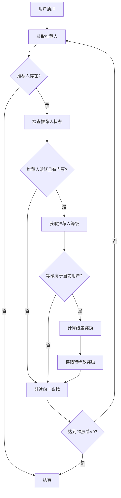
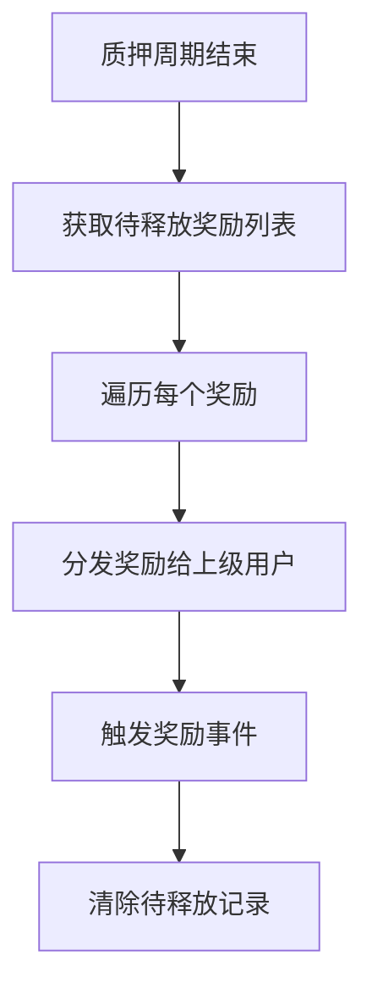

# Jinbao Protocol 级差奖励机制详解

## 📋 **机制概述**

级差奖励（Differential Reward）是 Jinbao Protocol 中的一种团队激励机制，基于用户的团队规模和等级差异来分配奖励。当下级用户进行质押时，上级用户可以根据等级差异获得相应的级差奖励。

## 🎯 **核心原理**

### **基本概念**
- **级差**: 指不同等级用户之间的收益比例差异
- **团队计数**: 用户直接和间接推荐的所有有效用户数量
- **等级系统**: 基于团队计数确定的 V0-V9 等级体系
- **延迟释放**: 级差奖励在质押周期结束时才释放

### **触发条件**
1. 用户进行质押操作
2. 向上遍历推荐链（最多20层）
3. 上级用户必须是活跃状态且有有效门票
4. 上级用户等级高于下级用户

## 📊 **等级体系与收益比例**

### **V0-V9 等级标准**

| 等级 | 团队人数要求 | 级差收益比例 | 说明 |
|------|-------------|-------------|------|
| **V0** | < 10 人 | 0% | 初始等级 |
| **V1** | ≥ 10 人 | 5% | 基础团队长 |
| **V2** | ≥ 30 人 | 10% | 小团队长 |
| **V3** | ≥ 100 人 | 15% | 中级团队长 |
| **V4** | ≥ 300 人 | 20% | 高级团队长 |
| **V5** | ≥ 1,000 人 | 25% | 区域经理 |
| **V6** | ≥ 3,000 人 | 30% | 大区经理 |
| **V7** | ≥ 10,000 人 | 35% | 总监 |
| **V8** | ≥ 30,000 人 | 40% | 高级总监 |
| **V9** | ≥ 100,000 人 | 45% | 最高等级 |

### **级差计算公式**

```
级差奖励 = min(质押金额, 上级门票金额) × (上级等级比例 - 下级等级比例)
```

## 🔄 **工作流程**

### **1. 质押时计算级差**



### **2. 质押结束时释放奖励**



## 💡 **实际案例分析**

### **案例设置**
- **用户A**: V0等级，质押 1000 MC
- **用户B**: V2等级（30人团队），A的推荐人
- **用户C**: V5等级（1000人团队），B的推荐人
- **用户D**: V7等级（10000人团队），C的推荐人

### **级差计算过程**

#### **步骤1: A质押1000 MC**
1. **向上查找到B (V2, 10%)**
   - 级差 = min(1000, B门票金额) × (10% - 0%) = 基数 × 10%
   
2. **继续向上查找到C (V5, 25%)**
   - 级差 = min(1000, C门票金额) × (25% - 10%) = 基数 × 15%
   
3. **继续向上查找到D (V7, 35%)**
   - 级差 = min(1000, D门票金额) × (35% - 25%) = 基数 × 10%

#### **假设所有上级门票都≥1000 MC**
- **B获得**: 1000 × 10% = 100 MC
- **C获得**: 1000 × 15% = 150 MC  
- **D获得**: 1000 × 10% = 100 MC
- **总级差**: 350 MC

### **门票金额限制示例**

#### **如果C的门票只有500 MC**
- **B获得**: min(1000, B门票) × 10%
- **C获得**: min(1000, 500) × 15% = 500 × 15% = 75 MC
- **D获得**: min(1000, D门票) × 10%

> **重要**: 级差奖励基数不能超过上级用户的门票金额

## ⏰ **时间机制**

### **计算时机**
- ✅ **质押时**: 立即计算并存储级差奖励
- ✅ **记录事件**: `DifferentialRewardRecorded`

### **释放时机**
- ✅ **自然到期**: 质押周期结束时自动释放
- ✅ **提前退出**: 用户主动退出质押时释放
- ✅ **释放事件**: `DifferentialRewardReleased` 和 `ReferralRewardPaid`

### **延迟释放的意义**
1. **风险控制**: 确保质押周期完成
2. **激励长期**: 鼓励团队稳定发展
3. **资金安全**: 避免短期套利行为

## 🔒 **安全机制**

### **防护措施**
1. **层级限制**: 最多向上查找20层
2. **状态检查**: 只有活跃用户才能获得奖励
3. **门票验证**: 必须有有效门票才能参与
4. **金额限制**: 级差基数不超过上级门票金额
5. **等级验证**: 只有更高等级才能获得级差

### **防刷机制**
1. **团队计数**: 基于真实推荐关系
2. **活跃状态**: 需要持续参与才能维持等级
3. **门票要求**: 必须有资金投入才能获得奖励

## 📈 **激励效果**

### **对个人的激励**
- **等级提升**: 推动用户扩大团队规模
- **长期收益**: 团队越大，级差收益越多
- **复利效应**: 下级质押越多，收益越高

### **对团队的激励**
- **团队建设**: 鼓励培养下级用户
- **知识传递**: 上级有动力指导下级
- **生态发展**: 促进整个网络的扩张

## 🎯 **优化建议**

### **用户策略**
1. **专注团队建设**: 提升团队人数以获得更高等级
2. **保持活跃**: 维持活跃状态以持续获得奖励
3. **合理门票**: 门票金额影响可获得的级差上限
4. **长期规划**: 级差奖励需要时间积累

### **系统优化**
1. **等级可视化**: 清晰显示用户等级和进度
2. **收益预测**: 帮助用户了解潜在级差收益
3. **团队管理**: 提供团队数据和分析工具

## 📊 **数据统计**

### **关键指标**
- **级差奖励总量**: 系统累计分发的级差奖励
- **平均等级分布**: 各等级用户的数量分布
- **团队活跃度**: 活跃用户占比
- **奖励释放率**: 成功释放的奖励比例

### **监控重点**
- **异常等级提升**: 防止虚假团队计数
- **大额级差奖励**: 监控异常的高额奖励
- **团队结构**: 分析推荐网络的健康度

## 🔍 **技术实现要点**

### **核心函数**
```solidity
// 计算并存储级差奖励
function _calculateAndStoreDifferentialRewards(address user, uint256 amount, uint256 stakeId) internal

// 释放级差奖励
function _releaseDifferentialRewards(uint256 stakeId) internal

// 获取用户等级
function _getLevel(uint256 teamCount) private pure returns (uint256 level, uint256 percent)
```

### **关键事件**
```solidity
event DifferentialRewardRecorded(uint256 indexed stakeId, address indexed upline, uint256 amount);
event DifferentialRewardReleased(uint256 indexed stakeId, address indexed upline, uint256 amount);
event ReferralRewardPaid(address indexed user, address indexed from, uint256 mcAmount, uint8 rewardType, uint256 ticketId);
```

## 🎉 **总结**

级差奖励机制是 Jinbao Protocol 的核心激励系统，通过等级差异化的收益分配，激励用户建设团队、扩大网络规模。该机制具有以下特点：

1. **公平性**: 基于真实团队贡献分配奖励
2. **激励性**: 等级越高，收益潜力越大
3. **安全性**: 多重防护机制防止滥用
4. **延迟性**: 通过延迟释放确保系统稳定

通过合理的等级设计和级差计算，该机制有效促进了生态系统的健康发展和用户的长期参与。

---

*文档更新时间: ${new Date().toLocaleString()}*  
*合约版本: JinbaoProtocol.sol*  
*机制类型: 级差奖励 (Differential Reward)*