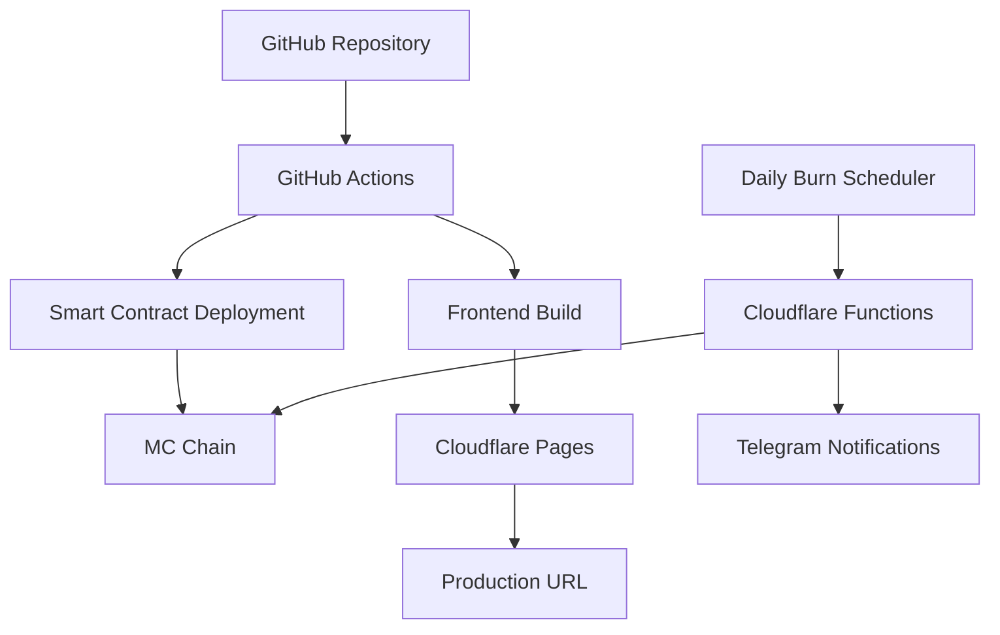

# 🚀 Jinbao Protocol 生产环境部署

## 快速开始

### 1. 自动部署 (推荐)
```bash
# 推送到 prod 分支触发自动部署
git checkout prod
git push origin prod
```

### 2. 本地部署
```bash
# 设置环境变量
export PROD_PRIVATE_KEY="0x..."
export MC_RPC_URL="https://rpc.mcchain.io"
export CLOUDFLARE_API_TOKEN="..."
export CLOUDFLARE_ACCOUNT_ID="..."

# 执行部署
npm run deploy:prod
```

### 3. 配置 Secrets
```bash
# 交互式配置生产环境 secrets
npm run setup:secrets:prod

# 或者配置测试环境
npm run setup:secrets:staging
```

## 部署架构



## 环境配置

### 生产环境
- **前端**: `jinbao-protocol-prod.pages.dev`
- **智能合约**: MC Chain 主网
- **每日燃烧**: 500 JBC
- **最大燃烧**: 5000 JBC

### 测试环境  
- **前端**: `jinbao-protocol-staging.pages.dev`
- **智能合约**: MC Chain 测试网
- **每日燃烧**: 10 JBC
- **最大燃烧**: 100 JBC

## 必要的 GitHub Secrets

在 Repository Settings > Secrets 中配置:

```bash
# 智能合约
PROD_PRIVATE_KEY=0x...
MC_RPC_URL=https://rpc.mcchain.io
PROD_JBC_CONTRACT_ADDRESS=0x...
PROD_PROTOCOL_CONTRACT_ADDRESS=0x...

# Cloudflare
CLOUDFLARE_API_TOKEN=...
CLOUDFLARE_ACCOUNT_ID=...
PROD_FRONTEND_URL=https://your-domain.com

# 通知 (可选)
TELEGRAM_BOT_TOKEN=...
TELEGRAM_CHAT_ID=...
```

## 部署流程

1. **构建和测试** - 编译合约，运行测试，构建前端
2. **合约部署** - 部署到 MC Chain 主网
3. **前端部署** - 部署到 Cloudflare Pages
4. **环境配置** - 设置生产环境变量
5. **验证测试** - 健康检查和功能验证
6. **通知发送** - Telegram 部署结果通知

## 监控和维护

### 每日燃烧任务
- 自动执行时间: 每日 UTC 00:00
- 监控方式: GitHub Actions + Telegram 通知
- 手动触发: GitHub Actions 页面

### 健康检查
```bash
# 系统状态
curl https://jinbao-protocol-prod.pages.dev/api/health

# 燃烧状态
curl https://jinbao-protocol-prod.pages.dev/api/status
```

### 常用命令
```bash
# 查看生产环境 secrets
npm run secrets:list:prod

# 部署到生产环境
npm run pages:deploy:prod

# 查看部署状态
wrangler pages deployment list --project-name=jinbao-protocol-prod
```

## 故障排除

### 合约部署失败
- 检查私钥和 RPC 配置
- 确认钱包余额充足
- 验证网络连接

### 前端部署失败  
- 检查 Cloudflare API Token
- 确认构建过程无误
- 验证环境变量配置

### 燃烧任务失败
- 检查合约地址配置
- 确认 JBC 代币余额
- 验证 RPC 连接状态

## 安全注意事项

1. **私钥安全**: 使用专用部署钱包，定期轮换
2. **环境隔离**: 生产和测试完全分离
3. **权限控制**: 最小权限原则，定期审查
4. **监控告警**: 及时发现和处理异常

## 支持联系

- 📧 技术支持: support@jinbao.io
- 📖 详细文档: [docs/DEPLOYMENT_GUIDE.md](docs/DEPLOYMENT_GUIDE.md)
- 🐛 问题反馈: GitHub Issues

---

**最后更新**: 2024-12-29  
**版本**: 1.0.0