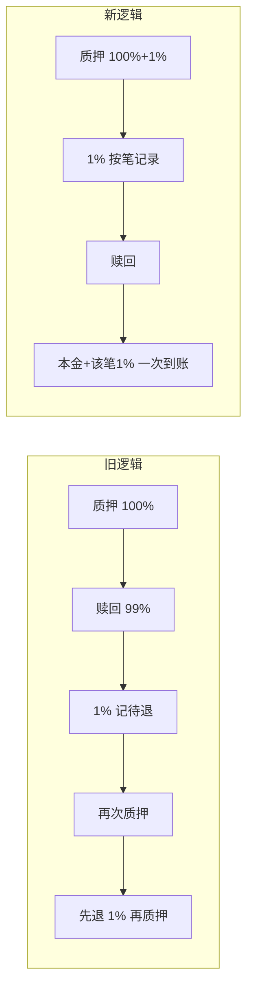

# 赎回金 1% 逻辑上线影响与对比

## 一、行为对比总览

| 维度 | 旧逻辑（上线前） | 新逻辑（本次更新） |
|------|------------------|---------------------|
| **1% 收取时机** | 赎回时从本金中扣 1% | 质押时单独多付 1%（与本金一起打款） |
| **1% 记录方式** | 整户一个数：`refundFeeAmount` | 按笔：`stakeRedemptionFeePaid[stakeId]` |
| **1% 退还时机** | 下次「重质押」时先退再质押 | 赎回该笔时直接退（本金 + 该笔 1%） |
| **多笔质押分批赎回** | 每次赎回扣 1% 都进同一待退池，下次重质押一次性退 | 每笔只退该笔的 1%，可分批赎、按笔退 |
| **被动退出扣费** | 记入 `refundFeeAmount`，下次重质押退 | 不变，仍记入 `refundFeeAmount`，下次重质押退 |

---

## 二、流程对比图

### 旧逻辑（赎回扣 → 重质押退）

```text
┌─────────────────────────────────────────────────────────────────────────┐
│  旧逻辑：赎回扣 1% → 下次重质押时退 1%                                    │
└─────────────────────────────────────────────────────────────────────────┘

  质押                    赎回                        再次质押
   ──►                    ──►                         ──►
  付 100%                拿回 99%                     先退 1%
  本金                    (1% 记入 refundFeeAmount)    再付新一笔 100%
                                                       (相当于拿回上次的 1%)
```

### 新逻辑（质押扣 1% → 赎回按笔退）

```text
┌─────────────────────────────────────────────────────────────────────────┐
│  新逻辑：质押时多付 1% → 赎回该笔时退该笔的 1%                            │
└─────────────────────────────────────────────────────────────────────────┘

  质押                          赎回
   ──►                           ──►
  付 100% + 1%                  拿回 100% + 该笔的 1%
  (1% 记入 stakeRedemptionFeePaid[stakeId])
```

### 对比图（并排）



|  | 旧逻辑 | 新逻辑 |
|---|--------|--------|
| **付钱** | 质押时只付本金 | 质押时付「本金 + 1%」 |
| **扣/记** | 赎回时从本金扣 1%，记整户待退 | 质押时把 1% 记在该笔 stake 上 |
| **拿回** | 赎回拿 99%；下次重质押先退 1% | 赎回该笔时拿「本金 + 该笔 1%」 |

---

## 三、用户侧影响对比表

| 场景 | 旧逻辑表现 | 新逻辑表现 | 影响说明 |
|------|------------|------------|----------|
| **单笔质押 → 到期赎回** | 赎回到手 = 本金 − 1%；下次重质押时退 1% | 赎回到手 = 本金 + 1%（一笔到账） | 新逻辑：钱在赎回时一次拿齐，无需再质押才退 |
| **多笔质押 → 只赎一部分** | 每赎一笔扣 1% 进待退池，下次重质押一次性退所有 | 每赎一笔退该笔的 1%，不混在一起 | 新逻辑：按笔清晰，分批赎也不丢 1% |
| **质押时余额要求** | 只需 ≥ 本金 | 需 ≥ 本金 + 1% 门票 | 新逻辑：前端/钱包需按「本金+1%」展示与校验 |
| **被动退出** | 扣费进 `refundFeeAmount`，下次重质押退 | 不变 | 无变化 |

---

## 四、上线后对不同用户的影响

| 用户类型 | 说明 | 上线后影响 |
|----------|------|------------|
| **已有待退金额（旧逻辑产生的 refundFeeAmount > 0）** | 曾在旧逻辑下赎回，还没重质押 | 不受损：下次调用 `stakeLiquidity` 时会先退 `refundFeeAmount` 再处理本次质押；需按新逻辑多付本次的 1% |
| **升级前已存在的质押（旧合约创建的 stake）** | 这些 stake 的 `stakeRedemptionFeePaid[id] = 0` | 赎回时得到：本金 + 0 = 全额本金。旧逻辑下会扣 1% 进待退，新逻辑下不扣、直接全额，相当于对这批老质押更有利 |
| **升级后新产生的质押** | 用新合约新创建的 stake | 质押时多付 1%，赎回该笔时拿回本金 + 该笔 1%，按笔对应 |
| **仅被动退出、从未主动赎回** | 只有 `_handleExit` 产生的 refundFeeAmount | 行为不变：下次重质押时先退再质押 |

---

## 五、前端/对接需配合项

| 项目 | 说明 |
|------|------|
| **质押金额展示与校验** | 显示并校验「所需 MC = 本金 + 门票的 1%」，错误时提示金额不足或需多付 1% |
| **赎回金额展示** | 可说明：到账 = 本金 + 该笔 1% 赎回金（多笔赎回时按笔加总） |
| **合约升级后** | 若前端曾按「赎回扣 1%」做文案，需改为「质押时付 1%，赎回时退还」 |

---

## 六、更新对数据的影响

### 6.1 链上存储（合约状态变量）

| 数据 | 类型 | 升级前 | 升级后 | 说明 |
|------|------|--------|--------|------|
| **userInfo[user].refundFeeAmount** | 已有字段 | 旧逻辑：每次赎回扣的 1% 累加在此 | 只由被动退出 `_handleExit` 写入；`redeem()` 不再写入 | 升级后已有数值**保留**，下次 `stakeLiquidity` 会先退再清零；新逻辑下主动赎回不再往这里写 |
| **stakeRedemptionFeePaid[stakeId]** | 新增 mapping | 不存在（未使用） | 质押时写入：该笔支付的 1% 金额 | 升级**前**已存在的 stakeId 未写入，默认 **0**；升级**后**新创建的 stake 会写入 |
| **userStakes / Stake 结构** | 已有 | amount = 本金 | 不变，amount 仍为**本金** | 旧逻辑也是本金，只是赎回时少转 1%；新逻辑赎回时多转该笔的 1% |
| **nextStakeId** | 已有 | 递增 | 继续递增 | 新 stake 的 id 接着老的，老 id 在 `stakeRedemptionFeePaid` 里为 0 |

### 6.2 已有数据在升级后的含义

| 数据场景 | 升级后读到的值 | 业务含义 |
|----------|----------------|----------|
| 升级前已存在的某笔质押 `stake.id = N` | `stakeRedemptionFeePaid[N] == 0` | 该笔未在质押时付过 1%，赎回时只退本金（不扣 1%，相当于更优） |
| 某用户曾在旧逻辑下赎回，未再质押 | `userInfo[user].refundFeeAmount > 0` | 待退金额仍有效，下次 `stakeLiquidity` 会先退再处理本次质押 |
| 升级后新产生的质押 `stake.id = M` | `stakeRedemptionFeePaid[M] = 门票的 1%` | 赎回该笔时退 `amount + stakeRedemptionFeePaid[M]` |

### 6.3 数据兼容性小结

- **存储布局**：仅新增 `stakeRedemptionFeePaid` mapping，未改已有结构顺序，升级兼容。
- **历史质押**：老 stake 的 `stakeRedemptionFeePaid[id]=0`，赎回时只加本金，不扣 1%，用户不受损。
- **历史待退**：`refundFeeAmount` 仍会在下次重质押时退还，无需迁移。
- **新质押**：需多付 1% 且会写入 `stakeRedemptionFeePaid`，赎回时按笔退。

### 6.4 依赖数据的其他位置（需核对/调整）

| 位置 | 可能影响 | 建议 |
|------|----------|------|
| **前端** | 展示「赎回可得」= 本金 − 1% 或「质押所需」= 本金 | 改为：赎回可得 = 本金 + 该笔 1%；质押所需 = 本金 + 1% |
| **子图 / 链下索引** | 若按「赎回金额」统计或展示 | 新逻辑下赎回金额 = 本金 + stakeRedemptionFeePaid，需能取到该 mapping 或从事件还原 |
| **报表 / 对账** | 按「用户收到 MC」与合约转出对账 | 赎回转出 = 本金之和 + 本次赎回各笔的 stakeRedemptionFeePaid 之和，公式变化 |
| **事件** | `LiquidityStaked(amount)` 为本金 | 已是本金，无变；若有 `Redeemed(totalReturn)`，totalReturn 现含 1% 退还，数值变大 |

---

## 七、小结（一句话对比）

- **旧**：赎回时少拿 1%，下次重质押时再退（整户一个待退池）。
- **新**：质押时多付 1%，赎回该笔时该笔的 1% 一起退（按笔清晰、可分批赎）。

**上线影响**：老质押赎回更优（不扣 1%）；已有待退用户下次重质押会先退再按新规则付；新质押需多付 1%、赎回时按笔退。前端需按「本金+1%」展示与校验质押金额。

---

**文档版本**: v1.1（增加「更新对数据的影响」）  
**更新日期**: 2026-02-10
